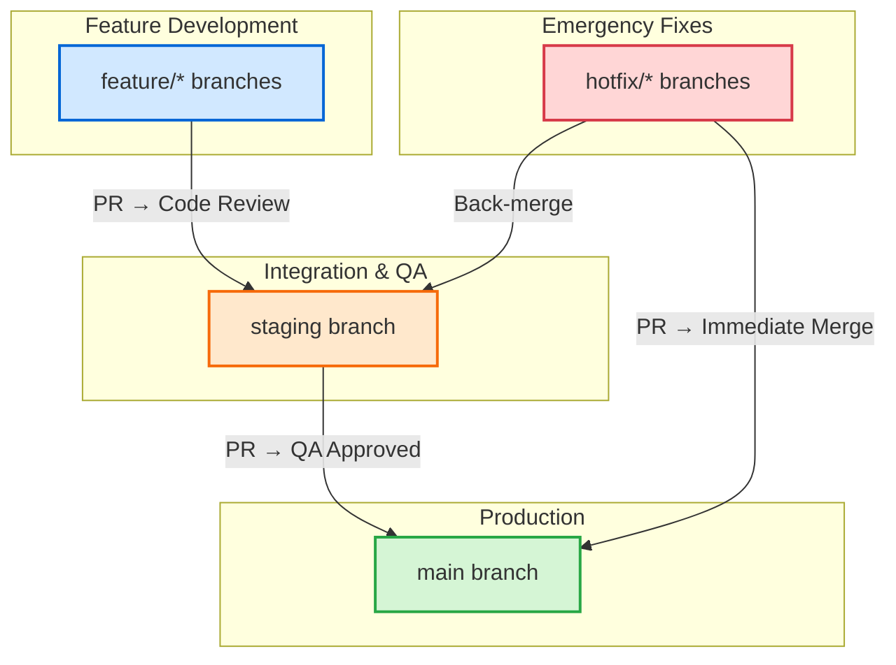

# 🗺️ Advancia Pay Platform - Comprehensive Roadmap

**Last Updated:** November 24, 2025  
**Current Sprint:** Week 1 - TypeScript Reliability & Validation

---

## 📋 Navigation

- **[Sprint Board](./SPRINT_BOARD.md)** - Current sprint tracking, metrics, and blockers
- **[Issues Templates](./ISSUES_TEMPLATE.md)** - Copy-paste GitHub issue templates with labels
- **[Execution Plan](./EXECUTION_PLAN.md)** - Day-by-day implementation guide
- **[Branching Strategy](./BRANCHING_STRATEGY.md)** - Git workflow and branch protection rules

---

## 🎯 Strategic Vision

Transform Advancia Pay from a functional fintech platform into an **enterprise-ready, globally scalable payment ecosystem** with:

- **Type-safe architecture** - Zero compile errors, strict TypeScript, validated inputs
- **Security-first design** - PII redaction, audit trails, compliance-ready logging
- **Developer experience** - Comprehensive testing, clear patterns, automated workflows
- **Business readiness** - Monetization layers, subscription tiers, usage billing
- **Operational excellence** - Multi-cloud deployment, horizontal scaling, observability

---

## 🏗️ Epics and Deliverables

### Epic 1: TypeScript Reliability

**Status:** 🟡 In Progress (62% complete - 28/75 errors fixed)

**Deliverables:**

- ✅ DTOs/schemas aligned with Prisma models (camelCase → snake_case)
- ✅ Required fields added to all Prisma create operations (withDefaults pattern)
- 🔄 Middleware type augmentation (express-validator, multer, sessionID)
- 🔄 Service import resolution (jobQueue.ts missing services)
- 🔄 Undefined checks (gamification, tasks, tokensEnhanced)
- ⏳ Decimal import fixes (@prisma/client/runtime/library)
- ⏳ Export type syntax for isolated modules

**Acceptance Criteria:**

- [ ] `npx tsc --noEmit` passes with zero errors
- [ ] No `any` types in public interfaces
- [ ] Strict mode enabled in tsconfig.json
- [ ] All route handlers properly typed

**Estimated Completion:** End of Week 1 (Day 2 checkpoint)

---

### Epic 2: Request Validation and Security

**Status:** ⏳ Not Started

**Deliverables:**

- Zod schemas enforced in `projects.ts`, `tasks.ts`, `teams.ts`
- `validateRequest(schema)` middleware with standardized error responses
- History guards finalized in `tokensEnhanced.ts` (safe array access)
- Sentry redaction in place (PII, tokens, payment data masked)

**Acceptance Criteria:**

- [ ] All routes validate inputs with Zod schemas
- [ ] Invalid payloads return standardized `ErrorResponse` with 400 status
- [ ] Redaction tests prove no sensitive fields ever logged
- [ ] Unit tests cover validation edge cases

**Estimated Completion:** End of Week 1 (Day 3-4)

---

### Epic 3: Testing Coverage and Quality Gates

**Status:** ⏳ Not Started

**Deliverables:**

- Edge-case unit tests for tasks, teams, payments
- Coverage thresholds in CI (85% statements, 80% branches)
- Security scans (npm audit, Snyk)
- Flaky test elimination

**Acceptance Criteria:**

- [ ] CI blocks merges under coverage threshold
- [ ] SAST/dependency checks pass
- [ ] All critical paths tested
- [ ] Zero flaky tests in pipeline

**Estimated Completion:** End of Week 1 (Day 4-5)

---

### Epic 4: API Response Standardization

**Status:** ⏳ Not Started (Planned for Week 2)

**Deliverables:**

- Global `PaginatedResponse<T>` type implemented
- Standardized `ErrorResponse` format across all endpoints
- Feature flags for controlled rollout
- Frontend API clients updated

**Acceptance Criteria:**

- [ ] All list endpoints return standardized pagination metadata
- [ ] Error responses consistent across services
- [ ] Backward compatibility maintained via feature flags
- [ ] API documentation updated

**Estimated Completion:** Week 2-3

---

### Epic 5: Deployment and Operations

**Status:** ⏳ Not Started (Planned for Month 1-2)

**Deliverables:**

- Docker templates for AWS ECS, Azure Container Apps, Kubernetes
- Improved CI/CD pipeline (security scans, coverage enforcement)
- Environment-specific configs (dev, staging, production)
- Observability enhancements (Sentry, CloudWatch, Application Insights)

**Acceptance Criteria:**

- [ ] Sample deployments runnable with minimal inputs
- [ ] Pipelines green across all branches
- [ ] Infrastructure as Code (Bicep/Terraform) documented
- [ ] Deployment runbooks created

**Estimated Completion:** Month 2

---

### Epic 6: Monetization and Enterprise Readiness

**Status:** ⏳ Not Started (Planned for Month 2-3)

**Deliverables:**

- Subscription tiers (Free, Pro, Enterprise)
- Usage billing events and tracking
- Enterprise feature gating (RBAC hardening)
- Audit logs with export capabilities
- Compliance documentation (GDPR, PCI-DSS alignment)

**Acceptance Criteria:**

- [ ] Billing events traceable in audit logs
- [ ] Role-based access enforced per tier
- [ ] Usage metrics tracked and reportable
- [ ] Stripe subscription integration complete
- [ ] Compliance audit trail meets regulatory needs

**Estimated Completion:** Month 3

---

## 📅 Timeline and Sequencing

### Week 1: Foundation (Current Sprint)

**Goal:** TypeScript reliability, validation enforcement, security hardening

- **Day 1-2:** TypeScript cleanup (fix 47 remaining errors)
- **Day 2-3:** Zod enforcement (projects, tasks, teams routes)
- **Day 3:** Sentry redaction (PII/secret masking)
- **Day 4:** History guards (safe array access patterns)
- **Day 5:** Unit tests (edge cases, coverage thresholds)

**Deliverables:** Zero TypeScript errors, validated inputs, 85% test coverage

---

### Month 1: Standardization and Infrastructure

#### Week 2-3: API Standardization

- Implement `PaginatedResponse<T>` and `ErrorResponse`
- Roll out feature flags for controlled changes
- Update frontend clients to consume new types
- Document breaking changes and migration path

#### Week 4: Docker & Deployment

- Create Docker Compose for local development
- ECS task definitions and service configs
- Azure Container Apps Bicep templates
- Kubernetes manifests (deployment, service, ingress)

**Deliverables:** Consistent API responses, multi-cloud deployment templates

---

### Month 2: Operations and Scaling

#### Week 5-6: CI/CD Enhancements

- Add security scans (npm audit --audit-level=moderate, Snyk)
- Automate dependency updates (Dependabot, Renovate)
- Enforce coverage thresholds and branch protection
- Implement blue-green or canary deployment patterns

#### Week 7-8: Observability

- Centralize logging with structured formats
- Add distributed tracing (OpenTelemetry)
- Dashboard creation (Grafana, CloudWatch)
- Alerting policies (PagerDuty, Slack integrations)

**Deliverables:** Hardened CI/CD pipeline, production-ready monitoring

---

### Month 3: Monetization and Enterprise Features

#### Week 9-10: Subscription Tiers

- Define tier schema in database
- Implement feature gating middleware
- Stripe subscription integration
- Admin dashboard for tier management

#### Week 11-12: Audit and Compliance

- Audit log enhancements (export to S3, compliance reports)
- RBAC hardening (permission boundaries, least privilege)
- Data retention policies
- Compliance documentation (GDPR data flows, PCI-DSS alignment)

**Deliverables:** Revenue-ready billing system, compliance-ready audit trails

---

## 🚀 Long-Term Vision (3-6 Months)

### GraphQL Support

- Optional query layer for complex frontend needs
- Federation for microservices (if architecture evolves)
- Real-time subscriptions via WebSocket

### Advanced Integrations

- Slack notifications and bot commands
- Notion database sync for project management
- Jira issue tracking integration
- HubSpot CRM connector for sales pipeline

### Scalability and Performance

- Horizontal scaling playbooks (load balancer config, session management)
- Database read replicas and connection pooling
- Caching strategies (Redis, CDN)
- Rate limiting per-tier (Free: 100 req/min, Pro: 1000 req/min, Enterprise: unlimited)

### Community and Extensibility

- Plugin architecture with documented extension points
- Schema contracts for third-party integrations
- Contributor guide and governance model
- Open-source components (auth middleware, validation utils)

---

## 🛠️ Standard Patterns and Code Conventions

### API Response Types

```typescript
export type PaginationMeta = {
  page: number;
  pageSize: number;
  totalItems: number;
  totalPages: number;
};

export type PaginatedResponse<T> = {
  data: T[];
  meta: PaginationMeta;
};

export type ErrorResponse = {
  error: {
    code: string;
    message: string;
    details?: unknown;
  };
};
```

### Zod Middleware Pattern

```typescript
import { z } from "zod";
import type { Request, Response, NextFunction } from "express";

export const validate =
  <T extends z.ZodTypeAny>(schema: T) =>
  (req: Request, res: Response, next: NextFunction) => {
    const result = schema.safeParse({
      body: req.body,
      query: req.query,
      params: req.params,
    });

    if (!result.success) {
      const issues = result.error.issues.map((i) => ({
        path: i.path.join("."),
        message: i.message,
      }));

      return res.status(400).json({
        error: {
          code: "VALIDATION_ERROR",
          message: "Invalid request",
          details: issues,
        },
      } as ErrorResponse);
    }

    // Optionally assign parsed values: req.valid = result.data
    next();
  };
```

### Sentry Redaction Hook

```typescript
import * as Sentry from "@sentry/node";

Sentry.init({
  dsn: process.env.SENTRY_DSN,
  beforeSend(event) {
    // Redact sensitive string patterns
    const redact = (v: unknown): unknown => {
      if (typeof v === "string") {
        if (/Bearer\s+\S+/.test(v) || /sk_[a-zA-Z0-9]+/.test(v)) {
          return "[REDACTED]";
        }
      }
      return v;
    };

    // Redact headers
    if (event.request?.headers) {
      ["authorization", "cookie"].forEach((h) => {
        if (event.request!.headers![h]) {
          event.request!.headers![h] = "[REDACTED]";
        }
      });
    }

    // Redact extras
    if (event.extra) {
      for (const k of Object.keys(event.extra)) {
        event.extra[k] = redact(event.extra[k]);
      }
    }

    return event;
  },
});
```

---

## 🔍 CI/CD and Quality Gates

### Lint and Type Gates

```bash
# Run before every commit
npm run lint           # ESLint checks
npx tsc --noEmit       # TypeScript compilation
npm test -- --coverage # Jest with coverage report
```

**Thresholds:**

- **Statements:** 85% minimum
- **Branches:** 80% minimum
- **Functions:** 85% minimum
- **Lines:** 85% minimum

### Security Scans

```bash
# Automated in CI pipeline
npm audit --audit-level=moderate  # Check for vulnerable dependencies
npx snyk test                     # Advanced security scanning (if available)
```

### Branch Protection Rules

- ✅ Require status checks passing before merge
- ✅ Require at least 1 approval from code owners
- ✅ No direct pushes to `main` or `staging`
- ✅ Enforce linear history (rebase or squash merge)
- ✅ Automatically delete head branches after merge

### Feature Flags

```typescript
// Environment-driven flags with safe defaults
const featureFlags = {
  FF_GRAPHQL: process.env.FF_GRAPHQL === "true",
  FF_NEW_PAGINATION: process.env.FF_NEW_PAGINATION === "true",
  FF_ADVANCED_ANALYTICS: process.env.FF_ADVANCED_ANALYTICS === "true",
};

// Usage in routes
if (featureFlags.FF_NEW_PAGINATION) {
  return res.json(newPaginationFormat(data));
} else {
  return res.json(legacyFormat(data));
}
```

---

## 📊 Branching Strategy



**Workflow:**

- **Feature branches** (`feature/*`) → PR into `staging` for integration
- **Staging branch** → QA testing, then PR into `main`
- **Main branch** → production deploys (auto-deploy or manual approval)
- **Hotfix branches** (`hotfix/*`) → PR directly into `main` for urgent fixes, then back-merge into `staging`

---

## 📈 Success Metrics and KPIs

### Code Quality

- **TypeScript Errors:** 0 (target), 47 (current)
- **Test Coverage:** 85% (target), TBD (current)
- **Lint Warnings:** 0
- **Security Vulnerabilities:** 0 critical, 0 high

### Developer Experience

- **Build Time:** <2 minutes (CI pipeline)
- **Code Review Turnaround:** <4 hours
- **PR Merge Time:** <24 hours
- **Documentation Completeness:** 100% public APIs documented

### Operations

- **Deploy Success Rate:** 100% (target), blocked (current)
- **Mean Time to Recovery (MTTR):** <30 minutes
- **API Response Time (p95):** <200ms
- **Uptime:** 99.9%

### Business

- **Monthly Recurring Revenue (MRR):** Track by tier
- **User Growth Rate:** Track daily/weekly signups
- **Feature Adoption Rate:** Track feature flag usage
- **Customer Support Tickets:** Track by category and resolution time

---

## 🚧 Current Blockers

### Critical Issues

1.  **GitHub Push Protection** 🔴
    - **Issue:** Secrets detected in documentation files
    - **Files Affected:** PRODUCTION_READINESS_REPORT.md, RENDER_ENV_UPDATE.md, SLACK_WEBHOOK_SETUP.md, etc.
    - **Action Required:** Redact test secrets or whitelist via GitHub URLs
    - **Owner:** DevOps team
    - **Impact:** Blocks all git pushes to remote

2.  **Service Import Errors** 🟡
    - **Issue:** 13 errors in `jobQueue.ts` - missing service files
    - **Missing Services:** authService.js, paymentService.js, cryptomusService.js, etc.
    - **Action Required:** Create service stubs or fix import paths
    - **Owner:** Backend team
    - **Impact:** TypeScript compilation failures

### Non-Critical Issues

- Middleware type augmentation needed (express-validator, multer)
- Decimal import path issues
- TaskStatus type mismatch in tasks.ts

---

## 🤝 Contribution Guidelines

### Getting Started

1.  Review the [Sprint Board](./SPRINT_BOARD.md) for current priorities
2.  Check [Issues Templates](./ISSUES_TEMPLATE.md) for task descriptions
3.  Follow the [Execution Plan](./EXECUTION_PLAN.md) for implementation guidance
4.  Adhere to the [Branching Strategy](./BRANCHING_STRATEGY.md)

### Pull Request Process

1.  Create feature branch from `staging`: `git checkout -b feature/your-feature-name`
2.  Implement changes with tests (aim for 85% coverage)
3.  Run linters and type checks: `npm run lint && npx tsc --noEmit`
4.  Commit with conventional commit messages: `feat: add user validation`
5.  Push and create PR to `staging` branch
6.  Request review from code owners
7.  Address feedback and merge after approval

### Code Review Checklist

- [ ] TypeScript compiles with no errors
- [ ] Tests added and passing (unit + integration)
- [ ] Coverage thresholds met (85%/80%)
- [ ] Linters pass (ESLint, Prettier)
- [ ] API changes documented
- [ ] No sensitive data in logs or commits
- [ ] Error handling follows `ErrorResponse` pattern
- [ ] Validation uses Zod schemas where applicable

---

## 📚 Additional Resources

- **[API Reference](./API_REFERENCE.md)** - Endpoint documentation
- **[Architecture Diagram](./ARCHITECTURE_DIAGRAM.md)** - System design
- **[Deployment Guide](./DEPLOYMENT_GUIDE.md)** - Infrastructure setup
- **[Security Guide](./SECRET_MANAGEMENT_GUIDE.md)** - Secret management
- **[Testing Guide](./AUTOMATED_TESTING.md)** - Testing patterns
- **[Tools Cheat Sheet](./CHEAT_SHEET.md)** - Quick reference commands

---

## 📝 Version History

| Version | Date         | Changes                                         |
| ------- | ------------ | ----------------------------------------------- |
| 1.0.0   | Nov 24, 2025 | Initial consolidated roadmap                    |
| 0.9.0   | Nov 2024     | TypeScript error reduction (75→47)              |
| 0.8.0   | Nov 2024     | Prisma model alignment and withDefaults pattern |
| 0.7.0   | Oct 2024     | CI/CD pipeline setup                            |

---

**Last Updated:** November 24, 2025  
**Maintained By:** Advancia Platform Team  
**Next Review:** December 1, 2025
