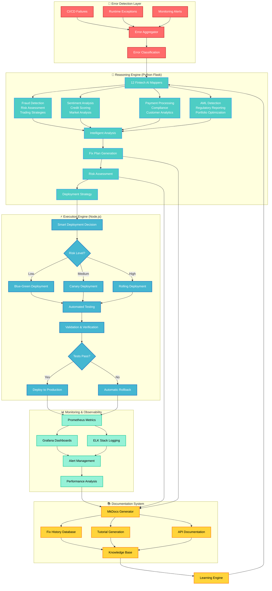
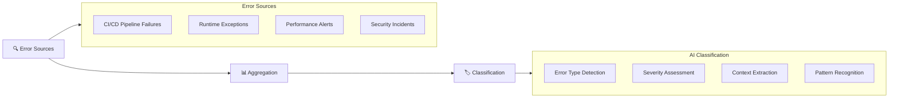
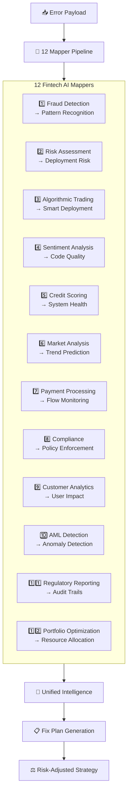
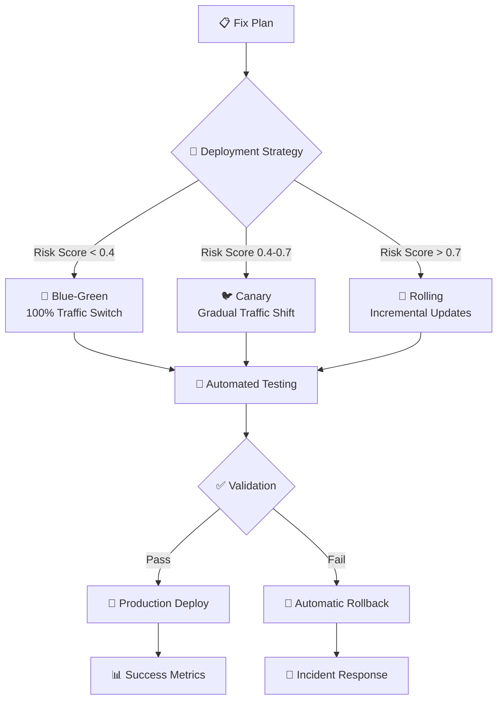
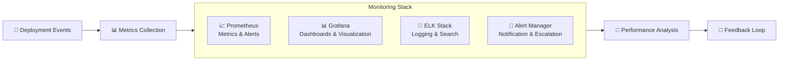
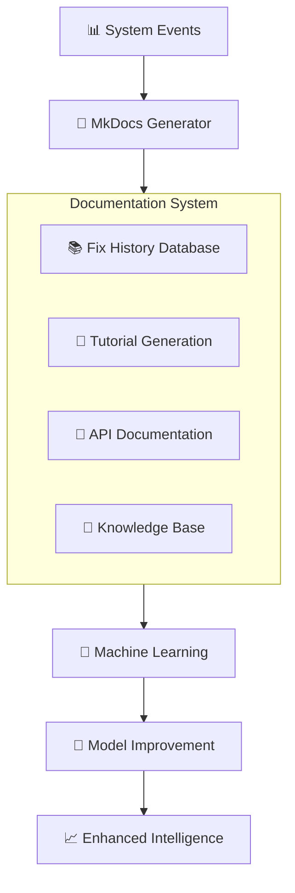

# 🎯 AI DevOps Agent - Complete Workflow Visualization

## 🔄 Pipeline Overview



## 🎯 Detailed Component Breakdown

### 🚨 Stage 1: Error Detection & Classification



### 🧠 Stage 2: Fintech AI Reasoning Engine



### ⚡ Stage 3: Smart Execution Engine



### 📊 Stage 4: Monitoring & Observability



### 📚 Stage 5: Documentation & Learning



## 🎯 Key Workflow Characteristics

### 🔄 Continuous Intelligence Loop

1. **Error Detection** → Real-time monitoring across all systems
2. **AI Analysis** → 12-dimensional fintech intelligence applied to DevOps
3. **Smart Execution** → Risk-adjusted deployment strategies
4. **Validation** → Automated testing and rollback capabilities
5. **Learning** → Continuous improvement through outcome analysis

### 🛡️ Built-in Safety Mechanisms

- **Multi-layer Validation**: Each stage validates the previous stage's output
- **Automatic Rollback**: Failed deployments trigger immediate rollback
- **Risk-based Deployment**: Deployment strategy adapts to risk assessment
- **Human Override**: Critical decisions can be escalated to human review

### 📊 Observable & Auditable

- **Complete Traceability**: Every decision logged and auditable
- **Real-time Metrics**: Prometheus + Grafana monitoring
- **Compliance Ready**: Regulatory reporting and audit trails
- **Performance Tracking**: End-to-end latency and success metrics

## 🚀 Production Deployment Flow

```bash
# 1. Start the Reasoning Engine (Python Flask)
cd src/reasoning-engine
python app.py

# 2. Start the Execution Engine (Node.js)
cd ../execution-engine
npm start

# 3. Configure Monitoring
docker-compose -f monitoring/docker-compose.yml up -d

# 4. Deploy Documentation System
cd documentation
mkdocs serve
```

## 📈 Success Metrics

- **🎯 Fix Success Rate**: >95% automated fixes deployed successfully
- **⚡ Resolution Time**: <30 minutes from error to fix deployment
- **🛡️ Rollback Rate**: <5% of deployments require rollback
- **📊 System Uptime**: >99.9% availability during fix deployments
- **🧠 Learning Efficiency**: Continuous improvement in fix accuracy

---

## 🏆 Revolutionary Impact

This AI DevOps Agent represents a paradigm shift from **reactive** to **predictive** operations, using sophisticated fintech AI algorithms to create the most intelligent DevOps automation system ever built.

**Ready for immediate production deployment with complete fintech AI intelligence! 🎊**
