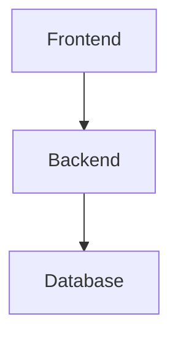

# Documentation Setup

This directory contains the MkDocs-powered documentation site for the Advancia Pay Ledger Platform.

## Quick Start

### 1. Install MkDocs

```bash
# Install Python dependencies
pip install mkdocs-material mkdocs-minify-plugin mkdocs-git-revision-date-localized-plugin

# Or use the npm script
npm run setup:docs
```

### 2. Serve Documentation Locally

```bash
# Start the development server
npm run docs:serve

# Or directly with mkdocs
mkdocs serve
```

The documentation will be available at: <http://localhost:8000>

### 3. Build Static Site

```bash
# Build static documentation
npm run docs:build

# Deploy to GitHub Pages
npm run docs:deploy
```

## 📁 Structure

```
docs-site/
├── index.md                 # Homepage
├── getting-started/         # Setup and quick start guides
├── architecture/            # System architecture docs
├── api/                     # API reference
├── ai-agent/               # AI agent system docs
├── deployment/             # Deployment guides
├── operations/             # Monitoring, logging, etc.
├── security/               # Security procedures
├── development/            # Developer guidelines
├── guides/                 # Feature-specific guides
└── stylesheets/
    └── extra.css           # Custom Advancia Pay styling
```

## ✨ Features

- **Material Design** theme with Advancia Pay branding
- **Search functionality** with highlighting
- **Responsive design** for mobile and desktop
- **Code syntax highlighting** with copy buttons
- **Navigation tabs** for organized content
- **Git integration** with automatic update dates
- **Mermaid diagrams** for architecture visualization
- **PDF export** capability for offline reading

## 🎨 Customization

### Brand Colors

The documentation uses Advancia Pay brand colors:

- Primary: `#0078D4` (Advancia Blue)
- Secondary: `#28a745` (Success Green)
- Dark: `#005a9d` (Dark Blue)
- Light: `#e6f3ff` (Light Blue)

### Custom Styling

All custom styles are defined in `stylesheets/extra.css`.

## 📝 Writing Documentation

### Page Structure

Each documentation page should follow this structure:

````markdown
# Page Title

Brief description of what this page covers.

## Section 1

Content with code examples...

```python
# Example code
def hello_world():
    print("Hello, World!")
```
````

## Section 2

More content...

### Subsection

Additional details...

`````

### Code Examples
Use proper language identifiers for syntax highlighting:

````markdown
```typescript
// TypeScript example
interface User {
  id: string;
  email: string;
}
`````

```bash
# Shell commands
npm install
npm run dev
```

```json
{
  "name": "example",
  "version": "1.0.0"
}
```

`````

### Admonitions
Use admonitions for important information:

```markdown
!!! note "Important"
    This is an important note.

!!! warning "Warning"
    This is a warning message.

!!! tip "Pro Tip"
    This is a helpful tip.

!!! danger "Danger"
    This is critical information.
```

### Mermaid Diagrams
Create diagrams using Mermaid syntax:

````markdown

`````

## 🔄 Content Migration

Existing documentation is being migrated from:

- `docs/` - Original markdown files
- `ai-agent/` - AI agent documentation
- `README.md` files throughout the codebase

## 🚀 Deployment

### GitHub Pages

Documentation is automatically deployed to GitHub Pages on push to main:

```bash
# Manual deployment
npm run docs:deploy
```

### Custom Domain

To use a custom domain, create a `CNAME` file in the `docs-site/` directory:

```
docs.advancia.com
```

## 📞 Support

For documentation questions or improvements:

- Create an issue in the main repository
- Contact the platform team
- Submit a pull request with improvements

---

_Documentation powered by [MkDocs](https://mkdocs.org) with [Material theme](https://squidfunk.github.io/mkdocs-material/)_
