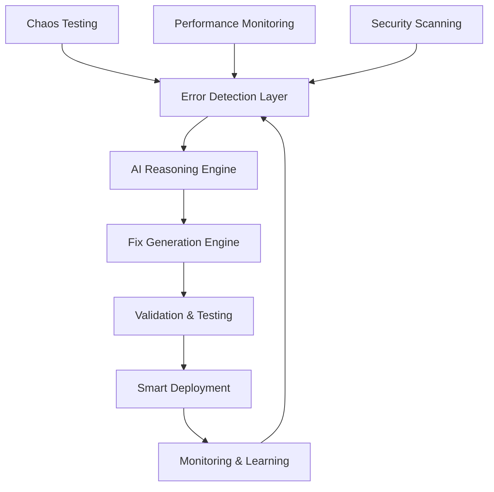

# AI Agent System Overview

The Advancia Pay Ledger Platform includes an advanced AI-powered DevOps agent system designed to automate infrastructure management, detect issues, and provide intelligent responses to system events.

## Architecture Overview

## Core Components

### 🔍 Error Detection & Monitoring

- **Real-time Error Detection**: Continuously monitors CI/CD pipelines, runtime exceptions, and performance anomalies
- **Multi-source Integration**: Aggregates data from logs, metrics, user reports, and automated testing
- **Intelligent Classification**: Uses AI to categorize and prioritize errors by severity and impact

### 🧠 AI Reasoning Engine

- **Root Cause Analysis**: Employs advanced reasoning algorithms to understand error patterns and correlations
- **Context Understanding**: Analyzes code changes, deployment history, and system state
- **Impact Assessment**: Evaluates potential business and technical impacts of detected issues

### 🛠️ Automated Fix Generation

- **Code Generation**: Automatically generates patches and fixes based on error analysis
- **Configuration Management**: Suggests infrastructure and application configuration changes
- **Dependency Resolution**: Handles package updates and compatibility issues

### ✅ Validation & Testing

- **Automated Testing**: Runs comprehensive test suites before deployment
- **Security Validation**: Ensures fixes don't introduce security vulnerabilities
- **Compliance Checking**: Validates against financial industry regulations

### 🚀 Smart Deployment

- **Risk-based Deployment**: Uses algorithmic logic to determine deployment strategies
- **Canary Releases**: Gradually rolls out fixes with automatic rollback capabilities
- **Environment Management**: Coordinates deployments across development, staging, and production

## Key Features

### Intelligent Automation

- **Self-healing Systems**: Automatically detects and fixes common issues
- **Predictive Maintenance**: Identifies potential problems before they occur
- **Continuous Learning**: Improves accuracy and effectiveness over time

### Developer Experience

- **Natural Language Interface**: Chat-based interaction for troubleshooting
- **Personalized Recommendations**: Tailored suggestions based on developer preferences
- **Automated Documentation**: Generates explanations and fix summaries

### Operational Excellence

- **24/7 Monitoring**: Continuous system health assessment
- **Performance Optimization**: Identifies and resolves performance bottlenecks
- **Cost Management**: Optimizes resource usage and infrastructure costs

## Security & Compliance

The AI agent system incorporates financial-grade security measures:

- **Audit Trail**: Comprehensive logging of all automated actions
- **Access Control**: Role-based permissions for agent operations
- **Security Scanning**: Continuous vulnerability assessment
- **Compliance Monitoring**: Ensures adherence to financial regulations

## Next Steps

- [Architecture Details](architecture.md)
- [DevOps Agent](devops-agent.md)
- [Monitoring Setup](monitoring.md)
- [Deployment Guide](deployment.md)
