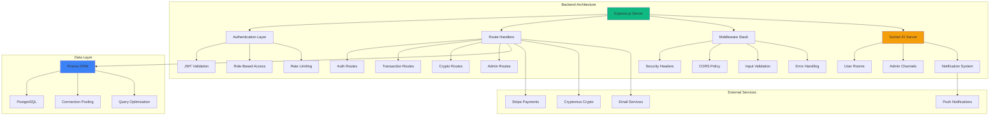

# Backend Architecture Guide

The Advancia Pay Ledger backend is built on Node.js with Express and TypeScript, providing a robust, secure, and scalable API for financial operations with real-time capabilities.

## 🏗️ Architecture Overview



## 🧩 Core Technologies

### **Server Framework**

- **Node.js 18+**: Runtime environment with ES modules support
- **Express.js**: Fast, unopinionated web framework
- **TypeScript**: Static type checking and enhanced developer experience
- **Socket.IO**: Real-time bidirectional event-based communication

### **Database & ORM**

- **PostgreSQL**: Robust relational database for financial data
- **Prisma ORM**: Type-safe database client with auto-generated types
- **Connection Pooling**: Optimized database connection management
- **Migration System**: Version-controlled database schema changes

### **Security & Authentication**

- **JWT Tokens**: JSON Web Tokens for stateless authentication
- **bcrypt**: Secure password hashing
- **Helmet.js**: Security headers and protection middleware
- **CORS**: Cross-Origin Resource Sharing configuration

### **Monitoring & Logging**

- **Winston**: Structured logging with multiple transports
- **Sentry**: Error tracking and performance monitoring
- **Prometheus**: Metrics collection for observability
- **node-cron**: Scheduled task management

## 📁 Project Structure

```
backend/
├── src/
│   ├── config/                 # Configuration management
│   │   ├── index.ts           # Environment configuration
│   │   ├── database.ts        # Database configuration
│   │   └── cors.ts            # CORS settings
│   │
│   ├── middleware/            # Express middleware
│   │   ├── auth.ts           # Authentication middleware
│   │   ├── security.ts       # Security middleware
│   │   ├── validation.ts     # Input validation
│   │   ├── errorHandler.ts   # Error handling
│   │   └── rateLimit.ts      # Rate limiting
│   │
│   ├── routes/               # API route handlers
│   │   ├── auth.ts          # Authentication endpoints
│   │   ├── users.ts         # User management
│   │   ├── transactions.ts  # Transaction operations
│   │   ├── tokens.ts        # Token wallet management
│   │   ├── rewards.ts       # Reward system
│   │   ├── cryptomus.ts     # Crypto payments
│   │   ├── payments.ts      # Stripe integration
│   │   ├── support.ts       # Support system
│   │   └── admin.ts         # Admin operations
│   │
│   ├── services/            # Business logic layer
│   │   ├── authService.ts   # Authentication service
│   │   ├── transactionService.ts # Transaction logic
│   │   ├── notificationService.ts # Notification system
│   │   ├── emailService.ts  # Email operations
│   │   ├── cryptoService.ts # Cryptocurrency operations
│   │   └── auditService.ts  # Audit trail logging
│   │
│   ├── utils/               # Utility functions
│   │   ├── decimal.ts       # Decimal number handling
│   │   ├── validation.ts    # Data validation helpers
│   │   ├── crypto.ts        # Cryptographic utilities
│   │   ├── logger.ts        # Winston logger configuration
│   │   └── sentry.ts        # Sentry error tracking
│   │
│   ├── types/               # TypeScript type definitions
│   │   ├── auth.ts         # Authentication types
│   │   ├── transaction.ts  # Transaction types
│   │   ├── user.ts         # User types
│   │   ├── crypto.ts       # Cryptocurrency types
│   │   └── api.ts          # API response types
│   │
│   ├── emails/             # Email template system
│   │   ├── emailTheme.ts   # Branding and styling
│   │   └── emailTemplates.ts # HTML email templates
│   │
│   ├── prismaClient.ts     # Singleton Prisma client
│   └── index.ts            # Application entry point
│
├── prisma/                 # Database schema and migrations
│   ├── schema.prisma      # Database schema definition
│   ├── migrations/        # Database migration files
│   └── seed.ts            # Database seeding script
│
├── __tests__/             # Test files
│   ├── unit/             # Unit tests
│   ├── integration/      # Integration tests
│   └── helpers/          # Test utilities
│
├── docs/                  # Backend documentation
├── scripts/              # Utility scripts
├── Dockerfile            # Container configuration
├── docker-compose.yml    # Local development setup
├── jest.config.js        # Jest testing configuration
├── tsconfig.json         # TypeScript configuration
├── eslint.config.mjs     # ESLint configuration
└── package.json          # Dependencies and scripts
```

## 🔧 Core Components

### **Application Bootstrap**

#### Server Initialization

```typescript
// src/index.ts
import express from "express";
import { createServer } from "http";
import { Server as SocketIOServer } from "socket.io";
import helmet from "helmet";
import cors from "cors";
import rateLimit from "express-rate-limit";
import cron from "node-cron";

import { config } from "./config";
import { errorHandler } from "./middleware/errorHandler";
import { securityHeaders } from "./middleware/security";
import { notificationService } from "./services/notificationService";

const app = express();
const server = createServer(app);
const io = new SocketIOServer(server, {
  cors: { origin: config.allowedOrigins },
});

// Security middleware (before body parsing)
app.use(helmet());
app.use(cors({ origin: config.allowedOrigins, credentials: true }));
app.use(securityHeaders);

// Stripe webhook (requires raw body)
app.use("/api/payments/webhook", express.raw({ type: "application/json" }));

// Body parsing middleware
app.use(express.json({ limit: "10mb" }));
app.use(express.urlencoded({ extended: true }));

// Rate limiting
const rateLimiter = rateLimit({
  windowMs: 15 * 60 * 1000, // 15 minutes
  max: 100, // requests per window
  message: "Too many requests from this IP",
});
app.use("/api", rateLimiter);

// Route registration
app.use("/api/auth", authRoutes);
app.use("/api/users", usersRoutes);
app.use("/api/transactions", transactionsRoutes);
app.use("/api/tokens", tokensRoutes);
app.use("/api/rewards", rewardsRoutes);
app.use("/api/cryptomus", cryptomusRoutes);
app.use("/api/payments", paymentsRoutes);
app.use("/api/support", supportRoutes);
app.use("/api/admin", adminRoutes);

// Error handling (must be last)
app.use(errorHandler);

// Socket.IO setup
notificationService.setSocketIO(io);
setupSocketAuthentication(io);

// Background jobs
cron.schedule("0 2 * * *", async () => {
  await notificationService.sendDailyDigest();
});

cron.schedule("0 */6 * * *", async () => {
  await notificationService.processFailedEmails();
});

server.listen(config.port, () => {
  logger.info(`Server running on port ${config.port}`);
});
```

### **Authentication System**

#### JWT Token Management

```typescript
// middleware/auth.ts
import jwt from "jsonwebtoken";
import { Request, Response, NextFunction } from "express";
import { PrismaClient } from "@prisma/client";
import { config } from "../config";

const prisma = new PrismaClient();

interface AuthRequest extends Request {
  user?: any;
}

export const authenticateToken = async (req: AuthRequest, res: Response, next: NextFunction) => {
  const authHeader = req.headers["authorization"];
  const token = authHeader && authHeader.split(" ")[1];

  if (!token) {
    return res.status(401).json({ error: "Access token required" });
  }

  try {
    const decoded = jwt.verify(token, config.jwtSecret) as any;

    // Verify user still exists and is active
    const user = await prisma.user.findUnique({
      where: { id: decoded.userId },
      select: {
        id: true,
        email: true,
        role: true,
        isActive: true,
        tier: { select: { name: true } },
      },
    });

    if (!user || !user.isActive) {
      return res.status(401).json({ error: "Invalid or expired token" });
    }

    req.user = user;
    next();
  } catch (error) {
    return res.status(403).json({ error: "Invalid token" });
  }
};

export const requireAdmin = (req: AuthRequest, res: Response, next: NextFunction) => {
  if (req.user?.role !== "ADMIN") {
    return res.status(403).json({ error: "Admin access required" });
  }
  next();
};

export const allowRoles = (...roles: string[]) => {
  return (req: AuthRequest, res: Response, next: NextFunction) => {
    if (!roles.includes(req.user?.role)) {
      return res.status(403).json({ error: "Insufficient permissions" });
    }
    next();
  };
};
```

#### Two-Factor Authentication

```typescript
// services/authService.ts
import speakeasy from "speakeasy";
import QRCode from "qrcode";
import { PrismaClient } from "@prisma/client";

export class AuthService {
  private prisma = new PrismaClient();

  async generateTOTPSecret(userId: string) {
    const secret = speakeasy.generateSecret({
      name: `Advancia Pay (${userId})`,
      issuer: "Advancia Pay Ledger",
    });

    // Store secret temporarily (user must verify before activation)
    await this.prisma.user.update({
      where: { id: userId },
      data: { tempTotpSecret: secret.base32 },
    });

    const qrCodeUrl = await QRCode.toDataURL(secret.otpauth_url);
    return { secret: secret.base32, qrCode: qrCodeUrl };
  }

  async verifyTOTP(userId: string, token: string): Promise<boolean> {
    const user = await this.prisma.user.findUnique({
      where: { id: userId },
      select: { totpSecret: true, tempTotpSecret: true },
    });

    const secret = user?.totpSecret || user?.tempTotpSecret;
    if (!secret) return false;

    return speakeasy.totp.verify({
      secret,
      encoding: "base32",
      token,
      window: 1,
    });
  }

  async activateTOTP(userId: string, token: string): Promise<boolean> {
    if (await this.verifyTOTP(userId, token)) {
      const user = await this.prisma.user.findUnique({
        where: { id: userId },
        select: { tempTotpSecret: true },
      });

      await this.prisma.user.update({
        where: { id: userId },
        data: {
          totpSecret: user.tempTotpSecret,
          tempTotpSecret: null,
          isTotpEnabled: true,
        },
      });

      return true;
    }
    return false;
  }
}
```

### **Real-time Communication**

#### Socket.IO Integration

```typescript
// services/socketService.ts
import { Server as SocketIOServer } from "socket.io";
import jwt from "jsonwebtoken";
import { config } from "../config";
import { logger } from "../utils/logger";

export class SocketService {
  private io: SocketIOServer;
  private authenticatedSockets: Map<string, string> = new Map();

  constructor(io: SocketIOServer) {
    this.io = io;
    this.setupAuthentication();
    this.setupEventHandlers();
  }

  private setupAuthentication() {
    this.io.use(async (socket, next) => {
      try {
        const token = socket.handshake.auth.token;
        const decoded = jwt.verify(token, config.jwtSecret) as any;

        socket.userId = decoded.userId;
        socket.userRole = decoded.role;
        this.authenticatedSockets.set(socket.id, decoded.userId);

        next();
      } catch (error) {
        next(new Error("Authentication error"));
      }
    });
  }

  private setupEventHandlers() {
    this.io.on("connection", (socket) => {
      logger.info(`User ${socket.userId} connected`);

      // Join user-specific room
      socket.join(`user-${socket.userId}`);

      // Join admin room if user is admin
      if (socket.userRole === "ADMIN") {
        socket.join("admins");
      }

      // Handle room joining
      socket.on("join-room", (room) => {
        if (this.isAuthorizedForRoom(socket, room)) {
          socket.join(room);
          logger.info(`User ${socket.userId} joined room ${room}`);
        }
      });

      // Handle disconnection
      socket.on("disconnect", () => {
        this.authenticatedSockets.delete(socket.id);
        logger.info(`User ${socket.userId} disconnected`);
      });
    });
  }

  private isAuthorizedForRoom(socket: any, room: string): boolean {
    // Users can only join their own room or public rooms
    if (room === `user-${socket.userId}`) return true;
    if (room === "public") return true;
    if (room === "admins" && socket.userRole === "ADMIN") return true;
    return false;
  }

  // Emit to specific user
  public emitToUser(userId: string, event: string, data: any) {
    this.io.to(`user-${userId}`).emit(event, data);
  }

  // Emit to all admins
  public emitToAdmins(event: string, data: any) {
    this.io.to("admins").emit(event, data);
  }

  // Broadcast to all connected users
  public broadcast(event: string, data: any) {
    this.io.emit(event, data);
  }
}
```

### **Transaction Management**

#### Transaction Service

```typescript
// services/transactionService.ts
import { PrismaClient, TransactionStatus } from "@prisma/client";
import { Decimal } from "@prisma/client/runtime";
import { serializeDecimal } from "../utils/decimal";
import { auditService } from "./auditService";
import { notificationService } from "./notificationService";

export class TransactionService {
  private prisma = new PrismaClient();

  async createTransaction(data: { userId: string; type: string; amount: Decimal; description?: string; metadata?: any }) {
    const transaction = await this.prisma.transaction.create({
      data: {
        ...data,
        status: "PENDING",
        transactionId: this.generateTransactionId(),
      },
      include: {
        user: { select: { email: true, firstName: true } },
      },
    });

    // Audit logging
    await auditService.logTransaction(transaction.userId, "CREATE", {
      transactionId: transaction.id,
      amount: serializeDecimal(transaction.amount),
      type: transaction.type,
    });

    // Real-time notification
    notificationService.emitToUser(transaction.userId, "transaction-created", {
      id: transaction.id,
      type: transaction.type,
      amount: serializeDecimal(transaction.amount),
      status: transaction.status,
    });

    return this.serializeTransaction(transaction);
  }

  async updateTransactionStatus(transactionId: string, status: TransactionStatus, updatedBy: string, reason?: string) {
    const transaction = await this.prisma.transaction.update({
      where: { id: transactionId },
      data: {
        status,
        updatedAt: new Date(),
        ...(reason && { metadata: { reason } }),
      },
      include: {
        user: { select: { email: true, firstName: true } },
      },
    });

    // Audit logging
    await auditService.logTransaction(updatedBy, "UPDATE_STATUS", {
      transactionId: transaction.id,
      oldStatus: transaction.status,
      newStatus: status,
      reason,
    });

    // Send notifications based on status
    await this.handleStatusChangeNotifications(transaction, status);

    return this.serializeTransaction(transaction);
  }

  private async handleStatusChangeNotifications(transaction: any, status: TransactionStatus) {
    const notificationData = {
      transactionId: transaction.id,
      type: transaction.type,
      amount: serializeDecimal(transaction.amount),
      status,
    };

    // Real-time notification
    notificationService.emitToUser(transaction.userId, "transaction-status-updated", notificationData);

    // Email notification for important status changes
    if (status === "COMPLETED") {
      await notificationService.sendTransactionCompletedEmail(transaction.user.email, transaction.user.firstName, notificationData);
    } else if (status === "FAILED") {
      await notificationService.sendTransactionFailedEmail(transaction.user.email, transaction.user.firstName, notificationData);
    }

    // Push notification
    await notificationService.sendPushNotification(transaction.userId, {
      title: "Transaction Update",
      body: `Your ${transaction.type} transaction has been ${status.toLowerCase()}`,
      data: notificationData,
    });
  }

  private generateTransactionId(): string {
    const timestamp = Date.now().toString(36);
    const randomStr = Math.random().toString(36).substring(2, 8);
    return `TXN-${timestamp}-${randomStr}`.toUpperCase();
  }

  private serializeTransaction(transaction: any) {
    return {
      ...transaction,
      amount: serializeDecimal(transaction.amount),
    };
  }
}
```

### **Cryptocurrency Integration**

#### Cryptomus Payment Service

```typescript
// services/cryptoService.ts
import crypto from "crypto";
import axios from "axios";
import { PrismaClient } from "@prisma/client";
import { config } from "../config";
import { logger } from "../utils/logger";

export class CryptoService {
  private prisma = new PrismaClient();
  private apiKey = config.cryptomusApiKey;
  private merchantId = config.cryptomusMerchantId;

  async createPaymentInvoice(data: { amount: string; currency: string; orderId: string; userId: string; callbackUrl?: string }) {
    try {
      const payload = {
        amount: data.amount,
        currency: data.currency,
        order_id: data.orderId,
        url_callback: data.callbackUrl || `${config.baseUrl}/api/cryptomus/webhook`,
        url_return: `${config.frontendUrl}/payment/success`,
        url_cancel: `${config.frontendUrl}/payment/cancel`,
        merchant: this.merchantId,
        lifetime: 3600, // 1 hour
      };

      const signature = this.generateSignature(payload);

      const response = await axios.post("https://api.cryptomus.com/v1/payment", payload, {
        headers: {
          "Content-Type": "application/json",
          merchant: this.merchantId,
          sign: signature,
        },
      });

      // Store payment record
      const payment = await this.prisma.cryptoPayment.create({
        data: {
          orderId: data.orderId,
          userId: data.userId,
          amount: data.amount,
          currency: data.currency,
          paymentId: response.data.result.payment_id,
          status: "PENDING",
          paymentUrl: response.data.result.url,
          expiresAt: new Date(Date.now() + 3600 * 1000),
        },
      });

      logger.info(`Crypto payment created: ${payment.id}`);

      return {
        paymentId: payment.id,
        paymentUrl: response.data.result.url,
        amount: data.amount,
        currency: data.currency,
        expiresAt: payment.expiresAt,
      };
    } catch (error) {
      logger.error("Crypto payment creation failed:", error);
      throw new Error("Failed to create crypto payment");
    }
  }

  async handleWebhook(payload: any, signature: string): Promise<boolean> {
    try {
      // Verify signature
      if (!this.verifyWebhookSignature(payload, signature)) {
        logger.warn("Invalid webhook signature");
        return false;
      }

      const payment = await this.prisma.cryptoPayment.findUnique({
        where: { paymentId: payload.order_id },
        include: { user: true },
      });

      if (!payment) {
        logger.warn(`Payment not found: ${payload.order_id}`);
        return false;
      }

      // Update payment status
      const updatedPayment = await this.prisma.cryptoPayment.update({
        where: { id: payment.id },
        data: {
          status: payload.status === "paid" ? "COMPLETED" : "FAILED",
          transactionHash: payload.txid,
          paidAt: payload.status === "paid" ? new Date() : null,
        },
      });

      // Process completed payment
      if (payload.status === "paid") {
        await this.processCompletedPayment(updatedPayment);
      }

      logger.info(`Crypto payment ${payment.id} updated to ${updatedPayment.status}`);
      return true;
    } catch (error) {
      logger.error("Webhook processing failed:", error);
      return false;
    }
  }

  private generateSignature(data: any): string {
    const jsonString = JSON.stringify(data);
    const hash = crypto
      .createHash("md5")
      .update(jsonString + this.apiKey)
      .digest("hex");
    return hash;
  }

  private verifyWebhookSignature(payload: any, signature: string): boolean {
    const expectedSignature = this.generateSignature(payload);
    return crypto.timingSafeEqual(Buffer.from(signature), Buffer.from(expectedSignature));
  }

  private async processCompletedPayment(payment: any) {
    // Credit user account or process order
    // Implementation depends on business logic

    // Send notification
    await notificationService.emitToUser(payment.userId, "payment-completed", {
      paymentId: payment.id,
      amount: payment.amount,
      currency: payment.currency,
    });
  }
}
```

### **Email System**

#### Email Template Service

```typescript
// services/emailService.ts
import nodemailer from "nodemailer";
import { config } from "../config";
import { emailTheme } from "../emails/emailTheme";
import { emailTemplates } from "../emails/emailTemplates";
import { logger } from "../utils/logger";

export class EmailService {
  private transporter: nodemailer.Transporter;

  constructor() {
    this.transporter = nodemailer.createTransporter({
      host: config.smtp.host,
      port: config.smtp.port,
      secure: config.smtp.port === 465,
      auth: {
        user: config.smtp.user,
        pass: config.smtp.password,
      },
    });
  }

  async sendPasswordResetEmail(email: string, firstName: string, resetToken: string) {
    try {
      const resetUrl = `${config.frontendUrl}/reset-password?token=${resetToken}`;

      const html = emailTemplates.resetPasswordTemplate({
        firstName,
        resetUrl,
        theme: emailTheme,
      });

      await this.transporter.sendMail({
        from: `"Advancia Pay" <${config.smtp.fromEmail}>`,
        to: email,
        subject: "Reset Your Password - Advancia Pay",
        html,
        text: `Reset your password: ${resetUrl}`,
      });

      logger.info(`Password reset email sent to ${email}`);
    } catch (error) {
      logger.error("Failed to send password reset email:", error);
      throw error;
    }
  }

  async sendVerificationEmail(email: string, firstName: string, verificationCode: string) {
    try {
      const html = emailTemplates.verificationTemplate({
        firstName,
        verificationCode,
        theme: emailTheme,
      });

      await this.transporter.sendMail({
        from: `"Advancia Pay" <${config.smtp.fromEmail}>`,
        to: email,
        subject: "Verify Your Account - Advancia Pay",
        html,
        text: `Your verification code: ${verificationCode}`,
      });

      logger.info(`Verification email sent to ${email}`);
    } catch (error) {
      logger.error("Failed to send verification email:", error);
      throw error;
    }
  }

  async sendWelcomeEmail(email: string, firstName: string) {
    try {
      const dashboardUrl = `${config.frontendUrl}/dashboard`;

      const html = emailTemplates.welcomeTemplate({
        firstName,
        dashboardUrl,
        theme: emailTheme,
      });

      await this.transporter.sendMail({
        from: `"Advancia Pay" <${config.smtp.fromEmail}>`,
        to: email,
        subject: "Welcome to Advancia Pay!",
        html,
      });

      logger.info(`Welcome email sent to ${email}`);
    } catch (error) {
      logger.error("Failed to send welcome email:", error);
      throw error;
    }
  }
}
```

## 🔒 Security Implementation

### **Input Validation & Sanitization**

```typescript
// middleware/validation.ts
import { body, param, query, validationResult } from "express-validator";
import { Request, Response, NextFunction } from "express";
import DOMPurify from "isomorphic-dompurify";

export const validateInput = (validations: any[]) => {
  return async (req: Request, res: Response, next: NextFunction) => {
    await Promise.all(validations.map((validation) => validation.run(req)));

    const errors = validationResult(req);
    if (!errors.isEmpty()) {
      return res.status(400).json({
        error: "Validation failed",
        details: errors.array(),
      });
    }

    // Sanitize request body
    if (req.body) {
      req.body = sanitizeObject(req.body);
    }

    next();
  };
};

const sanitizeObject = (obj: any): any => {
  if (typeof obj === "string") {
    return DOMPurify.sanitize(obj);
  }

  if (Array.isArray(obj)) {
    return obj.map(sanitizeObject);
  }

  if (obj && typeof obj === "object") {
    const sanitized: any = {};
    for (const [key, value] of Object.entries(obj)) {
      sanitized[key] = sanitizeObject(value);
    }
    return sanitized;
  }

  return obj;
};

// Example validation schemas
export const transactionValidation = [
  body("amount")
    .isNumeric()
    .withMessage("Amount must be a number")
    .custom((value) => value > 0)
    .withMessage("Amount must be positive"),

  body("type").isIn(["DEPOSIT", "WITHDRAWAL", "TRANSFER"]).withMessage("Invalid transaction type"),

  body("description").optional().isLength({ max: 500 }).withMessage("Description too long"),
];
```

### **Rate Limiting & DDoS Protection**

```typescript
// middleware/rateLimit.ts
import rateLimit from "express-rate-limit";
import RedisStore from "rate-limit-redis";
import Redis from "ioredis";
import { config } from "../config";

const redisClient = new Redis(config.redisUrl);

export const createRateLimit = (options: { windowMs: number; max: number; message?: string }) => {
  return rateLimit({
    store: new RedisStore({
      sendCommand: (...args: string[]) => redisClient.call(...args),
    }),
    windowMs: options.windowMs,
    max: options.max,
    message: options.message || "Too many requests",
    standardHeaders: true,
    legacyHeaders: false,
  });
};

// Different rate limits for different endpoints
export const authRateLimit = createRateLimit({
  windowMs: 15 * 60 * 1000, // 15 minutes
  max: 5, // 5 attempts per window
  message: "Too many authentication attempts",
});

export const apiRateLimit = createRateLimit({
  windowMs: 15 * 60 * 1000, // 15 minutes
  max: 100, // 100 requests per window
  message: "API rate limit exceeded",
});

export const transactionRateLimit = createRateLimit({
  windowMs: 60 * 1000, // 1 minute
  max: 10, // 10 transactions per minute
  message: "Transaction rate limit exceeded",
});
```

### **SQL Injection Prevention**

```typescript
// utils/queryBuilder.ts
import { PrismaClient } from "@prisma/client";

export class SafeQueryBuilder {
  private prisma = new PrismaClient();

  // Safe parameterized queries
  async findUsers(filters: { email?: string; role?: string; isActive?: boolean; limit?: number; offset?: number }) {
    const where: any = {};

    if (filters.email) {
      where.email = { contains: filters.email, mode: "insensitive" };
    }

    if (filters.role) {
      where.role = filters.role;
    }

    if (typeof filters.isActive === "boolean") {
      where.isActive = filters.isActive;
    }

    return await this.prisma.user.findMany({
      where,
      select: {
        id: true,
        email: true,
        firstName: true,
        lastName: true,
        role: true,
        isActive: true,
        createdAt: true,
      },
      take: Math.min(filters.limit || 50, 100), // Cap at 100
      skip: filters.offset || 0,
    });
  }

  // Safe transaction filtering
  async findTransactions(
    userId: string,
    filters: {
      type?: string;
      status?: string;
      fromDate?: Date;
      toDate?: Date;
      limit?: number;
      offset?: number;
    },
  ) {
    const where: any = { userId };

    if (filters.type) {
      where.type = filters.type;
    }

    if (filters.status) {
      where.status = filters.status;
    }

    if (filters.fromDate || filters.toDate) {
      where.createdAt = {};
      if (filters.fromDate) where.createdAt.gte = filters.fromDate;
      if (filters.toDate) where.createdAt.lte = filters.toDate;
    }

    return await this.prisma.transaction.findMany({
      where,
      include: {
        user: {
          select: { firstName: true, lastName: true, email: true },
        },
      },
      orderBy: { createdAt: "desc" },
      take: Math.min(filters.limit || 20, 50), // Cap at 50
      skip: filters.offset || 0,
    });
  }
}
```

## 📊 Monitoring & Observability

### **Structured Logging**

```typescript
// utils/logger.ts
import winston from "winston";
import { config } from "../config";

const logFormat = winston.format.combine(
  winston.format.timestamp(),
  winston.format.errors({ stack: true }),
  winston.format.json(),
  winston.format.printf(({ timestamp, level, message, ...meta }) => {
    return JSON.stringify({
      timestamp,
      level,
      message,
      ...meta,
    });
  }),
);

export const logger = winston.createLogger({
  level: config.logLevel || "info",
  format: logFormat,
  transports: [
    new winston.transports.File({
      filename: "logs/error.log",
      level: "error",
      maxsize: 10485760, // 10MB
      maxFiles: 5,
    }),
    new winston.transports.File({
      filename: "logs/combined.log",
      maxsize: 10485760, // 10MB
      maxFiles: 10,
    }),
  ],
});

// Console logging in development
if (config.nodeEnv !== "production") {
  logger.add(
    new winston.transports.Console({
      format: winston.format.combine(winston.format.colorize(), winston.format.simple()),
    }),
  );
}

// Context-aware logging helpers
export const createContextLogger = (context: string) => {
  return {
    info: (message: string, meta?: any) => logger.info(message, { context, ...meta }),
    warn: (message: string, meta?: any) => logger.warn(message, { context, ...meta }),
    error: (message: string, meta?: any) => logger.error(message, { context, ...meta }),
    debug: (message: string, meta?: any) => logger.debug(message, { context, ...meta }),
  };
};
```

### **Health Checks & Metrics**

```typescript
// routes/health.ts
import { Router, Request, Response } from "express";
import { PrismaClient } from "@prisma/client";
import Redis from "ioredis";
import { config } from "../config";

const router = Router();
const prisma = new PrismaClient();
const redis = new Redis(config.redisUrl);

// Basic health check
router.get("/health", async (req: Request, res: Response) => {
  const checks = await Promise.allSettled([checkDatabase(), checkRedis(), checkExternalServices()]);

  const results = {
    status: "healthy",
    timestamp: new Date().toISOString(),
    uptime: process.uptime(),
    memory: process.memoryUsage(),
    checks: {
      database: checks[0].status === "fulfilled" ? "healthy" : "unhealthy",
      redis: checks[1].status === "fulfilled" ? "healthy" : "unhealthy",
      external: checks[2].status === "fulfilled" ? "healthy" : "unhealthy",
    },
  };

  const isHealthy = Object.values(results.checks).every((status) => status === "healthy");

  res.status(isHealthy ? 200 : 503).json(results);
});

// Detailed metrics endpoint
router.get("/metrics", async (req: Request, res: Response) => {
  const [activeUsers, transactionCount, systemLoad] = await Promise.all([getActiveUsersCount(), getTransactionCount(), getSystemMetrics()]);

  res.json({
    users: { active: activeUsers },
    transactions: { total: transactionCount },
    system: systemLoad,
    timestamp: new Date().toISOString(),
  });
});

async function checkDatabase(): Promise<void> {
  await prisma.$queryRaw`SELECT 1`;
}

async function checkRedis(): Promise<void> {
  await redis.ping();
}

async function checkExternalServices(): Promise<void> {
  // Check external API endpoints
  // Implementation depends on services used
}

async function getActiveUsersCount(): Promise<number> {
  const oneHourAgo = new Date(Date.now() - 60 * 60 * 1000);
  return await prisma.user.count({
    where: {
      lastLoginAt: { gte: oneHourAgo },
      isActive: true,
    },
  });
}

async function getTransactionCount(): Promise<number> {
  const today = new Date();
  today.setHours(0, 0, 0, 0);

  return await prisma.transaction.count({
    where: { createdAt: { gte: today } },
  });
}

async function getSystemMetrics() {
  return {
    memory: process.memoryUsage(),
    uptime: process.uptime(),
    cpuUsage: process.cpuUsage(),
    nodeVersion: process.version,
  };
}

export { router as healthRouter };
```

## 🚀 Performance Optimization

### **Database Query Optimization**

```typescript
// utils/queryOptimizer.ts
import { PrismaClient } from "@prisma/client";

export class QueryOptimizer {
  private prisma = new PrismaClient();

  // Efficient pagination with cursor-based approach
  async getPaginatedTransactions(userId: string, cursor?: string, limit: number = 20) {
    return await this.prisma.transaction.findMany({
      where: { userId },
      take: limit,
      ...(cursor && {
        cursor: { id: cursor },
        skip: 1,
      }),
      orderBy: { createdAt: "desc" },
      select: {
        id: true,
        type: true,
        amount: true,
        status: true,
        createdAt: true,
        description: true,
      },
    });
  }

  // Batch operations for better performance
  async batchUpdateTransactions(transactionIds: string[], updateData: any) {
    return await this.prisma.transaction.updateMany({
      where: { id: { in: transactionIds } },
      data: updateData,
    });
  }

  // Optimized user statistics
  async getUserStatistics(userId: string) {
    const [user, transactionStats] = await Promise.all([
      this.prisma.user.findUnique({
        where: { id: userId },
        include: {
          tier: true,
          _count: { select: { transactions: true } },
        },
      }),
      this.prisma.transaction.groupBy({
        by: ["status", "type"],
        where: { userId },
        _sum: { amount: true },
        _count: true,
      }),
    ]);

    return { user, transactionStats };
  }
}
```

### **Caching Strategy**

```typescript
// services/cacheService.ts
import Redis from "ioredis";
import { config } from "../config";
import { logger } from "../utils/logger";

export class CacheService {
  private redis = new Redis(config.redisUrl);
  private defaultTTL = 300; // 5 minutes

  async get<T>(key: string): Promise<T | null> {
    try {
      const cached = await this.redis.get(key);
      return cached ? JSON.parse(cached) : null;
    } catch (error) {
      logger.warn(`Cache get failed for key ${key}:`, error);
      return null;
    }
  }

  async set(key: string, value: any, ttl: number = this.defaultTTL): Promise<void> {
    try {
      await this.redis.setex(key, ttl, JSON.stringify(value));
    } catch (error) {
      logger.warn(`Cache set failed for key ${key}:`, error);
    }
  }

  async delete(key: string): Promise<void> {
    try {
      await this.redis.del(key);
    } catch (error) {
      logger.warn(`Cache delete failed for key ${key}:`, error);
    }
  }

  async invalidatePattern(pattern: string): Promise<void> {
    try {
      const keys = await this.redis.keys(pattern);
      if (keys.length > 0) {
        await this.redis.del(...keys);
      }
    } catch (error) {
      logger.warn(`Cache pattern invalidation failed for ${pattern}:`, error);
    }
  }

  // Cache wrapper for database queries
  async cached<T>(key: string, fetcher: () => Promise<T>, ttl: number = this.defaultTTL): Promise<T> {
    const cached = await this.get<T>(key);
    if (cached) {
      return cached;
    }

    const result = await fetcher();
    await this.set(key, result, ttl);
    return result;
  }
}

// Usage example
export const cacheService = new CacheService();

// In a route handler
app.get("/api/users/:id/profile", async (req, res) => {
  const userId = req.params.id;
  const cacheKey = `user:${userId}:profile`;

  const profile = await cacheService.cached(
    cacheKey,
    () => userService.getProfile(userId),
    600, // 10 minutes
  );

  res.json(profile);
});
```

## 🧪 Testing Strategy

### **Unit Testing**

```typescript
// __tests__/services/transactionService.test.ts
import { TransactionService } from "../../src/services/transactionService";
import { PrismaClient } from "@prisma/client";
import { mockDeep, DeepMockProxy } from "jest-mock-extended";

jest.mock("../../src/prismaClient", () => ({
  __esModule: true,
  default: mockDeep<PrismaClient>(),
}));

describe("TransactionService", () => {
  let transactionService: TransactionService;
  let prismaMock: DeepMockProxy<PrismaClient>;

  beforeEach(() => {
    prismaMock = require("../../src/prismaClient").default;
    transactionService = new TransactionService();
  });

  it("should create a transaction successfully", async () => {
    const mockTransaction = {
      id: "1",
      userId: "user1",
      type: "DEPOSIT",
      amount: new Decimal(100),
      status: "PENDING",
      transactionId: "TXN-123",
      createdAt: new Date(),
      user: { email: "test@example.com", firstName: "John" },
    };

    prismaMock.transaction.create.mockResolvedValue(mockTransaction);

    const result = await transactionService.createTransaction({
      userId: "user1",
      type: "DEPOSIT",
      amount: new Decimal(100),
    });

    expect(prismaMock.transaction.create).toHaveBeenCalledWith({
      data: expect.objectContaining({
        userId: "user1",
        type: "DEPOSIT",
        amount: new Decimal(100),
        status: "PENDING",
      }),
      include: { user: { select: { email: true, firstName: true } } },
    });

    expect(result).toEqual(
      expect.objectContaining({
        id: "1",
        amount: "100",
      }),
    );
  });
});
```

### **Integration Testing**

```typescript
// __tests__/integration/auth.test.ts
import request from "supertest";
import { app } from "../../src/index";
import { PrismaClient } from "@prisma/client";

const prisma = new PrismaClient();

describe("Authentication Integration", () => {
  beforeAll(async () => {
    // Setup test database
    await prisma.$connect();
  });

  afterAll(async () => {
    // Cleanup
    await prisma.user.deleteMany();
    await prisma.$disconnect();
  });

  it("should register a new user", async () => {
    const userData = {
      email: "test@example.com",
      password: "securepassword123",
      firstName: "John",
      lastName: "Doe",
    };

    const response = await request(app).post("/api/auth/register").send(userData).expect(201);

    expect(response.body).toHaveProperty("token");
    expect(response.body.user.email).toBe(userData.email);
  });

  it("should login with correct credentials", async () => {
    const loginData = {
      email: "test@example.com",
      password: "securepassword123",
    };

    const response = await request(app).post("/api/auth/login").send(loginData).expect(200);

    expect(response.body).toHaveProperty("token");
    expect(response.body.user.email).toBe(loginData.email);
  });

  it("should reject invalid credentials", async () => {
    const invalidData = {
      email: "test@example.com",
      password: "wrongpassword",
    };

    await request(app).post("/api/auth/login").send(invalidData).expect(401);
  });
});
```

This comprehensive backend architecture provides a solid foundation for building secure, scalable, and maintainable financial applications with real-time capabilities, comprehensive security measures, and robust monitoring systems.
