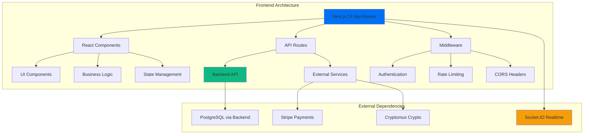

# Frontend Architecture Guide

The Advancia Pay Ledger frontend is built on Next.js 14 with the App Router, providing a modern, performant, and scalable user interface for our financial platform.

## 🏗️ Architecture Overview



## 🧩 Core Technologies

### **Framework Stack**

- **Next.js 14**: React framework with App Router for server-side rendering
- **React 18**: Component library with modern hooks and concurrent features
- **TypeScript**: Type-safe JavaScript for enhanced developer experience
- **Tailwind CSS**: Utility-first CSS framework for rapid styling

### **State Management**

- **React Context**: Global state management for user sessions
- **SWR/React Query**: Data fetching and caching for API calls
- **Local State**: Component-level state with useState and useReducer
- **Form State**: React Hook Form for complex form management

### **Development Tools**

- **ESLint**: Code linting with custom configuration
- **Prettier**: Code formatting for consistent style
- **TypeScript**: Static type checking for runtime safety
- **Jest**: Unit testing framework with React Testing Library

## 📁 Project Structure

```
frontend/
├── src/
│   ├── app/                    # Next.js 14 App Router pages
│   │   ├── (auth)/            # Authentication pages group
│   │   ├── dashboard/         # Dashboard pages
│   │   ├── transactions/      # Transaction management
│   │   ├── wallet/           # Crypto wallet interface
│   │   ├── admin/            # Admin panel
│   │   ├── api/              # API route handlers
│   │   ├── globals.css       # Global styles
│   │   ├── layout.tsx        # Root layout component
│   │   └── page.tsx          # Home page
│   │
│   ├── components/            # Reusable React components
│   │   ├── ui/               # Base UI components (shadcn/ui)
│   │   ├── auth/             # Authentication components
│   │   ├── dashboard/        # Dashboard specific components
│   │   ├── transactions/     # Transaction related components
│   │   ├── wallet/           # Wallet interface components
│   │   └── common/           # Shared components
│   │
│   ├── lib/                   # Utility libraries and configurations
│   │   ├── auth.ts           # Authentication utilities
│   │   ├── utils.ts          # General utility functions
│   │   ├── validations.ts    # Form validation schemas
│   │   └── constants.ts      # Application constants
│   │
│   ├── hooks/                 # Custom React hooks
│   │   ├── useAuth.ts        # Authentication hook
│   │   ├── useSocket.ts      # Socket.IO integration
│   │   ├── useTransaction.ts # Transaction management
│   │   └── useWallet.ts      # Wallet operations
│   │
│   ├── services/             # API service layer
│   │   ├── api.ts           # Base API client configuration
│   │   ├── auth.service.ts  # Authentication API calls
│   │   ├── transaction.service.ts # Transaction API
│   │   └── wallet.service.ts # Wallet API
│   │
│   ├── types/                # TypeScript type definitions
│   │   ├── api.ts           # API response types
│   │   ├── auth.ts          # Authentication types
│   │   ├── transaction.ts   # Transaction types
│   │   └── wallet.ts        # Wallet types
│   │
│   └── styles/               # CSS and styling files
│       ├── components.css    # Component-specific styles
│       └── utilities.css     # Utility classes
│
├── public/                   # Static assets
│   ├── images/              # Image assets
│   ├── icons/               # Icon files
│   └── favicon.ico          # Site favicon
│
├── __tests__/               # Test files
│   ├── components/          # Component tests
│   ├── pages/              # Page tests
│   └── utils/              # Utility tests
│
├── docs/                    # Documentation
├── next.config.js          # Next.js configuration
├── tailwind.config.js      # Tailwind CSS configuration
├── tsconfig.json           # TypeScript configuration
├── eslint.config.mjs       # ESLint configuration
├── jest.config.js          # Jest configuration
└── package.json            # Dependencies and scripts
```

## 🔧 Key Components

### **Authentication System**

#### JWT Token Management

```typescript
// hooks/useAuth.ts
export const useAuth = () => {
  const [user, setUser] = useState<User | null>(null);
  const [token, setToken] = useState<string | null>(null);

  const login = async (credentials: LoginCredentials) => {
    const response = await authService.login(credentials);
    setToken(response.token);
    setUser(response.user);
    localStorage.setItem("token", response.token);
  };

  const logout = () => {
    setToken(null);
    setUser(null);
    localStorage.removeItem("token");
  };

  return { user, token, login, logout, isAuthenticated: !!token };
};
```

#### Protected Routes

```typescript
// components/auth/ProtectedRoute.tsx
export const ProtectedRoute: React.FC<{ children: React.ReactNode }> = ({ children }) => {
  const { isAuthenticated, user } = useAuth();
  const router = useRouter();

  useEffect(() => {
    if (!isAuthenticated) {
      router.push('/login');
    }
  }, [isAuthenticated]);

  if (!isAuthenticated) {
    return <LoadingSpinner />;
  }

  return <>{children}</>;
};
```

### **Real-time Communication**

#### Socket.IO Integration

```typescript
// hooks/useSocket.ts
export const useSocket = () => {
  const [socket, setSocket] = useState<Socket | null>(null);
  const { user } = useAuth();

  useEffect(() => {
    if (user) {
      const newSocket = io(process.env.NEXT_PUBLIC_API_URL, {
        auth: { token: localStorage.getItem("token") },
      });

      newSocket.emit("join-room", `user-${user.id}`);
      setSocket(newSocket);

      return () => newSocket.close();
    }
  }, [user]);

  return socket;
};
```

#### Real-time Notifications

```typescript
// components/common/NotificationSystem.tsx
export const NotificationSystem: React.FC = () => {
  const socket = useSocket();
  const [notifications, setNotifications] = useState<Notification[]>([]);

  useEffect(() => {
    if (socket) {
      socket.on('transaction-update', (data) => {
        addNotification({
          type: 'success',
          message: `Transaction ${data.type} completed`,
          data
        });
      });

      socket.on('payment-received', (data) => {
        addNotification({
          type: 'info',
          message: `Payment received: ${data.amount}`,
          data
        });
      });
    }
  }, [socket]);

  return (
    <div className="notifications-container">
      {notifications.map(notification => (
        <NotificationCard key={notification.id} notification={notification} />
      ))}
    </div>
  );
};
```

### **Transaction Management**

#### Transaction Dashboard

```typescript
// components/transactions/TransactionDashboard.tsx
export const TransactionDashboard: React.FC = () => {
  const { data: transactions, error, isLoading } = useSWR(
    '/api/transactions',
    transactionService.getAll
  );

  const { mutate } = useSWRConfig();

  const handleTransactionAction = async (id: string, action: string) => {
    try {
      await transactionService.updateStatus(id, action);
      mutate('/api/transactions'); // Revalidate data
      toast.success(`Transaction ${action} successful`);
    } catch (error) {
      toast.error(`Transaction ${action} failed`);
    }
  };

  if (isLoading) return <TransactionSkeleton />;
  if (error) return <ErrorMessage error={error} />;

  return (
    <div className="transaction-dashboard">
      <TransactionFilters />
      <TransactionTable
        transactions={transactions}
        onAction={handleTransactionAction}
      />
      <TransactionPagination />
    </div>
  );
};
```

### **Crypto Wallet Interface**

#### Wallet Management

```typescript
// components/wallet/WalletDashboard.tsx
export const WalletDashboard: React.FC = () => {
  const { data: wallets } = useSWR('/api/wallets', walletService.getAll);
  const { data: rates } = useSWR('/api/crypto/rates', cryptoService.getRates);

  return (
    <div className="wallet-dashboard">
      <WalletBalance wallets={wallets} rates={rates} />
      <CryptoTransactionHistory />
      <QuickActions />
    </div>
  );
};
```

#### Ethereum Integration

```typescript
// services/ethereum.service.ts
import { ethers } from "ethers";

export class EthereumService {
  private provider: ethers.providers.Provider;

  constructor() {
    this.provider = new ethers.providers.JsonRpcProvider(process.env.NEXT_PUBLIC_ETHEREUM_RPC_URL);
  }

  async getBalance(address: string): Promise<string> {
    const balance = await this.provider.getBalance(address);
    return ethers.utils.formatEther(balance);
  }

  async sendTransaction(privateKey: string, to: string, amount: string) {
    const wallet = new ethers.Wallet(privateKey, this.provider);
    const tx = await wallet.sendTransaction({
      to,
      value: ethers.utils.parseEther(amount),
    });
    return tx.hash;
  }
}
```

## 🎨 UI/UX Architecture

### **Design System**

#### Component Library (shadcn/ui)

```typescript
// components/ui/Button.tsx
export interface ButtonProps extends React.ButtonHTMLAttributes<HTMLButtonElement> {
  variant?: 'primary' | 'secondary' | 'outline' | 'ghost';
  size?: 'sm' | 'md' | 'lg';
  loading?: boolean;
}

export const Button: React.FC<ButtonProps> = ({
  variant = 'primary',
  size = 'md',
  loading = false,
  children,
  className,
  ...props
}) => {
  return (
    <button
      className={cn(
        'inline-flex items-center justify-center rounded-md font-medium transition-colors',
        'focus-visible:outline-none focus-visible:ring-2 focus-visible:ring-offset-2',
        'disabled:opacity-50 disabled:pointer-events-none',
        {
          'bg-blue-600 text-white hover:bg-blue-700': variant === 'primary',
          'bg-gray-200 text-gray-900 hover:bg-gray-300': variant === 'secondary',
          'border border-gray-300 bg-white text-gray-700 hover:bg-gray-50': variant === 'outline',
          'text-gray-700 hover:bg-gray-100': variant === 'ghost',
          'h-8 px-3 text-sm': size === 'sm',
          'h-10 px-4': size === 'md',
          'h-12 px-6 text-lg': size === 'lg',
        },
        className
      )}
      disabled={loading}
      {...props}
    >
      {loading && <Spinner className="mr-2 h-4 w-4" />}
      {children}
    </button>
  );
};
```

#### Responsive Layout

```typescript
// components/layout/DashboardLayout.tsx
export const DashboardLayout: React.FC<{ children: React.ReactNode }> = ({ children }) => {
  const [sidebarOpen, setSidebarOpen] = useState(false);

  return (
    <div className="min-h-screen bg-gray-50">
      {/* Mobile sidebar */}
      <MobileSidebar open={sidebarOpen} onClose={() => setSidebarOpen(false)} />

      {/* Desktop sidebar */}
      <DesktopSidebar />

      {/* Main content */}
      <div className="lg:pl-64">
        <Header onMenuClick={() => setSidebarOpen(true)} />
        <main className="px-4 py-8 sm:px-6 lg:px-8">
          {children}
        </main>
      </div>
    </div>
  );
};
```

### **Theme Configuration**

```javascript
// tailwind.config.js
module.exports = {
  content: ["./src/**/*.{js,ts,jsx,tsx}"],
  theme: {
    extend: {
      colors: {
        primary: {
          50: "#eff6ff",
          500: "#3b82f6",
          600: "#2563eb",
          700: "#1d4ed8",
        },
        advancia: {
          blue: "#0078D4",
          green: "#28a745",
          gray: "#f8f9fa",
        },
      },
      fontFamily: {
        sans: ["Inter", "system-ui", "sans-serif"],
      },
    },
  },
  plugins: [require("@tailwindcss/forms"), require("@tailwindcss/typography")],
};
```

## 🔒 Security Implementation

### **Input Validation**

```typescript
// lib/validations.ts
import { z } from "zod";

export const loginSchema = z.object({
  email: z.string().email("Invalid email address"),
  password: z.string().min(8, "Password must be at least 8 characters"),
});

export const transactionSchema = z.object({
  amount: z.number().positive("Amount must be positive"),
  recipient: z.string().min(1, "Recipient is required"),
  description: z.string().optional(),
});
```

### **XSS Protection**

```typescript
// lib/security.ts
import DOMPurify from "dompurify";

export const sanitizeHtml = (html: string): string => {
  return DOMPurify.sanitize(html, {
    ALLOWED_TAGS: ["b", "i", "em", "strong", "p"],
    ALLOWED_ATTR: [],
  });
};

export const escapeHtml = (text: string): string => {
  const div = document.createElement("div");
  div.textContent = text;
  return div.innerHTML;
};
```

### **CSRF Protection**

```typescript
// middleware.ts
import { NextResponse } from "next/server";
import type { NextRequest } from "next/server";

export function middleware(request: NextRequest) {
  // CSRF protection for state-changing requests
  if (["POST", "PUT", "DELETE", "PATCH"].includes(request.method)) {
    const csrfToken = request.headers.get("x-csrf-token");
    const sessionToken = request.cookies.get("csrf-token")?.value;

    if (!csrfToken || csrfToken !== sessionToken) {
      return NextResponse.json({ error: "CSRF token mismatch" }, { status: 403 });
    }
  }

  return NextResponse.next();
}
```

## 📊 Performance Optimization

### **Code Splitting**

```typescript
// Dynamic imports for large components
const HeavyChart = dynamic(() => import('../components/charts/HeavyChart'), {
  loading: () => <ChartSkeleton />,
  ssr: false
});

const AdminPanel = dynamic(() => import('../components/admin/AdminPanel'), {
  loading: () => <div>Loading admin panel...</div>
});
```

### **Image Optimization**

```typescript
// components/common/OptimizedImage.tsx
import Image from 'next/image';

export const OptimizedImage: React.FC<{
  src: string;
  alt: string;
  width?: number;
  height?: number;
}> = ({ src, alt, width = 400, height = 300 }) => {
  return (
    <Image
      src={src}
      alt={alt}
      width={width}
      height={height}
      placeholder="blur"
      blurDataURL="data:image/jpeg;base64,/9j/4AAQSkZJRgABAQAAAQ..."
      sizes="(max-width: 768px) 100vw, (max-width: 1200px) 50vw, 33vw"
    />
  );
};
```

### **Bundle Analysis**

```javascript
// next.config.js
const withBundleAnalyzer = require("@next/bundle-analyzer")({
  enabled: process.env.ANALYZE === "true",
});

module.exports = withBundleAnalyzer({
  experimental: {
    optimizeCss: true,
  },
  compiler: {
    removeConsole: process.env.NODE_ENV === "production",
  },
  images: {
    domains: ["cdn.advancia.dev"],
    formats: ["image/webp", "image/avif"],
  },
});
```

## 🧪 Testing Strategy

### **Component Testing**

```typescript
// __tests__/components/Button.test.tsx
import { render, screen, fireEvent } from '@testing-library/react';
import { Button } from '@/components/ui/Button';

describe('Button', () => {
  it('renders with correct text', () => {
    render(<Button>Click me</Button>);
    expect(screen.getByRole('button', { name: 'Click me' })).toBeInTheDocument();
  });

  it('handles click events', () => {
    const handleClick = jest.fn();
    render(<Button onClick={handleClick}>Click me</Button>);

    fireEvent.click(screen.getByRole('button'));
    expect(handleClick).toHaveBeenCalledTimes(1);
  });

  it('shows loading state', () => {
    render(<Button loading>Loading</Button>);
    expect(screen.getByRole('button')).toBeDisabled();
  });
});
```

### **Integration Testing**

```typescript
// __tests__/pages/dashboard.test.tsx
import { render, screen, waitFor } from '@testing-library/react';
import { rest } from 'msw';
import { setupServer } from 'msw/node';
import Dashboard from '@/app/dashboard/page';

const server = setupServer(
  rest.get('/api/transactions', (req, res, ctx) => {
    return res(ctx.json([
      { id: '1', amount: 100, status: 'completed' },
      { id: '2', amount: 200, status: 'pending' }
    ]));
  })
);

beforeAll(() => server.listen());
afterEach(() => server.resetHandlers());
afterAll(() => server.close());

test('displays transaction list', async () => {
  render(<Dashboard />);

  await waitFor(() => {
    expect(screen.getByText('Transaction History')).toBeInTheDocument();
    expect(screen.getByText('$100')).toBeInTheDocument();
    expect(screen.getByText('$200')).toBeInTheDocument();
  });
});
```

## 🚀 Deployment Configuration

### **Build Optimization**

```javascript
// next.config.js
module.exports = {
  output: "standalone",
  compress: true,
  poweredByHeader: false,

  async headers() {
    return [
      {
        source: "/(.*)",
        headers: [
          {
            key: "X-Content-Type-Options",
            value: "nosniff",
          },
          {
            key: "X-Frame-Options",
            value: "DENY",
          },
          {
            key: "X-XSS-Protection",
            value: "1; mode=block",
          },
        ],
      },
    ];
  },

  async rewrites() {
    return [
      {
        source: "/api/:path*",
        destination: `${process.env.BACKEND_URL}/api/:path*`,
      },
    ];
  },
};
```

### **Environment Configuration**

```bash
# .env.local
NEXT_PUBLIC_API_URL=http://localhost:4000
NEXT_PUBLIC_WS_URL=ws://localhost:4000
NEXT_PUBLIC_STRIPE_PUBLISHABLE_KEY=pk_test_...
NEXT_PUBLIC_ETHEREUM_RPC_URL=https://mainnet.infura.io/v3/...

# Production
NEXT_PUBLIC_API_URL=https://api.advancia.dev
NEXT_PUBLIC_WS_URL=wss://api.advancia.dev
NEXT_PUBLIC_STRIPE_PUBLISHABLE_KEY=pk_live_...
NEXT_PUBLIC_ETHEREUM_RPC_URL=https://mainnet.infura.io/v3/...
```

## 📈 Monitoring and Analytics

### **Performance Monitoring**

```typescript
// lib/monitoring.ts
import { getCLS, getFID, getFCP, getLCP, getTTFB } from "web-vitals";

export const reportWebVitals = (metric: any) => {
  if (process.env.NODE_ENV === "production") {
    // Send to analytics service
    fetch("/api/analytics", {
      method: "POST",
      headers: { "Content-Type": "application/json" },
      body: JSON.stringify(metric),
    });
  }
};

// Measure Core Web Vitals
getCLS(reportWebVitals);
getFID(reportWebVitals);
getFCP(reportWebVitals);
getLCP(reportWebVitals);
getTTFB(reportWebVitals);
```

### **Error Tracking**

```typescript
// lib/error-tracking.ts
import * as Sentry from "@sentry/nextjs";

Sentry.init({
  dsn: process.env.NEXT_PUBLIC_SENTRY_DSN,
  environment: process.env.NODE_ENV,
  tracesSampleRate: 0.1,
});

export const captureError = (error: Error, context?: any) => {
  Sentry.captureException(error, {
    tags: { section: "frontend" },
    extra: context,
  });
};
```

## 🔄 Best Practices

### **Code Organization**

- Use consistent file naming conventions
- Implement proper TypeScript types
- Follow React best practices and hooks rules
- Maintain clean component composition

### **Performance**

- Implement proper memoization with React.memo and useMemo
- Use lazy loading for heavy components
- Optimize images and static assets
- Monitor bundle size and Core Web Vitals

### **Security**

- Validate all user inputs
- Sanitize dynamic content
- Implement proper authentication flows
- Use HTTPS in production

### **Testing**

- Write unit tests for components and utilities
- Implement integration tests for user flows
- Use end-to-end tests for critical paths
- Maintain good test coverage

This frontend architecture provides a solid foundation for building scalable, secure, and performant financial applications with modern React and Next.js technologies.
