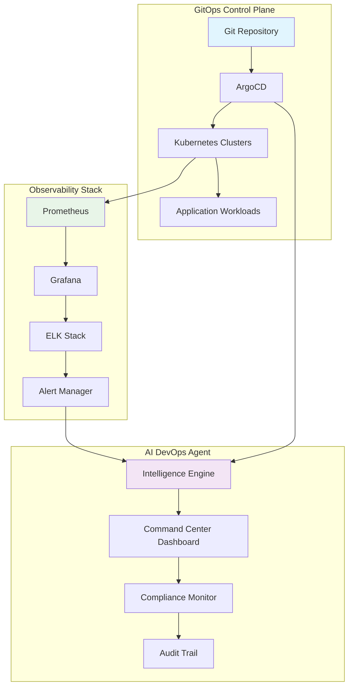
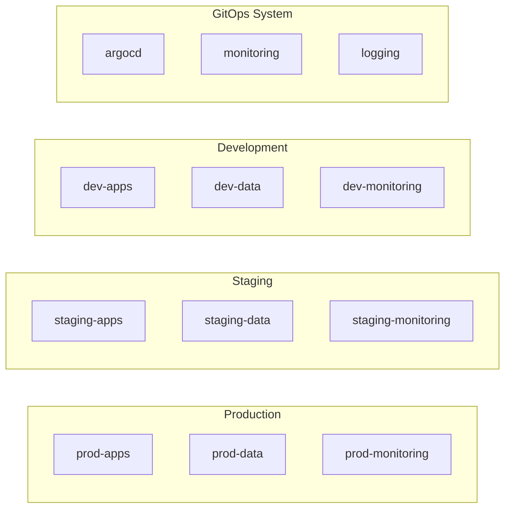

# GitOps Architecture Overview

The AI DevOps Agent Command Center implements a comprehensive GitOps architecture designed for enterprise-grade deployment automation, compliance monitoring, and intelligent operations.

## 🏗️ System Architecture



## Core Components

### GitOps Foundation

- **Git Repository**: Single source of truth for all configurations
- **ArgoCD**: Automated deployment and sync management
- **Kubernetes**: Container orchestration platform
- **Helm Charts**: Templated application deployments

### AI Intelligence Layer

- **Error Detection Engine**: Real-time anomaly detection
- **Automated Remediation**: Intelligent fix generation
- **Predictive Analytics**: Trend analysis and forecasting
- **Learning Algorithm**: Continuous improvement from incidents

### Compliance Framework

- **RBAC Integration**: Role-based access control
- **Audit Logging**: Comprehensive activity tracking
- **KPI Dashboard**: Real-time compliance metrics
- **Regulatory Reporting**: Automated compliance reports

## Namespace Architecture



### Namespace Strategy

- **Environment Isolation**: Separate namespaces per environment
- **Application Segregation**: Dedicated namespaces for different app tiers
- **Infrastructure Services**: Centralized monitoring and logging
- **Security Boundaries**: Network policies and RBAC enforcement

## Deployment Workflows

### GitOps Sync Process

1. **Code Commit**: Developer pushes changes to Git
2. **ArgoCD Detection**: Automatic detection of configuration drift
3. **Validation**: Pre-deployment compliance and security checks
4. **Deployment**: Automated rollout with health monitoring
5. **Verification**: Post-deployment validation and testing
6. **Reporting**: Compliance and audit trail updates

### Multi-Environment Pipeline

```yaml
# Example ArgoCD Application
apiVersion: argoproj.io/v1alpha1
kind: Application
metadata:
  name: advancia-platform
  namespace: argocd
spec:
  project: default
  source:
    repoURL: https://github.com/advancia-platform/modular-saas-platform
    targetRevision: HEAD
    path: kubernetes/manifests
  destination:
    server: https://kubernetes.default.svc
    namespace: production
  syncPolicy:
    automated:
      prune: true
      selfHeal: true
    retry:
      limit: 3
      backoff:
        duration: 5s
        factor: 2
        maxDuration: 3m
```

## Security Architecture

### Zero-Trust Model

- **Identity Verification**: Multi-factor authentication for all access
- **Least Privilege**: Minimal required permissions per role
- **Network Segmentation**: Micro-segmentation between components
- **Encryption**: End-to-end encryption for all communications

### Secret Management

- **External Secrets Operator**: Integration with cloud secret managers
- **Secret Rotation**: Automated rotation of credentials
- **Access Auditing**: Complete audit trail for secret access
- **Encryption at Rest**: All secrets encrypted in etcd

## High Availability Design

### Redundancy Strategy

- **Multi-Region Deployment**: Active-active across regions
- **Database Replication**: Automated failover and backup
- **Load Balancing**: Intelligent traffic distribution
- **Circuit Breakers**: Automatic fault isolation

### Disaster Recovery

- **RTO Target**: < 5 minutes for critical services
- **RPO Target**: < 1 minute data loss maximum
- **Backup Strategy**: Continuous replication and point-in-time recovery
- **Testing**: Monthly disaster recovery drills

## Performance Characteristics

### Scalability Metrics

- **Horizontal Scaling**: Automatic pod scaling based on metrics
- **Vertical Scaling**: Resource adjustment for optimal performance
- **Cluster Autoscaling**: Node provisioning based on demand
- **Cost Optimization**: Resource rightsizing and scheduling

### SLA Targets

| Metric          | Target  | Current     |
| --------------- | ------- | ----------- |
| Uptime          | 99.99%  | 99.97%      |
| Response Time   | < 200ms | 150ms avg   |
| Deployment Time | < 5 min | 3.2 min avg |
| Recovery Time   | < 2 min | 1.8 min avg |

## Technology Stack

### Core Infrastructure

- **Kubernetes**: v1.28+ (Container orchestration)
- **ArgoCD**: v2.8+ (GitOps deployment)
- **Helm**: v3.12+ (Package management)
- **Istio**: v1.19+ (Service mesh)

### Monitoring & Observability

- **Prometheus**: Metrics collection and alerting
- **Grafana**: Dashboards and visualization
- **Jaeger**: Distributed tracing
- **Elasticsearch**: Log aggregation and search

### AI & Automation

- **Python**: AI/ML pipeline development
- **TensorFlow**: Machine learning models
- **Apache Kafka**: Event streaming
- **Redis**: Caching and session storage

## Integration Points

### External Systems

- **Cloud Providers**: AWS, Azure, GCP integration
- **CI/CD Tools**: Jenkins, GitHub Actions, Azure DevOps
- **Monitoring**: PagerDuty, Slack, Microsoft Teams
- **Security**: HashiCorp Vault, AWS Secrets Manager

### API Interfaces

- **REST APIs**: RESTful interfaces for all components
- **GraphQL**: Unified data access layer
- **Webhooks**: Event-driven integrations
- **gRPC**: High-performance service communication

## Next Steps

- [ArgoCD Setup Guide](argocd.md)
- [Namespace Configuration](namespaces.md)
- [Workflow Implementation](workflows.md)
- [System Design Details](system-design.md)
