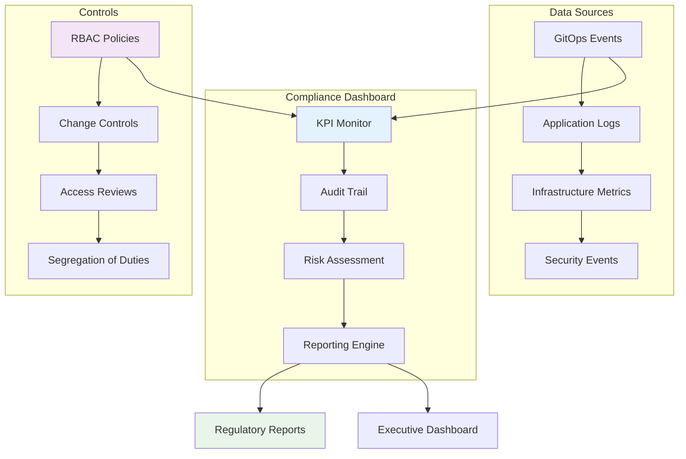

# Compliance Overview

The AI DevOps Agent Command Center implements comprehensive compliance monitoring and governance to meet enterprise and regulatory requirements for financial services operations.

## 🛡️ Compliance Framework

### Regulatory Standards

- **SOX (Sarbanes-Oxley)**: Financial reporting and internal controls
- **PCI DSS**: Payment card industry data security standards
- **GDPR**: General data protection regulation compliance
- **SOC 2 Type II**: Security, availability, and confidentiality controls
- **ISO 27001**: Information security management systems

### Compliance Architecture



## 📊 Key Performance Indicators (KPIs)

### Operational KPIs

#### Deployment Metrics

| KPI                         | Target  | Current | Trend |
| --------------------------- | ------- | ------- | ----- |
| **Deployment Success Rate** | > 99%   | 99.7%   | ↑     |
| **Mean Time to Deploy**     | < 5 min | 3.2 min | ↓     |
| **Change Failure Rate**     | < 5%    | 2.8%    | ↓     |
| **Mean Time to Recovery**   | < 5 min | 4.1 min | ↓     |

#### Security Compliance

| KPI                           | Target  | Current  | Status |
| ----------------------------- | ------- | -------- | ------ |
| **Failed Login Rate**         | < 1%    | 0.3%     | ✅     |
| **Privileged Access Reviews** | Monthly | On Track | ✅     |
| **Vulnerability Remediation** | < 24h   | 18h avg  | ✅     |
| **Security Patch Compliance** | 100%    | 98.5%    | ⚠️     |

#### Access Control

| KPI                            | Target | Current | Status |
| ------------------------------ | ------ | ------- | ------ |
| **RBAC Policy Coverage**       | 100%   | 100%    | ✅     |
| **Segregation of Duties**      | 100%   | 95%     | ⚠️     |
| **Access Review Completion**   | 100%   | 92%     | ⚠️     |
| **Orphaned Account Detection** | 0      | 2       | ❌     |

### Financial Controls

#### Change Management

```yaml
# Change approval workflow
apiVersion: argoproj.io/v1alpha1
kind: WorkflowTemplate
metadata:
  name: change-approval
spec:
  entrypoint: change-approval-workflow
  templates:
    - name: change-approval-workflow
      steps:
        - - name: security-review
            template: security-check
        - - name: business-approval
            template: business-review
            when: "{{steps.security-review.outputs.result}} == 'approved'"
        - - name: compliance-validation
            template: compliance-check
            when: "{{steps.business-approval.outputs.result}} == 'approved'"
        - - name: deploy-change
            template: execute-deployment
            when: "{{steps.compliance-validation.outputs.result}} == 'approved'"
```

### Data Integrity Controls

#### Database Change Controls

```sql
-- Audit trail for database changes
CREATE TABLE audit_trail (
    id SERIAL PRIMARY KEY,
    timestamp TIMESTAMPTZ DEFAULT NOW(),
    user_id VARCHAR(50),
    operation VARCHAR(20),
    table_name VARCHAR(50),
    record_id VARCHAR(50),
    old_values JSONB,
    new_values JSONB,
    ip_address INET,
    session_id VARCHAR(100)
);

-- Trigger for automatic audit logging
CREATE OR REPLACE FUNCTION audit_trigger()
RETURNS TRIGGER AS $$
BEGIN
    IF TG_OP = 'DELETE' THEN
        INSERT INTO audit_trail (user_id, operation, table_name, record_id, old_values)
        VALUES (current_setting('app.user_id'), 'DELETE', TG_TABLE_NAME, OLD.id, row_to_json(OLD));
        RETURN OLD;
    ELSIF TG_OP = 'UPDATE' THEN
        INSERT INTO audit_trail (user_id, operation, table_name, record_id, old_values, new_values)
        VALUES (current_setting('app.user_id'), 'UPDATE', TG_TABLE_NAME, NEW.id, row_to_json(OLD), row_to_json(NEW));
        RETURN NEW;
    ELSIF TG_OP = 'INSERT' THEN
        INSERT INTO audit_trail (user_id, operation, table_name, record_id, new_values)
        VALUES (current_setting('app.user_id'), 'INSERT', TG_TABLE_NAME, NEW.id, row_to_json(NEW));
        RETURN NEW;
    END IF;
END;
$$ LANGUAGE plpgsql;
```

## 🔍 Audit Trail Implementation

### GitOps Audit Events

```yaml
# ArgoCD audit configuration
apiVersion: v1
kind: ConfigMap
metadata:
  name: argocd-cmd-params-cm
  namespace: argocd
data:
  server.audit.enabled: "true"
  server.audit.log.format: "json"
  server.audit.log.path: "/var/log/audit/argocd-audit.log"
```

### Comprehensive Event Logging

```yaml
# Audit event schema
{ "timestamp": "2025-11-26T10:30:00Z", "eventType": "deployment", "userId": "john.doe@advancia.com", "sessionId": "sess-abc123", "ipAddress": "192.168.1.100", "application": "advancia-platform", "action": "sync", "result": "success", "details": { "revision": "abc123def456", "namespace": "production", "resources": ["Deployment/advancia-platform", "Service/advancia-platform-svc"] }, "approvals": [{ "approver": "jane.smith@advancia.com", "timestamp": "2025-11-26T10:25:00Z", "type": "business-approval" }], "riskLevel": "medium", "complianceFlags": [] }
```

### Audit Data Retention

```yaml
# Elasticsearch index lifecycle policy
{
  "policy": "audit-trail-policy",
  "phases": {
    "hot": {
      "actions": {
        "rollover": {
          "max_size": "10gb",
          "max_age": "7d"
        }
      }
    },
    "warm": {
      "min_age": "7d",
      "actions": {
        "allocate": {
          "number_of_replicas": 0
        }
      }
    },
    "cold": {
      "min_age": "30d",
      "actions": {
        "allocate": {
          "number_of_replicas": 0
        }
      }
    },
    "delete": {
      "min_age": "2555d"  // 7 years for SOX compliance
    }
  }
}
```

## 👥 Role-Based Access Control (RBAC)

### RBAC Matrix

#### Platform Roles

| Role                   | Permissions                           | Approval Required          | Segregation                  |
| ---------------------- | ------------------------------------- | -------------------------- | ---------------------------- |
| **Developer**          | View apps, Request deployments        | Yes                        | Cannot approve own changes   |
| **DevOps Engineer**    | Deploy to staging, View production    | Business approval for prod | Cannot deploy and approve    |
| **Platform Admin**     | Full cluster access                   | Security review            | Cannot access financial data |
| **Security Officer**   | Security policies, Audit access       | C-level for policy changes | Read-only for operations     |
| **Compliance Officer** | Audit trail access, Report generation | None                       | Read-only access only        |

### ArgoCD RBAC Configuration

```yaml
# ArgoCD RBAC policy
apiVersion: v1
kind: ConfigMap
metadata:
  name: argocd-rbac-cm
  namespace: argocd
data:
  policy.default: role:readonly
  policy.csv: |
    # Developer role
    p, role:developer, applications, get, *, allow
    p, role:developer, applications, sync, development/*, allow
    p, role:developer, applications, sync, staging/*, deny
    g, developer-group, role:developer

    # DevOps Engineer role  
    p, role:devops, applications, *, staging/*, allow
    p, role:devops, applications, get, production/*, allow
    p, role:devops, applications, sync, production/*, deny
    g, devops-group, role:devops

    # Platform Admin role
    p, role:admin, applications, *, *, allow
    p, role:admin, clusters, *, *, allow
    p, role:admin, repositories, *, *, allow
    g, admin-group, role:admin

    # Compliance Officer role
    p, role:compliance, applications, get, *, allow
    p, role:compliance, logs, get, *, allow
    g, compliance-group, role:compliance
```

### Kubernetes RBAC

```yaml
# Production namespace access
apiVersion: rbac.authorization.k8s.io/v1
kind: Role
metadata:
  namespace: production
  name: production-viewer
rules:
  - apiGroups: [""]
    resources: ["pods", "services", "configmaps"]
    verbs: ["get", "list", "watch"]
  - apiGroups: ["apps"]
    resources: ["deployments", "replicasets"]
    verbs: ["get", "list", "watch"]

---
apiVersion: rbac.authorization.k8s.io/v1
kind: RoleBinding
metadata:
  name: production-viewers
  namespace: production
subjects:
  - kind: Group
    name: devops-group
    apiGroup: rbac.authorization.k8s.io
roleRef:
  kind: Role
  name: production-viewer
  apiGroup: rbac.authorization.k8s.io
```

## 📋 Regulatory Reporting

### Automated Report Generation

```python
# Compliance report generator
import json
from datetime import datetime, timedelta
from elasticsearch import Elasticsearch

class ComplianceReporter:
    def __init__(self, es_client):
        self.es = es_client

    def generate_sox_report(self, start_date, end_date):
        """Generate SOX compliance report"""
        query = {
            "query": {
                "bool": {
                    "must": [
                        {"range": {"timestamp": {"gte": start_date, "lte": end_date}}},
                        {"terms": {"eventType": ["deployment", "configuration_change", "access_grant"]}}
                    ]
                }
            },
            "aggs": {
                "by_user": {"terms": {"field": "userId"}},
                "by_application": {"terms": {"field": "application"}},
                "approval_compliance": {
                    "filter": {"exists": {"field": "approvals"}},
                    "aggs": {
                        "approval_count": {"value_count": {"field": "approvals.approver"}}
                    }
                }
            }
        }

        result = self.es.search(index="audit-trail-*", body=query)

        report = {
            "period": {"start": start_date, "end": end_date},
            "total_events": result["hits"]["total"]["value"],
            "users": result["aggregations"]["by_user"]["buckets"],
            "applications": result["aggregations"]["by_application"]["buckets"],
            "approval_compliance_rate": self._calculate_approval_rate(result),
            "segregation_violations": self._check_segregation_violations(result),
            "generated_at": datetime.utcnow().isoformat()
        }

        return report

    def _calculate_approval_rate(self, result):
        total = result["hits"]["total"]["value"]
        approved = result["aggregations"]["approval_compliance"]["doc_count"]
        return (approved / total) * 100 if total > 0 else 0
```

### Report Delivery Schedule

```yaml
# Automated reporting schedule
apiVersion: batch/v1
kind: CronJob
metadata:
  name: compliance-reports
  namespace: compliance
spec:
  schedule: "0 8 1 * *" # First day of month at 8 AM
  jobTemplate:
    spec:
      template:
        spec:
          containers:
            - name: report-generator
              image: advancia/compliance-reporter:latest
              env:
                - name: REPORT_TYPE
                  value: "monthly"
                - name: ELASTICSEARCH_URL
                  valueFrom:
                    secretKeyRef:
                      name: elasticsearch-config
                      key: url
              volumeMounts:
                - name: reports
                  mountPath: /reports
          volumes:
            - name: reports
              persistentVolumeClaim:
                claimName: compliance-reports-pvc
          restartPolicy: OnFailure
```

## 🚨 Compliance Monitoring & Alerting

### Real-time Compliance Monitoring

```yaml
# Prometheus compliance rules
groups:
  - name: compliance.rules
    rules:
      - alert: UnauthorizedDeployment
        expr: |
          increase(audit_events_total{
            event_type="deployment",
            approval_status="missing"
          }[5m]) > 0
        labels:
          severity: critical
          team: compliance
        annotations:
          summary: "Unauthorized deployment detected"
          description: "Deployment without proper approval in {{ $labels.namespace }}"

      - alert: SegregationOfDutiesViolation
        expr: |
          increase(audit_events_total{
            event_type="approval",
            self_approval="true"
          }[1h]) > 0
        labels:
          severity: critical
          team: compliance
        annotations:
          summary: "Segregation of duties violation"
          description: "User {{ $labels.user_id }} approved their own change"

      - alert: PrivilegedAccessAnomaly
        expr: |
          rate(audit_events_total{
            event_type="privileged_access",
            user_id!="system"
          }[1h]) > 0.1
        labels:
          severity: warning
          team: security
        annotations:
          summary: "Unusual privileged access pattern"
          description: "Elevated privileged access rate detected"
```

### Compliance Dashboard

```json
{
  "dashboard": {
    "title": "Compliance Monitoring Dashboard",
    "panels": [
      {
        "title": "Deployment Approval Rate",
        "type": "stat",
        "targets": [
          {
            "expr": "rate(audit_events_total{event_type='deployment',approval_status='approved'}[24h]) / rate(audit_events_total{event_type='deployment'}[24h]) * 100"
          }
        ]
      },
      {
        "title": "Segregation Violations",
        "type": "table",
        "targets": [
          {
            "expr": "audit_events_total{event_type='approval',self_approval='true'}"
          }
        ]
      },
      {
        "title": "Access Review Status",
        "type": "piechart",
        "targets": [
          {
            "expr": "access_review_status"
          }
        ]
      }
    ]
  }
}
```

## 📊 Compliance Metrics & KPIs

### Executive Dashboard Metrics

```yaml
# Key compliance indicators
compliance_kpis:
  operational_excellence:
    deployment_success_rate: 99.7%
    change_failure_rate: 2.8%
    mean_time_to_recovery: 4.1min
    deployment_frequency: 15.3/day

  security_compliance:
    failed_login_rate: 0.3%
    privileged_access_reviews: "100% current"
    vulnerability_remediation_time: 18h
    security_patch_compliance: 98.5%

  access_control:
    rbac_policy_coverage: 100%
    segregation_of_duties: 95%
    access_review_completion: 92%
    orphaned_accounts: 2

  audit_readiness:
    audit_trail_completeness: 100%
    data_retention_compliance: 100%
    report_generation_success: 98%
    control_effectiveness: 94%
```

## 🔧 Implementation Checklist

### Monthly Compliance Tasks

- [ ] Access review completion verification
- [ ] Privileged account audit
- [ ] Security patch compliance check
- [ ] Segregation of duties validation
- [ ] Audit trail integrity verification
- [ ] Compliance report generation
- [ ] Control effectiveness assessment
- [ ] Risk assessment update

### Quarterly Tasks

- [ ] SOX control testing
- [ ] PCI DSS assessment
- [ ] GDPR compliance review
- [ ] SOC 2 control validation
- [ ] Third-party risk assessment
- [ ] Business continuity testing
- [ ] Incident response testing
- [ ] Compliance training updates

## 📚 Related Documentation

- [KPI Dashboard](kpi-dashboard.md)
- [Audit Trail Implementation](audit-trail.md)
- [RBAC Configuration](rbac.md)
- [Regulatory Requirements](regulatory.md)
- [Security Controls](../security/overview.md)
