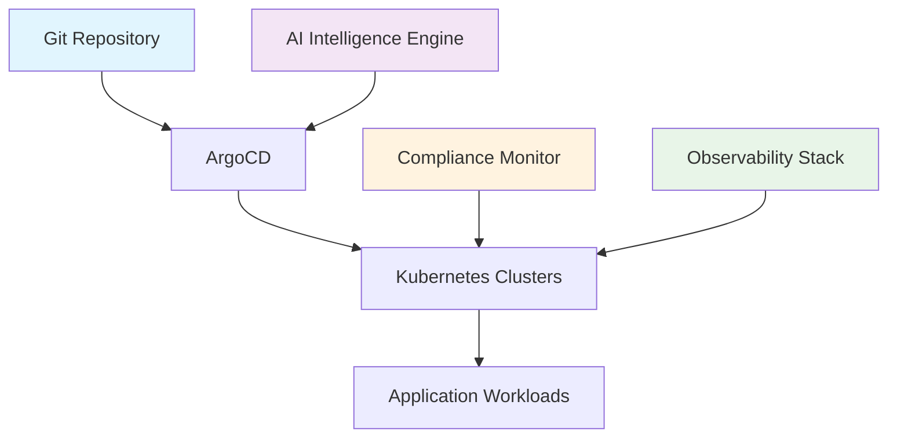

# Getting Started Overview

Welcome to the AI DevOps Agent Command Center! This guide will help you get up and running with our enterprise GitOps platform designed for automated deployment, compliance monitoring, and intelligent operations.

## 🎯 What You'll Learn

By following this getting started guide, you'll:

- Set up a complete GitOps infrastructure with ArgoCD
- Deploy the AI DevOps Agent Command Center
- Configure monitoring and observability stack
- Implement compliance and audit frameworks
- Understand day-to-day operations and troubleshooting

## 🏗️ System Overview

The AI DevOps Agent Command Center is built on these core principles:



### Core Components

#### **GitOps Foundation**

- **Single Source of Truth**: All configurations managed in Git
- **Automated Sync**: Continuous deployment with ArgoCD
- **Drift Detection**: Automatic identification of configuration changes
- **Rollback Capabilities**: Instant reversion to previous states

#### **AI Intelligence Layer**

- **Predictive Analytics**: Anticipate issues before they occur
- **Automated Remediation**: Self-healing infrastructure
- **Performance Optimization**: Intelligent resource management
- **Anomaly Detection**: Real-time error identification

#### **Compliance Framework**

- **Audit Trails**: Comprehensive tracking of all changes
- **Policy Enforcement**: Automated compliance validation
- **Risk Assessment**: Continuous security monitoring
- **Regulatory Reporting**: Automated compliance documentation

#### **Observability Stack**

- **Metrics Collection**: Prometheus-based monitoring
- **Log Aggregation**: ELK stack for centralized logging
- **Visualization**: Grafana dashboards for insights
- **Alerting**: Multi-channel notification system

## 📋 Prerequisites

Before beginning the installation, ensure you have:

### Infrastructure Requirements

- [ ] **Kubernetes Cluster**: v1.24+ with minimum 3 nodes
- [ ] **Storage**: 100GB+ persistent storage with backup
- [ ] **Network**: Load balancer and ingress controller support
- [ ] **DNS**: Wildcard DNS configuration for subdomains
- [ ] **Certificates**: SSL/TLS certificates for HTTPS endpoints

### Tool Requirements

- [ ] **kubectl**: v1.24+ configured with cluster admin access
- [ ] **Helm**: v3.10+ for package management
- [ ] **Git**: Access to GitOps repository with write permissions
- [ ] **Docker**: For local development and testing

### Access Requirements

- [ ] **Container Registry**: Access to push/pull images
- [ ] **Secret Management**: Vault or cloud secret store
- [ ] **Monitoring**: Prometheus and Grafana access
- [ ] **Notifications**: PagerDuty, Slack, or Teams integration

## 🚀 Quick Start Paths

Choose your path based on your experience level and requirements:

### Path 1: Automated Setup (Recommended)

**Time Required**: 30 minutes  
**Complexity**: Low  
**Prerequisites**: Basic Kubernetes knowledge

```bash
# One-command setup
curl -sSL https://raw.githubusercontent.com/advancia-platform/bootstrap/main/install.sh | bash
```

Perfect for:

- First-time users
- Development environments
- Proof-of-concept deployments

### Path 2: Manual Setup

**Time Required**: 2-3 hours  
**Complexity**: Medium  
**Prerequisites**: Advanced Kubernetes and GitOps knowledge

Follow the detailed [Bootstrap Guide](bootstrap.md) for step-by-step instructions.

Perfect for:

- Production deployments
- Custom configurations
- Enterprise environments

### Path 3: Hybrid Setup

**Time Required**: 1 hour  
**Complexity**: Medium  
**Prerequisites**: Intermediate Kubernetes knowledge

Use automated setup with custom configuration overrides.

Perfect for:

- Staging environments
- Testing custom configurations
- Iterative deployment

## 🎓 Learning Path

### Phase 1: Foundation (Week 1)

1. **[Quick Start](quick-start.md)** - Get running in 10 minutes
2. **[Bootstrap Guide](bootstrap.md)** - Complete manual setup
3. **[Architecture Overview](../architecture/gitops-overview.md)** - Understand the system

### Phase 2: Operations (Week 2)

1. **[GitOps Operations](../operations/gitops-operations.md)** - Day-to-day management
2. **[Monitoring Setup](../observability/monitoring.md)** - Observability stack
3. **[Security Configuration](../security/overview.md)** - Security best practices

### Phase 3: Advanced Topics (Week 3-4)

1. **[Compliance Framework](../compliance/overview.md)** - Audit and governance
2. **[Troubleshooting](../troubleshooting/common-issues.md)** - Problem resolution
3. **[Best Practices](../reference/best-practices.md)** - Production optimization

## ⚡ System Validation

After installation, verify your system with these quick checks:

### Basic Health Check

```bash
# Check cluster status
kubectl get nodes

# Verify ArgoCD installation
kubectl get pods -n argocd

# Test dashboard access
curl -f https://dashboard.advancia.dev/health
```

### Component Verification

```bash
# Check GitOps sync status
argocd app list

# Verify monitoring stack
kubectl get pods -n monitoring

# Test AI agent functionality
kubectl logs -n ai-agent -l app=ai-devops-agent
```

### Compliance Validation

```bash
# Check audit trail logging
kubectl get pods -n logging

# Verify RBAC configuration
kubectl auth can-i --list --as=system:serviceaccount:default:default

# Test compliance dashboard
curl -f https://dashboard.advancia.dev/compliance
```

## 🛠️ Configuration Options

### Environment Profiles

#### **Development**

- Minimal resource requirements
- Relaxed security policies
- Enhanced debugging capabilities
- Rapid deployment cycles

#### **Staging**

- Production-like configuration
- Full compliance monitoring
- Performance testing enabled
- Automated testing integration

#### **Production**

- High availability setup
- Strict security policies
- Comprehensive audit logging
- 24/7 monitoring and alerting

### Customization Options

#### **Cloud Provider Integration**

- AWS EKS with IAM integration
- Azure AKS with Azure AD
- Google GKE with Google Cloud IAM
- On-premises with custom authentication

#### **Compliance Frameworks**

- SOX compliance for financial services
- PCI DSS for payment processing
- GDPR for European operations
- Custom regulatory requirements

## 🆘 Getting Help

### Documentation Resources

- **[Troubleshooting Guide](../troubleshooting/common-issues.md)** - Common issues and solutions
- **[FAQ](../troubleshooting/faq.md)** - Frequently asked questions
- **[Glossary](../reference/glossary.md)** - Technical terms and definitions
- **[API Reference](../reference/api.md)** - Complete API documentation

### Community Support

- **GitHub Issues**: Report bugs and feature requests
- **Discussions**: Ask questions and share experiences
- **Slack Channel**: Real-time support (#ai-devops-agent)
- **Office Hours**: Weekly live Q&A sessions

### Enterprise Support

- **24/7 Support**: Critical issue resolution
- **Professional Services**: Custom implementation assistance
- **Training Programs**: Team onboarding and certification
- **Dedicated Support**: Assigned technical account manager

## 🔄 Next Steps

Ready to begin? Choose your next action:

1. **[Quick Start](quick-start.md)** - Get running immediately
2. **[Bootstrap Guide](bootstrap.md)** - Complete manual installation
3. **[Architecture Deep Dive](../architecture/gitops-overview.md)** - Understand the system design
4. **[Configuration Guide](../reference/configuration.md)** - Customize your deployment

## 📊 Success Metrics

Track your progress with these key indicators:

| Metric                | Target   | Description                       |
| --------------------- | -------- | --------------------------------- |
| **Setup Time**        | < 30 min | Time from start to working system |
| **First Deployment**  | < 5 min  | Time to deploy first application  |
| **Compliance Score**  | > 95%    | Automated compliance validation   |
| **System Uptime**     | > 99.9%  | Overall system availability       |
| **User Satisfaction** | > 4.5/5  | Team feedback on usability        |

Welcome to the future of intelligent DevOps! 🚀
