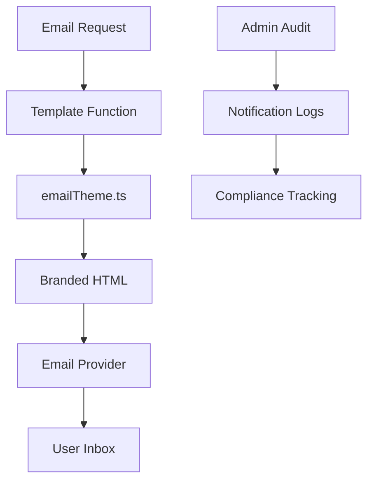

# Email Templates Guide

The Advancia Pay platform includes a comprehensive email template system for user communications. All templates are branded with Advancia Pay styling and include security best practices.

## Overview

The email system consists of:

- **Template Functions**: Generate branded HTML and text content
- **Theme Configuration**: Centralized branding and styling
- **Multi-provider Support**: Gmail SMTP, Resend, and SendGrid
- **Security Features**: Expiration warnings, verification codes, and safe links

## Email Template Architecture



## Available Templates

### 1. Password Reset Template

**Function**: `resetPasswordTemplate(resetUrl: string)`
**Purpose**: Secure password reset with branded styling

```typescript
import { resetPasswordTemplate } from "./services/emailTemplates";

const email = resetPasswordTemplate("https://app.advancia.com/reset?token=abc123");
// Returns: { subject, text, html }
```

**Features**:

- 15-minute expiration warning
- Security messaging for unauthorized requests
- Branded button styling with primary color
- Support contact links

### 2. Email Verification Template

**Function**: `verificationTemplate(verificationUrl: string)`
**Purpose**: Email address verification for new accounts

```typescript
import { verificationTemplate } from "./services/emailTemplates";

const email = verificationTemplate("https://app.advancia.com/verify?token=xyz789");
```

**Features**:

- Clear verification instructions
- Branded header with logo
- Responsive design for all devices
- Security tips and best practices

### 3. Welcome Template

**Function**: `welcomeTemplate(userFirstName: string)`
**Purpose**: Onboarding new users with getting started guide

```typescript
import { welcomeTemplate } from "./services/emailTemplates";

const email = welcomeTemplate("John");
```

**Features**:

- Personalized greeting with user's name
- Getting started checklist
- Important security reminders
- Links to key platform features

## Theme Configuration

All templates use the centralized `emailTheme.ts` configuration:

```typescript
export const emailTheme = {
  brandName: "Advancia Pay",
  primaryColor: "#0078D4", // Advancia Blue
  secondaryColor: "#28a745", // Success Green
  backgroundColor: "#f8f9fa",
  textColor: "#333333",
  fontFamily: '-apple-system, BlinkMacSystemFont, "Segoe UI", Roboto',
  logoUrl: `${process.env.FRONTEND_URL}/logo.png`,
  footerText: "© 2025 Advancia Pay. All rights reserved.",
};
```

### Customizing Themes

To update branding across all templates:

1. **Edit Colors**: Update `primaryColor` and `secondaryColor` in `emailTheme.ts`
2. **Change Logo**: Update `logoUrl` to your branded logo
3. **Modify Footer**: Update `footerText` with your company information
4. **Typography**: Adjust `fontFamily` for custom fonts

## Email Providers

The platform supports multiple email providers for redundancy:

### Gmail SMTP (Primary)

```env
EMAIL_USER="your-email@gmail.com"
EMAIL_PASSWORD="your-app-password"
SMTP_HOST="smtp.gmail.com"
SMTP_PORT="587"
```

### Resend (Marketing)

```env
RESEND_API_KEY="re_xxxxxxxxxxxxx"
```

### SendGrid (Bulk)

```env
SENDGRID_API_KEY="SG.xxxxxxxxxxxxx"
```

## Usage Examples

### Sending Password Reset Email

```typescript
// In your route handler
import { resetPasswordTemplate } from "../services/emailTemplates";
import { sendEmail } from "../services/emailService";

export async function requestPasswordReset(req: Request, res: Response) {
  const { email } = req.body;

  // Generate reset token
  const resetToken = generateSecureToken();
  const resetUrl = `${process.env.FRONTEND_URL}/reset-password?token=${resetToken}`;

  // Get branded template
  const emailContent = resetPasswordTemplate(resetUrl);

  // Send email
  await sendEmail({
    to: email,
    subject: emailContent.subject,
    html: emailContent.html,
    text: emailContent.text,
  });

  res.json({ success: true, message: "Reset email sent" });
}
```

### Admin Notification Integration

All emails are automatically logged for audit purposes:

```typescript
// Automatic logging in sendEmail function
await prisma.notificationLog.create({
  data: {
    userId: user?.id,
    email: to,
    subject,
    message: html,
    template: "reset-password",
    provider: "gmail",
    status: "sent",
    sentAt: new Date(),
  },
});
```

## Security Features

### 1. Expiration Warnings

All action emails include clear expiration timeframes:

- Password resets: 15 minutes
- Email verification: 24 hours
- Magic links: 5 minutes

### 2. Suspicious Activity Notices

Templates include security messaging:

- "If you didn't request this action..."
- Support contact information
- Account security tips

### 3. Safe Links

All URLs are validated and include:

- HTTPS enforcement
- Domain verification
- Token-based authentication

## Testing Templates

### Development Testing

```bash
# Start the backend
cd backend && npm run dev

# Test endpoint in another terminal
curl -X POST http://localhost:4000/api/auth/request-reset \
  -H "Content-Type: application/json" \
  -d '{"email":"test@example.com"}'
```

### Email Preview

Use the email preview endpoint for development:

```typescript
// GET /api/dev/email-preview/:template
// Returns HTML preview of template
```

## Monitoring & Analytics

### Email Delivery Tracking

- **Success Rate**: Track delivery success per provider
- **Open Rates**: Monitor user engagement (where supported)
- **Bounce Handling**: Automatic retry and failure logging

### Admin Dashboard

Access comprehensive email analytics:

- **Logs View**: `/admin/notification-logs`
- **Export Data**: CSV export for compliance
- **Filter Options**: By date, template, status, user

### Compliance Features

- **Audit Trail**: Full history of email communications
- **Data Retention**: Configurable log retention periods
- **GDPR Compliance**: User data handling and deletion

## Best Practices

### 1. Template Design

- **Mobile First**: Responsive design for all devices
- **Clear CTAs**: Prominent buttons with Advancia branding
- **Security Focus**: Always include security messaging
- **Accessibility**: High contrast and readable fonts

### 2. Content Guidelines

- **Personalization**: Use user's first name when available
- **Clear Language**: Simple, direct communication
- **Brand Consistency**: Maintain Advancia Pay voice and tone
- **Legal Compliance**: Include required disclaimers

### 3. Technical Implementation

- **Error Handling**: Graceful fallbacks for template errors
- **Provider Failover**: Automatic switching between email providers
- **Rate Limiting**: Respect provider sending limits
- **Monitoring**: Track delivery and engagement metrics

## Troubleshooting

### Common Issues

#### Email Not Sending

1. Check provider credentials in environment variables
2. Verify SMTP settings and firewall rules
3. Check email service quotas and limits
4. Review notification logs for error details

#### Template Rendering Issues

1. Verify all template variables are provided
2. Check for missing environment variables
3. Test with simple text version first
4. Review browser developer tools for CSS issues

#### Deliverability Problems

1. Check spam folder and sender reputation
2. Verify SPF, DKIM, and DMARC records
3. Review provider bounce and complaint rates
4. Test with different email addresses

### Debug Commands

```bash
# Check email service status
npm run health:email

# Test template rendering
npm run test:templates

# Validate environment configuration
npm run validate:config
```

## API Reference

### Email Template Functions

```typescript
// All functions return { subject: string, text: string, html: string }

resetPasswordTemplate(resetUrl: string)
verificationTemplate(verificationUrl: string)
welcomeTemplate(userFirstName: string)
```

### Email Service Methods

```typescript
sendEmail(options: {
  to: string;
  subject: string;
  html: string;
  text?: string;
  template?: string;
})
```

---

_For additional support with email templates, contact the platform team or submit an issue in the repository._
