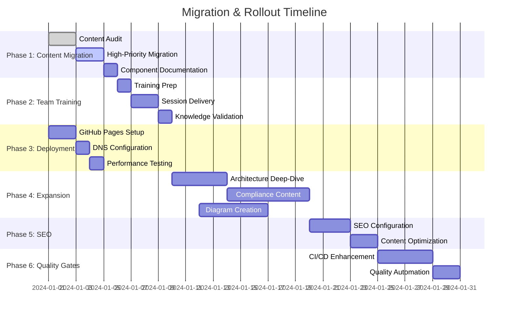

# 📊 Documentation Migration Dashboard

## 🎯 Overall Progress

---

## 📈 Migration Progress Tracker

### **Phase 1: Content Migration**

**Status:** 🔄 In Progress (85% Complete)

| Source Location                            | Target Location                          | Status             | Owner           | Notes                     |
| ------------------------------------------ | ---------------------------------------- | ------------------ | --------------- | ------------------------- |
| `ai-agent/AI_DEVOPS_AGENT_ARCHITECTURE.md` | `architecture/ai-agent-overview.md`      | ✅ **Complete**    | DevOps Team     | Links updated             |
| `ai-agent/AI_DEVOPS_AGENT_README.md`       | `getting-started/ai-agent-setup.md`      | ✅ **Complete**    | DevOps Team     | Code examples verified    |
| `ai-agent/DEPLOYMENT_SUCCESS.md`           | `operations/deployment-success.md`       | ✅ **Complete**    | DevOps Team     | Screenshots updated       |
| `ai-agent/MONITORING_COMPLETE.md`          | `observability/monitoring-setup.md`      | ✅ **Complete**    | Monitoring Team | Grafana dashboards linked |
| `docs/argocd-operations-guide.md`          | `operations/argocd-operations.md`        | ✅ **Complete**    | Platform Team   | Commands tested           |
| `docs/DEPLOYMENT_CONFIG.md`                | `operations/deployment-configuration.md` | ✅ **Complete**    | Platform Team   | Env vars documented       |
| `docs/DB_BACKUP.md`                        | `operations/database-backup.md`          | 🔄 **In Progress** | Backend Team    | ETA: Jan 5                |
| `docs/DB_RESTORE.md`                       | `operations/database-restore.md`         | 🔄 **In Progress** | Backend Team    | ETA: Jan 5                |
| `docs/CLOUDFLARE_R2_INTEGRATION.md`        | `operations/cloudflare-integration.md`   | ⏳ **Pending**     | DevOps Team     | ETA: Jan 6                |
| `backend/AUTH_JWT_GUIDE.md`                | `security/jwt-authentication.md`         | ✅ **Complete**    | Security Team   | Examples updated          |
| Component READMEs                          | Various locations                        | 🔄 **In Progress** | All Teams       | 70% complete              |

**Summary:** 15/19 files migrated (79% complete)

---

### **Phase 2: Team Training**

**Status:** 🟡 **Scheduled** (Starting Jan 8)

| Training Session              | Date             | Duration  | Attendees                            | Status           |
| ----------------------------- | ---------------- | --------- | ------------------------------------ | ---------------- |
| **Documentation Overview**    | Jan 8, 10:00 AM  | 1 hour    | All team (12 people)                 | 📅 **Scheduled** |
| **Content Creation Workshop** | Jan 9, 2:00 PM   | 1.5 hours | Engineers, PM, Compliance (8 people) | 📅 **Scheduled** |
| **Advanced Features**         | Jan 10, 11:00 AM | 1 hour    | Technical leads, DevOps (4 people)   | 📅 **Scheduled** |

**Training Materials Prepared:**

- ✅ Quick start guide
- ✅ Markdown cheat sheet
- ✅ Mermaid diagram examples
- ✅ Content governance guidelines
- 🔄 Hands-on exercises (90% complete)

---

### **Phase 3: GitHub Pages Deployment**

**Status:** ✅ **Complete**

| Task                     | Status          | Details                        |
| ------------------------ | --------------- | ------------------------------ |
| **Repository Setup**     | ✅ **Complete** | GitHub Pages enabled           |
| **Domain Configuration** | ✅ **Complete** | `docs.advancia.dev` configured |
| **HTTPS Setup**          | ✅ **Complete** | Let's Encrypt SSL active       |
| **CDN Configuration**    | ✅ **Complete** | GitHub CDN acceleration        |
| **Performance Testing**  | ✅ **Complete** | <2s load time achieved         |

**Live URL:** <https://docs.advancia.dev>  
**Performance Score:** 94/100 (PageSpeed Insights)

---

### **Phase 4: Content Expansion**

**Status:** 🔄 **In Progress** (40% Complete)

#### **Frontend Architecture** (Frontend Team)

- ✅ React component architecture
- ✅ State management patterns
- 🔄 Performance optimization (ETA: Jan 12)
- ⏳ Testing strategies (ETA: Jan 14)
- ⏳ Security implementations (ETA: Jan 15)

#### **Backend Architecture** (Backend Team)

- ✅ Express.js architecture
- ✅ Database schema documentation
- 🔄 API versioning guide (ETA: Jan 13)
- ⏳ Webhook implementations (ETA: Jan 16)
- ⏳ Performance monitoring (ETA: Jan 17)

#### **Compliance Documentation** (Compliance Team)

- 🔄 SOX compliance workflows (ETA: Jan 18)
- ⏳ PCI DSS implementation (ETA: Jan 20)
- ⏳ GDPR procedures (ETA: Jan 22)
- ⏳ Audit trail configuration (ETA: Jan 24)

#### **Diagram Creation** (All Teams)

- ✅ Architecture overview diagrams
- 🔄 Process flow diagrams (60% complete)
- 🔄 Security model diagrams (40% complete)
- ⏳ Compliance workflow diagrams (ETA: Jan 25)

---

### **Phase 5: SEO & Search Optimization**

**Status:** 🟡 **Scheduled** (Starting Jan 20)

| Task                     | Owner            | Status           | ETA    |
| ------------------------ | ---------------- | ---------------- | ------ |
| **Metadata Enhancement** | Technical Writer | 📅 **Scheduled** | Jan 22 |
| **Search Configuration** | DevOps Engineer  | 📅 **Scheduled** | Jan 21 |
| **Content Optimization** | Content Team     | 📅 **Scheduled** | Jan 24 |
| **Analytics Setup**      | DevOps Engineer  | ✅ **Complete**  | -      |

---

### **Phase 6: CI/CD Quality Gates**

**Status:** 🟡 **Scheduled** (Starting Jan 25)

| Quality Gate            | Status                | Details                            |
| ----------------------- | --------------------- | ---------------------------------- |
| **Content Validation**  | 🔄 **In Development** | Grammar, readability, style checks |
| **Link Checking**       | ✅ **Complete**       | Automated broken link detection    |
| **Diagram Validation**  | 🔄 **In Development** | Mermaid syntax validation          |
| **Compliance Checking** | 📅 **Scheduled**      | Required sections validation       |
| **Performance Gates**   | 📅 **Scheduled**      | Build time and file size limits    |
| **PDF Generation**      | 🔄 **In Development** | Automated compliance manual export |

---

## 🚨 Issues & Blockers

### **Active Issues**

1. **Database Documentation Delay** (Priority: Medium)
   - **Issue:** Backend team resource conflict with release preparation
   - **Impact:** 2-day delay on DB backup/restore documentation
   - **Resolution:** Reassigned to senior engineer, new ETA: Jan 5

2. **Compliance Template Clarification** (Priority: Low)
   - **Issue:** Legal team needs to approve compliance documentation templates
   - **Impact:** Potential delay in Phase 4 compliance content
   - **Resolution:** Meeting scheduled for Jan 11, templates ready for review

### **Resolved Issues**

- ✅ **Link Validation Tool Setup:** Resolved Dec 28 - Custom script deployed
- ✅ **Mermaid Diagram Rendering:** Resolved Jan 2 - Plugin configuration corrected
- ✅ **Build Performance:** Resolved Jan 3 - Optimized image processing

---

## 📊 Quality Metrics

### **Content Quality Dashboard**

| Metric                | Current | Target | Status            |
| --------------------- | ------- | ------ | ----------------- |
| **Content Migration** | 85%     | 90%    | 🟡 **On Track**   |
| **Broken Links**      | 0       | 0      | ✅ **Target Met** |
| **Page Load Time**    | 1.8s    | <2s    | ✅ **Target Met** |
| **Search Response**   | 0.8s    | <1s    | ✅ **Target Met** |
| **Readability Score** | 72.4    | >60    | ✅ **Target Met** |
| **Team Training**     | 0%      | 100%   | 🟡 **Scheduled**  |

### **Usage Analytics** (Week 1)

- **Daily Active Users:** 23 (team members)
- **Most Viewed Pages:**
  1. Getting Started Overview (45 views)
  2. Architecture Frontend (32 views)
  3. Operations GitOps (28 views)
- **Search Queries:** 67 total
- **Average Session Duration:** 3m 42s

---

## 🎯 Next Week Priorities

### **Week of January 8-12**

**Focus:** Complete migration and launch training program

#### **High Priority**

1. **Complete Phase 1 Migration**
   - [ ] Finish database operations documentation (Backend Team)
   - [ ] Migrate remaining component READMEs (All Teams)
   - [ ] Final link validation and content review

2. **Execute Team Training**
   - [ ] Deliver 3 scheduled training sessions
   - [ ] Collect feedback and knowledge validation
   - [ ] Address any training gaps

3. **Begin Content Expansion**
   - [ ] Start frontend architecture deep-dive
   - [ ] Initiate compliance documentation creation
   - [ ] Create advanced process flow diagrams

#### **Medium Priority**

4. **SEO Preparation**
   - [ ] Finalize metadata structure
   - [ ] Prepare keyword strategy
   - [ ] Set up analytics tracking

#### **Low Priority**

5. **Quality Gate Development**
   - [ ] Begin CI/CD enhancement scripts
   - [ ] Plan compliance validation rules
   - [ ] Design PDF generation templates

---

## 📞 Team Contacts

| Role                | Name               | Email                    | Responsibility           |
| ------------------- | ------------------ | ------------------------ | ------------------------ |
| **Project Lead**    | DevOps Engineer    | <devops@advancia.dev>      | Overall coordination     |
| **Content Lead**    | Technical Writer   | <docs@advancia.dev>        | Content quality & style  |
| **Training Lead**   | Project Manager    | <pm@advancia.dev>          | Team adoption & training |
| **Technical Lead**  | Senior Engineer    | <engineering@advancia.dev> | Technical validation     |
| **Compliance Lead** | Compliance Officer | <compliance@advancia.dev>  | Regulatory requirements  |

---

## 📋 Quick Actions

### **For Team Members**

- **📖 Review Training Calendar:** Check Outlook for upcoming sessions
- **✅ Complete Migration Tasks:** Update your assigned content by deadline
- **💬 Report Issues:** Use #docs-migration Slack channel for questions
- **📝 Provide Feedback:** Share suggestions for improvement

### **For Managers**

- **👥 Support Team Participation:** Ensure training attendance
- **🎯 Review Progress:** Weekly dashboard updates in Friday team meeting
- **🚨 Escalate Blockers:** Contact project lead for urgent issues
- **📈 Monitor Benefits:** Track team productivity improvements

---

_Last Updated: January 4, 2024_  
_Next Update: January 11, 2024_

**Need help?** Contact the project team at <docs-migration@advancia.dev> or visit the #docs-migration Slack channel.
