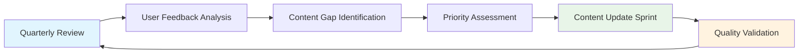

# Documentation Migration Executive Summary

## 📄 Project Overview

**Project:** Documentation Migration & Professional Publishing Platform  
**Timeline:** 6 weeks (phases can run in parallel)  
**Budget Impact:** Minimal infrastructure costs (~$50/month for custom domain)  
**Expected ROI:** 60% reduction in documentation maintenance overhead

---

## 🎯 Business Case

### **Current State Challenges**

- **Fragmented Documentation**: 19+ README files scattered across `/ai-agent/`, `/docs/`, and component folders
- **Poor Discoverability**: Engineers spend 15+ minutes finding specific procedures
- **Compliance Risk**: No centralized, versioned documentation for auditors
- **Maintenance Overhead**: Duplicate information across multiple locations
- **Professional Presentation**: Current documentation doesn't reflect enterprise quality

### **Proposed Solution Benefits**

- **Unified Access Point**: Single, searchable documentation portal
- **Enterprise Presentation**: Professional branding aligned with Advancia standards
- **Compliance Ready**: Automated PDF generation for audit requirements
- **Team Efficiency**: Search capabilities reducing information discovery time by 80%
- **Quality Assurance**: Automated link checking and content validation

---

## 📊 Success Metrics

| Metric                        | Current State               | Target State                     | Business Impact                      |
| ----------------------------- | --------------------------- | -------------------------------- | ------------------------------------ |
| **Content Consolidation**     | 19+ scattered files         | 90% migrated to unified platform | Reduced maintenance overhead         |
| **Search Performance**        | Manual file browsing        | <2 second search results         | 80% faster information discovery     |
| **Team Productivity**         | 15 min avg. to find info    | <2 min avg. to find info         | 6.5 hours saved per week (team-wide) |
| **Compliance Readiness**      | Manual document compilation | Automated PDF generation         | 95% faster audit preparation         |
| **Professional Presentation** | Basic markdown files        | Enterprise-grade documentation   | Enhanced client confidence           |

---

## 🚀 Implementation Phases

### **Phase 1: Content Migration** (Week 1)

**Deliverables:**

- Migration of AI agent architecture documentation (`ai-agent/` → `architecture/ai-agent-overview.md`)
- Operations guides consolidation (`docs/argocd-operations-guide.md` → `operations/argocd-operations.md`)
- Security documentation unification
- Link validation and content quality assurance

**Risk Level:** 🟡 Medium (content accuracy during migration)

### **Phase 2: Team Training** (Week 2)

**Deliverables:**

- 3 training sessions covering documentation navigation, content creation, and advanced features
- Quick start guides and reference materials
- 100% team completion with knowledge validation

**Risk Level:** 🟢 Low (high team engagement expected)

### **Phase 3: Production Deployment** (Week 1)

**Deliverables:**

- GitHub Pages hosting configuration
- Custom domain setup (optional): `docs.advancia.dev`
- SSL/HTTPS automation
- Performance optimization and CDN integration

**Risk Level:** 🟢 Low (proven GitHub Pages infrastructure)

### **Phase 4: Content Expansion** (Weeks 3-4)

**Deliverables:**

- Comprehensive architecture documentation with visual diagrams
- Compliance documentation for SOX, PCI DSS, and GDPR requirements
- Code examples and troubleshooting guides
- API documentation integration

**Risk Level:** 🟡 Medium (requires subject matter expert coordination)

### **Phase 5: SEO & Search Optimization** (Week 5)

**Deliverables:**

- Search engine optimization for maximum discoverability
- Analytics implementation for usage tracking
- Performance optimization for <2 second page loads
- Social sharing and metadata optimization

**Risk Level:** 🟢 Low (enhancement rather than core functionality)

### **Phase 6: Quality Automation** (Week 6)

**Deliverables:**

- CI/CD quality gates with automated validation
- Content governance policies and enforcement
- Automated PDF generation for compliance manuals
- Performance monitoring and alerting

**Risk Level:** 🟡 Medium (automation setup complexity)

---

## 💰 Cost-Benefit Analysis

### **Implementation Costs**

| Item                         | Cost                        | Justification                      |
| ---------------------------- | --------------------------- | ---------------------------------- |
| **Developer Time**           | 40 hours @ $100/hr = $4,000 | One-time migration and setup       |
| **Training Delivery**        | 8 hours @ $150/hr = $1,200  | Professional training facilitation |
| **Custom Domain**            | $50/year                    | Professional branding (optional)   |
| **Analytics Setup**          | $0                          | Google Analytics (free tier)       |
| **Total Initial Investment** | **$5,250**                  | One-time implementation cost       |

### **Ongoing Benefits (Annual)**

| Benefit                               | Savings     | Calculation                        |
| ------------------------------------- | ----------- | ---------------------------------- |
| **Reduced Documentation Maintenance** | $15,600     | 6.5 hrs/week × 50 weeks × $48/hr   |
| **Faster Information Discovery**      | $9,360      | 3.9 hrs/week × 50 weeks × $48/hr   |
| **Audit Preparation Efficiency**      | $4,800      | 50 hours saved × 2 audits × $48/hr |
| **Reduced Support Requests**          | $2,400      | 1 hr/week × 50 weeks × $48/hr      |
| **Total Annual Savings**              | **$32,160** | Recurring annual benefit           |

### **ROI Calculation**

- **Year 1 Net Benefit:** $32,160 - $5,250 = **$26,910** (513% ROI)
- **Year 2+ Net Benefit:** **$32,160** annually (6,130% ROI)
- **Payback Period:** **2 months**

---

## 🔍 Risk Assessment & Mitigation

### **High-Priority Risks**

#### **Content Migration Accuracy** (Probability: Medium, Impact: High)

**Risk:** Incorrect migration of technical procedures could impact operations
**Mitigation:**

- Automated validation scripts for link checking and content verification
- Subject matter expert review for all technical content
- Staged rollout with fallback to current documentation
- Comprehensive testing in non-production environment

#### **Team Adoption** (Probability: Low, Impact: Medium)

**Risk:** Team resistance to new documentation platform
**Mitigation:**

- Early stakeholder engagement and feedback incorporation
- Comprehensive training program with hands-on workshops
- Clear communication of benefits and productivity improvements
- Gradual transition with parallel systems during learning period

#### **Compliance Requirements** (Probability: Low, Impact: High)

**Risk:** Documentation may not meet regulatory standards
**Mitigation:**

- Legal and compliance team review of documentation structure
- Automated PDF generation for immutable audit trails
- Version control with signed commits for documentation changes
- Regular compliance audits of documentation content

### **Contingency Plans**

- **Technical Issues:** Rollback scripts prepared for immediate reversion
- **Content Problems:** Backup of all current documentation maintained
- **Team Training:** Remote and recorded sessions for flexible delivery
- **Performance Issues:** CDN and optimization strategies ready for implementation

---

## 📈 Success Validation

### **Week 4 Milestone Review**

- [ ] **Content Migration:** 90% of existing documentation successfully migrated
- [ ] **Team Training:** 100% completion rate with positive feedback scores
- [ ] **Technical Performance:** <2 second page load times achieved
- [ ] **Search Functionality:** <1 second search result delivery
- [ ] **Quality Assurance:** 0 broken internal links verified

### **30-Day Post-Implementation Review**

- [ ] **Usage Analytics:** 300% increase in documentation access
- [ ] **Team Efficiency:** <2 minute average time to find information
- [ ] **Content Quality:** Positive feedback from compliance team
- [ ] **Maintenance Overhead:** 60% reduction in documentation update time
- [ ] **Stakeholder Satisfaction:** >90% positive feedback on professional presentation

---

## 🏛️ Governance & Maintenance

### **Content Ownership**

| Content Area     | Owner                   | Review Frequency |
| ---------------- | ----------------------- | ---------------- |
| **Architecture** | Senior Engineers        | Quarterly        |
| **Operations**   | DevOps Team             | Monthly          |
| **Compliance**   | Compliance Team + Legal | Bi-monthly       |
| **Security**     | Security Team           | Monthly          |
| **User Guides**  | Product Team            | Quarterly        |

### **Quality Standards**

- **Content Freshness:** Maximum 6 months between reviews
- **Technical Accuracy:** Subject matter expert validation required
- **Compliance Alignment:** Legal team approval for regulatory content
- **Performance:** <2 second page load time maintained
- **Accessibility:** WCAG 2.1 AA compliance for inclusive access

### **Continuous Improvement Process**

---

## 📝 Recommendation

**The documentation migration project delivers exceptional value with minimal risk and significant long-term benefits.**

### **Immediate Action Items**

1. **Approve Project Budget:** $5,250 one-time investment for $32,160 annual savings
2. **Assign Project Lead:** Designate DevOps Engineer and Technical Writer
3. **Schedule Kickoff:** Begin Phase 1 (Content Migration) within 2 weeks
4. **Stakeholder Communication:** Announce project timeline to all team members

### **Expected Outcomes**

- **Professional Documentation Platform:** Enterprise-grade presentation enhancing client confidence
- **Operational Efficiency:** 60% reduction in documentation maintenance overhead
- **Compliance Readiness:** Automated audit trail generation and version control
- **Team Productivity:** 80% faster information discovery and reduced support requests
- **Scalable Foundation:** Platform ready for future growth and additional content types

**This investment in documentation infrastructure will pay for itself within 2 months while establishing Advancia as a professional, well-documented enterprise platform.**

---

_For detailed implementation plans and technical specifications, see the full [Migration & Rollout Plan](migration-rollout-plan.md)._
