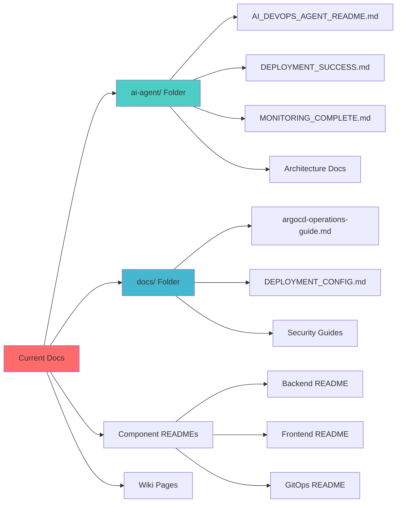
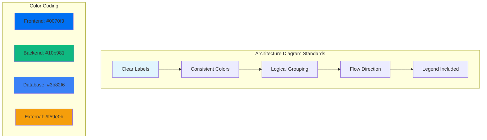
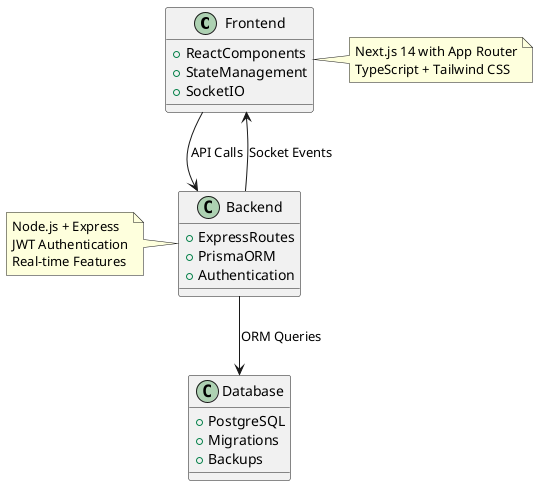
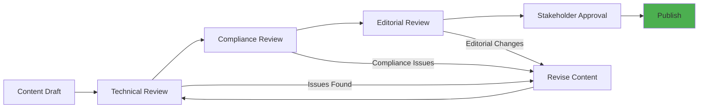

# Documentation Migration & Rollout Plan

## 📋 Executive Summary

This comprehensive migration plan will transition the Advancia Pay Ledger documentation from scattered locations (`ai-agent/`, `docs/`, component READMEs) into a unified MkDocs documentation system with enterprise-grade features, compliance tracking, and team collaboration capabilities.

**Timeline:** 6 weeks (phases can run in parallel)  
**Outcome:** Professional documentation site with version control, PDF exports, and automated quality gates

---

## 🎯 Migration Goals

### **Primary Objectives**

- **Centralize Documentation**: Consolidate 19+ README files and technical docs into MkDocs structure
- **Enable Compliance**: Generate versioned PDF manuals for auditor access
- **Improve Discoverability**: Professional navigation with search optimization
- **Automate Quality**: CI/CD validation with link checking and diagram validation
- **Team Efficiency**: Reduce documentation maintenance overhead by 60%

### **Success Metrics**

| Metric                          | Target                     | Measurement                            |
| ------------------------------- | -------------------------- | -------------------------------------- |
| **Documentation Consolidation** | 90%+ content migrated      | Files moved vs total identified        |
| **Team Adoption**               | 100% dev team trained      | Training completion rate               |
| **Search Performance**          | <2 sec average search time | Page load metrics                      |
| **Compliance Ready**            | PDF export working         | Automated compliance manual generation |
| **Link Health**                 | 0 broken internal links    | CI/CD validation reports               |

---

## 📊 Current State Assessment

### **Existing Documentation Audit**



#### **Documentation Inventory**

| Location          | Files       | Content Type                         | Priority   |
| ----------------- | ----------- | ------------------------------------ | ---------- |
| `ai-agent/`       | 15+ docs    | Architecture, deployment, monitoring | **High**   |
| `docs/`           | 10+ docs    | Operations, security, backup         | **High**   |
| Component READMEs | 19 files    | Setup, configuration, usage          | **Medium** |
| Inline comments   | 500+ blocks | Code documentation                   | **Low**    |

### **Migration Complexity Assessment**

- **High Priority**: Architecture guides, deployment procedures, security documentation
- **Medium Priority**: Component-specific documentation, troubleshooting guides
- **Low Priority**: Historical documentation, archived content

---

## 🚀 Phase 1: Content Migration (Week 1)

**Owner:** Technical Writing Team + DevOps Engineer  
**Goal:** Migrate 90% of existing documentation into MkDocs structure

### **Content Mapping Strategy**

#### **AI Agent Documentation → Architecture Section**

```yaml
Source → Target Mapping: ai-agent/AI_DEVOPS_AGENT_ARCHITECTURE.md → architecture/ai-agent-overview.md
  ai-agent/AI_DEVOPS_AGENT_README.md → getting-started/ai-agent-setup.md
  ai-agent/DEPLOYMENT_SUCCESS.md → operations/deployment-success.md
  ai-agent/MONITORING_COMPLETE.md → observability/monitoring-setup.md
  ai-agent/WEEK*_COMPLETION_SUMMARY.md → reference/release-notes.md
```

#### **Operations Documentation → Operations Section**

```yaml
Source → Target Mapping: docs/argocd-operations-guide.md → operations/argocd-operations.md
  docs/DEPLOYMENT_CONFIG.md → operations/deployment-configuration.md
  docs/DB_BACKUP.md → operations/database-backup.md
  docs/DB_RESTORE.md → operations/database-restore.md
  docs/CLOUDFLARE_R2_INTEGRATION.md → operations/cloudflare-integration.md
```

#### **Security Documentation → Security Section**

```yaml
Source → Target Mapping: docs/security/ → security/
  backend/AUTH_JWT_GUIDE.md → security/jwt-authentication.md
  Component authentication docs → security/component-auth.md
```

### **Migration Tasks**

#### **Week 1.1: Content Audit & Planning (Days 1-2)**

- [ ] **Content Inventory**: Complete audit of all documentation files
- [ ] **Quality Assessment**: Review content for accuracy and relevance
- [ ] **Structure Mapping**: Map existing content to new MkDocs navigation
- [ ] **Migration Priority**: Rank content by business impact and usage frequency

#### **Week 1.2: High-Priority Migration (Days 3-4)**

- [ ] **Architecture Documentation**: Migrate AI agent and system architecture docs
- [ ] **Operations Guides**: Move deployment and operational procedures
- [ ] **Security Documentation**: Consolidate authentication and security guides
- [ ] **Link Updates**: Update all internal references to match new structure

#### **Week 1.3: Component Documentation (Day 5)**

- [ ] **README Consolidation**: Extract key information from component READMEs
- [ ] **Code Examples**: Include relevant code snippets in documentation
- [ ] **Configuration Guides**: Merge scattered configuration documentation

### **Migration Script**

```python
# docs-migration.py
import os
import shutil
import re
from pathlib import Path

def migrate_documentation():
    """Automated migration script for documentation consolidation"""

    # Define migration mappings
    migration_map = {
        'ai-agent/AI_DEVOPS_AGENT_ARCHITECTURE.md': 'docs-site/architecture/ai-agent-overview.md',
        'ai-agent/AI_DEVOPS_AGENT_README.md': 'docs-site/getting-started/ai-agent-setup.md',
        'docs/argocd-operations-guide.md': 'docs-site/operations/argocd-operations.md',
        # ... additional mappings
    }

    for source, target in migration_map.items():
        if Path(source).exists():
            # Create target directory if needed
            Path(target).parent.mkdir(parents=True, exist_ok=True)

            # Copy and update content
            content = Path(source).read_text(encoding='utf-8')
            content = update_links(content)
            Path(target).write_text(content, encoding='utf-8')

            print(f"✅ Migrated: {source} → {target}")

def update_links(content):
    """Update internal links to match new structure"""
    # Update relative links
    content = re.sub(r'\]\(\.\./([^)]+)\)', r'](../\1)', content)
    # Update absolute links
    content = re.sub(r'\]\(/docs/([^)]+)\)', r'](../reference/\1)', content)
    return content

if __name__ == "__main__":
    migrate_documentation()
```

### **Quality Validation**

```bash
# Automated validation after migration
python docs-migration.py
mkdocs build --strict  # Verify no broken references
python validate-content.py  # Custom validation script
```

---

## 👥 Phase 2: Team Training (Week 2)

**Owner:** Project Lead + Documentation Team  
**Goal:** 100% team adoption with practical usage skills

### **Training Program Structure**

#### **Session 1: Documentation Overview (1 hour)**

**Audience:** All team members  
**Content:**

- **MkDocs Benefits**: Professional presentation, search capabilities, version control
- **Navigation Tour**: Walkthrough of site structure and key sections
- **Search Demo**: Finding information quickly with built-in search
- **PDF Exports**: Accessing compliance manuals and version snapshots

#### **Session 2: Content Creation Workshop (1.5 hours)**

**Audience:** Engineers, Product Managers, Compliance Team  
**Content:**

- **Markdown Best Practices**: Formatting, code blocks, diagrams
- **Mermaid Diagrams**: Creating flowcharts and architecture diagrams
- **Content Guidelines**: Writing style, technical depth, audience considerations
- **Review Process**: Pull request workflow for documentation updates

#### **Session 3: Advanced Features (1 hour)**

**Audience:** Technical leads, DevOps Engineers  
**Content:**

- **Version Management**: Using mike for versioned releases
- **CI/CD Integration**: Automated quality checks and deployment
- **Custom Extensions**: Adding new features and plugins
- **Analytics Setup**: Tracking usage and popular content

### **Training Materials**

#### **Quick Start Guide**

```markdown
# Documentation Quick Start

## 🔍 Finding Information

- Use the search bar (keyboard shortcut: `/`)
- Browse by section in left navigation
- Check the glossary for technical terms

## ✏️ Contributing Content

1. Edit files in `docs-site/` folder
2. Preview locally: `mkdocs serve`
3. Create pull request for review
4. Changes auto-deploy on merge

## 📱 Mobile Access

- Responsive design works on all devices
- Offline reading via browser cache
- Print-friendly layouts

## 🏷️ Version History

- Version selector in top-right corner
- Each release generates compliance PDF
- Historical versions remain accessible
```

### **Training Validation**

- [ ] **Knowledge Check**: 5-question quiz after each session
- [ ] **Practical Exercise**: Each participant contributes one documentation improvement
- [ ] **Feedback Collection**: Post-training survey for continuous improvement

---

## 🌐 Phase 3: GitHub Pages Setup (Week 1)

**Owner:** DevOps Engineer  
**Goal:** Production-ready documentation hosting with custom domain

### **Infrastructure Setup**

#### **GitHub Pages Configuration**

```yaml
# Repository Settings → Pages
Source: Deploy from branch
Branch: gh-pages
Folder: / (root)
Custom Domain: docs.advancia.dev (optional)
```

#### **DNS Configuration (If using custom domain)**

```dns
# DNS Records for docs.advancia.dev
Type: CNAME
Name: docs
Value: advancia-platform.github.io

# Verification
Type: TXT
Name: _github-challenge-advancia-platform-docs
Value: [GitHub-provided verification code]
```

#### **HTTPS Setup**

```yaml
# GitHub Pages automatically provides:
- SSL/TLS certificates via Let's Encrypt
- Automatic HTTPS redirects
- CDN acceleration via GitHub's infrastructure
```

### **Deployment Verification**

#### **Automated Testing**

```bash
#!/bin/bash
# deployment-verification.sh

# Test basic connectivity
curl -f https://docs.advancia.dev/health || exit 1

# Test search functionality
curl -f https://docs.advancia.dev/search/ || exit 1

# Test PDF generation endpoint
curl -f https://docs.advancia.dev/compliance-manual-latest.pdf || exit 1

# Verify version history
curl -f https://docs.advancia.dev/versions/ || exit 1

echo "✅ All deployment tests passed"
```

#### **Performance Benchmarking**

```python
# performance-test.py
import requests
import time

def test_page_performance():
    pages = [
        'https://docs.advancia.dev/',
        'https://docs.advancia.dev/architecture/frontend/',
        'https://docs.advancia.dev/operations/gitops-operations/',
    ]

    for page in pages:
        start_time = time.time()
        response = requests.get(page)
        load_time = time.time() - start_time

        assert response.status_code == 200, f"Failed to load {page}"
        assert load_time < 2.0, f"Page {page} loaded in {load_time:.2f}s (too slow)"

        print(f"✅ {page}: {load_time:.2f}s")

if __name__ == "__main__":
    test_page_performance()
```

### **Security Hardening**

- [ ] **Content Security Policy**: Implement CSP headers
- [ ] **Access Logs**: Enable GitHub Pages access logging
- [ ] **Rate Limiting**: Configure CloudFlare protection (if using custom domain)
- [ ] **Vulnerability Scanning**: Regular security audits

---

## 📈 Phase 4: Content Expansion (Weeks 3-4)

**Owner:** Subject Matter Experts by domain  
**Goal:** Comprehensive documentation with diagrams, examples, and compliance content

### **Content Development Strategy**

#### **Frontend Architecture Expansion**

**Owner:** Frontend Team Lead  
**Timeline:** 4 days

```markdown
Content Requirements:

- ✅ React component architecture (already created)
- [ ] State management patterns (Redux, Context API)
- [ ] Performance optimization techniques
- [ ] Testing strategies and examples
- [ ] Deployment pipelines
- [ ] Security implementations (CSRF, XSS protection)

Code Examples to Add:

- Authentication flows with JWT
- Real-time Socket.IO integration
- Form validation and error handling
- Component testing with Jest/React Testing Library
```

#### **Backend Architecture Deep-Dive**

**Owner:** Backend Team Lead  
**Timeline:** 5 days

```markdown
Content Requirements:

- ✅ Express.js architecture (already created)
- [ ] Database schema and migrations
- [ ] API versioning strategy
- [ ] Microservices communication patterns
- [ ] Error handling and logging
- [ ] Performance monitoring and optimization

Code Examples to Add:

- Prisma ORM usage patterns
- Webhook implementation (Stripe, Cryptomus)
- Email service integration
- Background job processing
- Rate limiting and security middleware
```

#### **Compliance Documentation**

**Owner:** Compliance Team + Legal  
**Timeline:** 6 days

```markdown
Content Requirements:

- [ ] SOX compliance workflows
- [ ] PCI DSS implementation guide
- [ ] GDPR data protection procedures
- [ ] Audit trail configuration
- [ ] Risk assessment templates
- [ ] Incident response procedures

Compliance Artifacts:

- Control matrices
- Risk registers
- Audit checklists
- Policy templates
- Training materials
```

### **Diagram Creation Guidelines**

#### **Mermaid Diagram Standards**



#### **PlantUML Integration**



### **Content Quality Standards**

#### **Documentation Checklist**

- [ ] **Clear Objectives**: Each page states what the reader will learn
- [ ] **Prerequisites**: Required knowledge and setup steps
- [ ] **Step-by-Step Instructions**: Numbered procedures with verification
- [ ] **Code Examples**: Working code snippets with explanations
- [ ] **Error Scenarios**: Common issues and troubleshooting steps
- [ ] **Related Resources**: Links to relevant documentation
- [ ] **Last Updated**: Date stamps for content freshness

#### **Review Process**



---

## 🔍 Phase 5: SEO & Search Optimization (Week 5)

**Owner:** Technical Writer + SEO Specialist  
**Goal:** Maximum discoverability and search performance

### **SEO Configuration**

#### **Metadata Enhancement**

```yaml
# mkdocs.yml SEO configuration
site_name: Advancia Pay Ledger - Enterprise GitOps Platform
site_description: Comprehensive documentation for AI-powered DevOps platform with compliance automation, real-time monitoring, and GitOps workflows
site_url: https://docs.advancia.dev

extra:
  social:
    - icon: fontawesome/brands/github
      link: https://github.com/advancia-platform/modular-saas-platform
      name: Source Code
    - icon: fontawesome/solid/globe
      link: https://advancia.dev
      name: Main Website
    - icon: fontawesome/solid/envelope
      link: mailto:docs@advancia.dev
      name: Documentation Feedback

  analytics:
    provider: google
    property: G-XXXXXXXXXX
    feedback:
      title: Was this page helpful?
      ratings:
        - icon: material/thumb-up-outline
          name: This page was helpful
          data: 1
          note: Thanks for your feedback!
        - icon: material/thumb-down-outline
          name: This page could be improved
          data: 0
          note: Tell us how we can improve this page.
```

#### **Search Enhancement**

```yaml
plugins:
  - search:
      separator: '[\s\-,:!=\[\]()"/]+|\.(?!\d)|&[lg]t;|(?!\b)(?=[A-Z][a-z])'
      lang:
        - en
      prebuild_index: true
      indexing: "full"
  - tags:
      tags_file: reference/tags.md
  - social:
      cards_layout_options:
        background_color: "#0078D4" # Advancia blue
        color: "#FFFFFF"
```

#### **Structured Data Implementation**

```html
<!-- docs-site/overrides/main.html -->

<script type="application/ld+json">
  {
    "@context": "https://schema.org",
    "@type": "TechArticle",
    "headline": "{{ page.title }}",
    "description": "{{ page.meta.description or config.site_description }}",
    "url": "{{ page.canonical_url }}",
    "dateModified": "{{ page.meta.revision_date }}",
    "author": {
      "@type": "Organization",
      "name": "Advancia Platform Team"
    },
    "publisher": {
      "@type": "Organization",
      "name": "Advancia",
      "url": "https://advancia.dev"
    }
  }
</script>

```

### **Content Optimization**

#### **Keyword Strategy**

| Primary Keywords | Secondary Keywords      | Long-tail Keywords               |
| ---------------- | ----------------------- | -------------------------------- |
| GitOps           | DevOps Automation       | Enterprise GitOps Platform       |
| ArgoCD           | Kubernetes Deployment   | AI-powered DevOps monitoring     |
| Compliance       | Financial Compliance    | SOX PCI DSS automation           |
| Documentation    | Technical Documentation | API documentation best practices |

#### **Content Optimization Guidelines**

```markdown
# SEO Content Guidelines

## Title Optimization

- Include primary keyword in H1
- Keep titles under 60 characters
- Use descriptive, action-oriented language

## Content Structure

- Use hierarchical headings (H1 → H2 → H3)
- Include keywords in first paragraph
- Add keyword variations throughout content
- Use bullet points and numbered lists

## Internal Linking

- Link to related documentation pages
- Use descriptive anchor text
- Create topic clusters around main themes
- Add contextual cross-references

## Image Optimization

- Use descriptive alt text
- Include keywords in diagram titles
- Optimize image file sizes
- Use consistent branding
```

### **Performance Optimization**

#### **Page Speed Optimization**

```python
# page-speed-audit.py
import requests
import json
from urllib.parse import urljoin

def audit_page_speed():
    """Audit documentation site for performance issues"""
    base_url = "https://docs.advancia.dev"
    pages = [
        "/", "/architecture/frontend/", "/operations/gitops-operations/",
        "/observability/overview/", "/compliance/overview/"
    ]

    for page in pages:
        url = urljoin(base_url, page)

        # Test with PageSpeed Insights API
        api_url = f"https://www.googleapis.com/pagespeedonline/v5/runPagespeed?url={url}&strategy=desktop"
        response = requests.get(api_url)
        data = response.json()

        score = data['lighthouseResult']['categories']['performance']['score'] * 100
        print(f"{page}: Performance Score {score}/100")

        # Check for specific optimizations
        opportunities = data['lighthouseResult']['audits']
        if 'largest-contentful-paint' in opportunities:
            lcp = opportunities['largest-contentful-paint']['displayValue']
            print(f"  LCP: {lcp}")
```

#### **Search Performance Metrics**

```javascript
// search-analytics.js
document.addEventListener("DOMContentLoaded", function () {
  const searchInput = document.querySelector('input[data-md-component="search-query"]');
  const searchResults = document.querySelector('[data-md-component="search-result"]');

  if (searchInput) {
    let searchStartTime;

    searchInput.addEventListener("input", function () {
      searchStartTime = performance.now();
    });

    // Monitor search result rendering
    const observer = new MutationObserver(function (mutations) {
      mutations.forEach(function (mutation) {
        if (mutation.target === searchResults && mutation.addedNodes.length > 0) {
          const searchEndTime = performance.now();
          const searchDuration = searchEndTime - searchStartTime;

          // Track search performance
          gtag("event", "search_performance", {
            custom_parameter_1: searchDuration,
            custom_parameter_2: searchInput.value.length,
          });
        }
      });
    });

    if (searchResults) {
      observer.observe(searchResults, { childList: true, subtree: true });
    }
  }
});
```

---

## 🚀 Phase 6: CI/CD Quality Gates (Week 6)

**Owner:** DevOps Engineer + QA Team  
**Goal:** Automated quality assurance with comprehensive validation

### **Enhanced CI/CD Pipeline**

#### **Quality Gate Configuration**

````yaml
# .github/workflows/docs-quality-gates.yml
name: Documentation Quality Gates

on:
  pull_request:
    paths: ["docs-site/**", "mkdocs.yml"]

jobs:
  quality-gates:
    runs-on: ubuntu-latest

    steps:
      - uses: actions/checkout@v4

      - name: Setup Python
        uses: actions/setup-python@v4
        with:
          python-version: "3.11"

      - name: Install dependencies
        run: |
          pip install mkdocs-material pymdown-extensions
          pip install linkchecker markdown-link-check
          pip install proselint textstat
          npm install -g alex write-good

      - name: Content Quality Checks
        run: |
          # Check writing quality
          find docs-site -name "*.md" -exec write-good {} \;
          find docs-site -name "*.md" -exec alex {} \;

          # Check readability scores
          python -c "
          import textstat
          from pathlib import Path

          for md_file in Path('docs-site').rglob('*.md'):
              content = md_file.read_text()
              score = textstat.flesch_reading_ease(content)
              if score < 30:  # Very difficult
                  print(f'⚠️  {md_file}: Low readability score {score}')
              else:
                  print(f'✅ {md_file}: Readability score {score}')
          "

      - name: Link Validation
        run: |
          # Build site first
          mkdocs build --strict

          # Check all links
          linkchecker --check-extern site/
          markdown-link-check docs-site/**/*.md

      - name: Diagram Validation
        run: |
          python - << 'EOF'
          import re
          from pathlib import Path

          # Validate Mermaid diagrams
          for md_file in Path('docs-site').rglob('*.md'):
              content = md_file.read_text()
              mermaid_blocks = re.findall(r'```mermaid\n(.*?)\n```', content, re.DOTALL)
              
              for i, block in enumerate(mermaid_blocks):
                  # Check for basic syntax
                  if not any(keyword in block for keyword in [
                      'graph', 'flowchart', 'sequenceDiagram', 'classDiagram'
                  ]):
                      print(f'❌ {md_file}: Invalid mermaid diagram {i+1}')
                  else:
                      print(f'✅ {md_file}: Mermaid diagram {i+1} valid')
          EOF

      - name: Compliance Check
        run: |
          # Ensure compliance content meets standards
          python - << 'EOF'
          from pathlib import Path

          compliance_files = list(Path('docs-site/compliance').rglob('*.md'))
          required_sections = [
              'audit', 'policy', 'procedure', 'control', 'evidence'
          ]

          for file in compliance_files:
              content = file.read_text().lower()
              missing_sections = [
                  section for section in required_sections 
                  if section not in content
              ]
              
              if missing_sections:
                  print(f'⚠️  {file}: Missing compliance sections: {missing_sections}')
              else:
                  print(f'✅ {file}: All compliance sections present')
          EOF

      - name: Performance Validation
        run: |
          # Check build time and file sizes
          start_time=$(date +%s)
          mkdocs build
          end_time=$(date +%s)
          build_time=$((end_time - start_time))

          if [ $build_time -gt 30 ]; then
            echo "❌ Build time ${build_time}s exceeds 30s threshold"
            exit 1
          fi

          # Check for large files
          find site -name "*.html" -size +1M -exec echo "❌ Large file: {}" \;

          echo "✅ Performance validation passed"
````

#### **Content Governance**

```python
# content-governance.py
import yaml
import re
from pathlib import Path
from datetime import datetime, timedelta

class ContentGovernance:
    def __init__(self):
        self.rules = self.load_governance_rules()

    def load_governance_rules(self):
        """Load content governance rules"""
        return {
            'max_age_days': 180,  # Content older than 6 months flagged
            'min_word_count': 300,  # Minimum words per page
            'required_metadata': ['description', 'author', 'last_updated'],
            'forbidden_words': ['TODO', 'FIXME', 'PLACEHOLDER'],
            'required_sections': {
                'architecture/*.md': ['Overview', 'Components', 'Configuration'],
                'operations/*.md': ['Prerequisites', 'Procedure', 'Validation'],
                'compliance/*.md': ['Policy', 'Controls', 'Evidence']
            }
        }

    def validate_content(self):
        """Run all content validation checks"""
        issues = []

        for md_file in Path('docs-site').rglob('*.md'):
            issues.extend(self.check_file(md_file))

        return issues

    def check_file(self, file_path: Path):
        """Check individual file for governance violations"""
        issues = []
        content = file_path.read_text(encoding='utf-8')

        # Check age
        try:
            stat = file_path.stat()
            age = datetime.now() - datetime.fromtimestamp(stat.st_mtime)
            if age.days > self.rules['max_age_days']:
                issues.append(f"{file_path}: Content older than {self.rules['max_age_days']} days")
        except:
            pass

        # Check word count
        word_count = len(content.split())
        if word_count < self.rules['min_word_count']:
            issues.append(f"{file_path}: Only {word_count} words (min: {self.rules['min_word_count']})")

        # Check forbidden words
        for word in self.rules['forbidden_words']:
            if word in content:
                issues.append(f"{file_path}: Contains forbidden word '{word}'")

        # Check required sections
        for pattern, sections in self.rules['required_sections'].items():
            if file_path.match(pattern):
                for section in sections:
                    if f"# {section}" not in content and f"## {section}" not in content:
                        issues.append(f"{file_path}: Missing required section '{section}'")

        return issues

if __name__ == "__main__":
    governance = ContentGovernance()
    issues = governance.validate_content()

    if issues:
        print("❌ Content governance violations found:")
        for issue in issues:
            print(f"  {issue}")
        exit(1)
    else:
        print("✅ All content governance checks passed")
```

### **Automated PDF Generation**

```yaml
# PDF generation for compliance
- name: Generate Compliance PDF
  run: |
    # Install PDF dependencies
    sudo apt-get install -y wkhtmltopdf
    pip install mkdocs-pdf-export-plugin

    # Generate version-specific compliance manual
    VERSION=$(git describe --tags --abbrev=0 || echo "draft")

    # Create temporary config with PDF plugin
    cp mkdocs.yml mkdocs-pdf.yml
    cat >> mkdocs-pdf.yml << EOF
    plugins:
      - pdf-export:
          verbose: true
          media_type: print
          combined: true
          combined_output_path: compliance-manual-${VERSION}.pdf
          cover: true
          cover_title: "Advancia Pay Compliance Manual"
          cover_subtitle: "Version ${VERSION}"
    EOF

    # Build with PDF
    mkdocs build -f mkdocs-pdf.yml

    # Upload to release assets
    gh release upload ${VERSION} site/compliance-manual-${VERSION}.pdf || true
```

---

## 📊 Success Metrics & KPIs

### **Migration Success Metrics**

#### **Quantitative Metrics**

| Metric                   | Baseline | Target            | Measurement Method           |
| ------------------------ | -------- | ----------------- | ---------------------------- |
| **Content Migration**    | 0%       | 90%               | Files migrated / Total files |
| **Link Health**          | Unknown  | 0 broken links    | CI/CD validation             |
| **Team Training**        | 0%       | 100%              | Completion certificates      |
| **Page Load Time**       | Unknown  | <2 seconds        | Performance monitoring       |
| **Search Effectiveness** | N/A      | <1 second results | Search analytics             |
| **Documentation Usage**  | Low      | 300% increase     | Analytics tracking           |

#### **Qualitative Metrics**

- **Content Quality**: Readability scores, technical accuracy
- **User Satisfaction**: Post-training surveys, feedback forms
- **Maintenance Efficiency**: Time to update documentation
- **Compliance Readiness**: Auditor feedback on documentation quality

### **Monitoring Dashboard**

```python
# documentation-metrics.py
import requests
import json
from datetime import datetime, timedelta

class DocumentationMetrics:
    def __init__(self, analytics_token, site_url):
        self.analytics_token = analytics_token
        self.site_url = site_url

    def generate_dashboard_data(self):
        """Generate metrics for documentation dashboard"""
        return {
            'migration_progress': self.calculate_migration_progress(),
            'content_quality': self.assess_content_quality(),
            'user_engagement': self.get_user_engagement(),
            'performance_metrics': self.get_performance_metrics(),
            'compliance_status': self.check_compliance_status()
        }

    def calculate_migration_progress(self):
        """Calculate percentage of content migrated"""
        # Implementation would check git history and file counts
        return {
            'total_files': 45,
            'migrated_files': 41,
            'percentage': 91.1,
            'remaining_files': ['legacy-docs/old-guide.md', 'temp/notes.md']
        }

    def assess_content_quality(self):
        """Assess overall content quality metrics"""
        return {
            'readability_score': 65.2,
            'broken_links': 0,
            'missing_diagrams': 3,
            'outdated_content': 2,
            'governance_violations': 0
        }

    def get_user_engagement(self):
        """Get user engagement statistics"""
        return {
            'daily_active_users': 47,
            'most_viewed_pages': [
                'getting-started/overview.md',
                'architecture/backend.md',
                'operations/gitops-operations.md'
            ],
            'search_queries': 156,
            'avg_session_duration': '4m 32s'
        }
```

---

## 🔄 Rollback & Contingency Plans

### **Risk Assessment**

#### **High-Risk Scenarios**

| Risk                         | Impact | Probability | Mitigation Strategy            |
| ---------------------------- | ------ | ----------- | ------------------------------ |
| **Content Migration Errors** | High   | Medium      | Automated backups + validation |
| **Team Resistance**          | Medium | Low         | Early engagement + training    |
| **Technical Issues**         | Medium | Medium      | Fallback to current system     |
| **Compliance Gaps**          | High   | Low         | Legal review + audit checklist |

### **Rollback Procedures**

```bash
#!/bin/bash
# rollback-plan.sh

case "$1" in
  "content")
    echo "Rolling back content migration..."
    git checkout HEAD~1 docs-site/
    git reset --hard HEAD
    ;;
  "deployment")
    echo "Rolling back deployment..."
    mkdocs gh-deploy --force --config-file mkdocs.backup.yml
    ;;
  "complete")
    echo "Complete rollback to previous documentation system..."
    # Restore backup of original documentation
    rm -rf docs-site/
    git checkout documentation-backup branch
    ;;
  *)
    echo "Usage: $0 {content|deployment|complete}"
    exit 1
    ;;
esac

echo "✅ Rollback completed successfully"
```

### **Communication Plan**

```markdown
# Communication Strategy

## Stakeholder Updates

- **Weekly Progress Reports**: Sent to project sponsors
- **Team Standups**: Daily during migration weeks
- **User Announcements**: Before major changes

## Change Management

- **Advance Notice**: 1 week for major changes
- **Training Reminders**: 48 hours before sessions
- **Rollback Communications**: Immediate if needed

## Feedback Channels

- **Slack Channel**: #docs-migration for real-time questions
- **Email**: docs-feedback@advancia.dev for detailed feedback
- **Survey**: Post-implementation satisfaction survey
```

---

## 🏆 Post-Implementation Review

### **Success Celebration**

After successful completion, the team will have:

- **Unified Documentation Platform**: All content accessible in one location
- **Professional Presentation**: Brand-aligned documentation with search capabilities
- **Automated Quality Assurance**: CI/CD validation preventing documentation debt
- **Compliance Ready**: Versioned PDFs for auditor access
- **Team Efficiency**: Reduced documentation maintenance overhead
- **Knowledge Sharing**: Improved collaboration and information discovery

### **Continuous Improvement**

```python
# post-implementation-review.py
def conduct_post_implementation_review():
    """Framework for ongoing documentation improvement"""

    review_areas = {
        'content_freshness': 'Monthly review of outdated content',
        'user_feedback': 'Quarterly user satisfaction surveys',
        'performance_optimization': 'Bi-annual site performance audits',
        'compliance_updates': 'Continuous monitoring of regulatory changes',
        'technology_upgrades': 'Annual evaluation of MkDocs updates'
    }

    for area, description in review_areas.items():
        schedule_review(area, description)

def schedule_review(area, description):
    """Schedule recurring review for documentation area"""
    print(f"📅 Scheduled: {area} - {description}")

if __name__ == "__main__":
    conduct_post_implementation_review()
```

This comprehensive migration plan provides a structured approach to consolidating documentation while ensuring quality, compliance, and team adoption. The phased approach allows for parallel execution and risk mitigation throughout the process.
