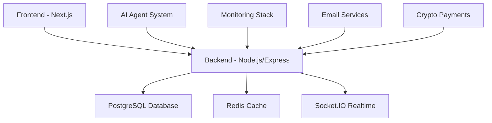

# Advancia Pay Ledger Platform

Welcome to the comprehensive documentation for the Advancia Pay Ledger Platform - a modular, enterprise-grade SaaS platform for financial transactions and user management.

## 🚀 Quick Start

Get up and running in minutes:

1. **[Environment Setup](getting-started/environment-setup.md)** - Configure your development environment
2. **[Local Development](getting-started/local-development.md)** - Start the platform locally
3. **[API Reference](api/authentication.md)** - Explore our REST API

## 🏗️ Architecture Overview

### Core Components

- **Backend**: Node.js + Express + TypeScript with Prisma ORM
- **Frontend**: Next.js 14 with App Router consuming REST API
- **Database**: PostgreSQL with comprehensive audit trails
- **Realtime**: Socket.IO for live notifications
- **AI Agent**: Intelligent DevOps automation system
- **Monitoring**: Prometheus + Grafana + PagerDuty integration

## 🔐 Security & Compliance

- **JWT Authentication** with role-based access control
- **Secret Rotation** with 90-day automation
- **Comprehensive Audit Trails** for all admin actions
- **PCI-DSS Friendly** patterns for payment processing
- **GDPR Compliant** data handling

## 📊 Key Features

### Financial Operations

- Multi-currency transaction processing
- Crypto payment integration (BTC/ETH/USDT)
- Stripe payment processing
- Real-time balance management
- Token wallet system

### User Management

- Email-only OTP authentication
- Multi-factor authentication (TOTP)
- Role-based permissions
- User tier management
- Comprehensive user profiles

### Admin & Monitoring

- Real-time system monitoring
- Alert threshold management
- PagerDuty escalation policies
- Comprehensive admin audit trails
- Email notification tracking
- Performance metrics dashboard

### AI-Powered DevOps

- Intelligent deployment automation
- Chaos engineering capabilities
- Automated incident response
- Performance optimization
- Security threat analysis

## 🛠️ Technology Stack

| Component         | Technology                     | Purpose                         |
| ----------------- | ------------------------------ | ------------------------------- |
| **Backend**       | Node.js + Express + TypeScript | API server and business logic   |
| **Frontend**      | Next.js 14 + React             | User interface                  |
| **Database**      | PostgreSQL + Prisma            | Data persistence                |
| **Cache**         | Redis                          | Session and performance caching |
| **Realtime**      | Socket.IO                      | Live notifications              |
| **Monitoring**    | Prometheus + Grafana           | Metrics and alerting            |
| **Notifications** | PagerDuty + Email + Push       | Multi-channel alerting          |
| **Payments**      | Stripe + Cryptomus             | Payment processing              |
| **Email**         | Gmail SMTP + Resend + SendGrid | Email delivery                  |
| **AI Agent**      | Python + Custom Framework      | Intelligent automation          |

## 📈 System Status

- **Uptime SLA**: 99.9%
- **Response Time**: <200ms average
- **Database**: PostgreSQL with automated backups
- **Monitoring**: 24/7 with PagerDuty escalation
- **Security**: Automated secret rotation every 90 days

## 🔗 Quick Links

- [Getting Started Guide](getting-started/overview.md)
- [API Documentation](api/authentication.md)
- [Deployment Guide](deployment/overview.md)
- [AI Agent System](ai-agent/overview.md)
- [Security Procedures](security/overview.md)
- [Development Guidelines](development/contributing.md)

## 🆘 Support

Need help? Check out:

- [Troubleshooting Guide](ai-agent/troubleshooting.md)
- [FAQ Section](guides/admin-features.md)
- [Contact Support](mailto:support@advancia.com)

---

_Last updated: November 26, 2025_
