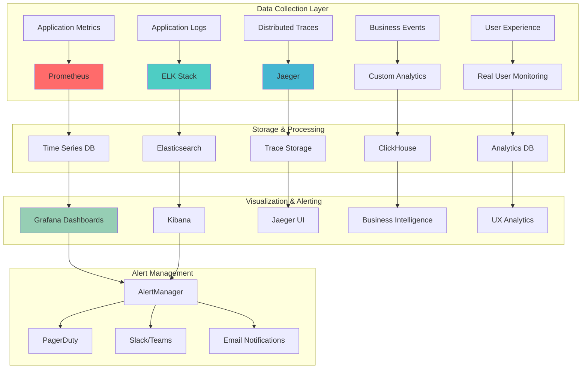

# Observability & Monitoring Guide

Comprehensive observability strategy for the Advancia Pay Ledger platform, providing deep insights into system performance, user behavior, and business metrics.

## 🎯 Observability Strategy

Our observability approach follows the three pillars of observability: **Metrics**, **Logs**, and **Traces**, enhanced with business intelligence and user experience monitoring.



## 📊 Metrics Collection

### **Application Metrics**

#### Express.js Metrics Middleware

```typescript
// middleware/metrics.ts
import promClient from "prom-client";
import { Request, Response, NextFunction } from "express";

// Custom metrics registry
export const register = new promClient.Registry();

// Default Node.js metrics
promClient.collectDefaultMetrics({ register });

// HTTP request metrics
const httpRequestDuration = new promClient.Histogram({
  name: "http_request_duration_seconds",
  help: "HTTP request duration in seconds",
  labelNames: ["method", "route", "status_code"],
  buckets: [0.1, 0.3, 0.5, 0.7, 1, 3, 5, 7, 10],
});

const httpRequestsTotal = new promClient.Counter({
  name: "http_requests_total",
  help: "Total number of HTTP requests",
  labelNames: ["method", "route", "status_code"],
});

const activeConnections = new promClient.Gauge({
  name: "http_active_connections",
  help: "Number of active HTTP connections",
});

// Business metrics
const transactionCounter = new promClient.Counter({
  name: "transactions_total",
  help: "Total number of transactions",
  labelNames: ["type", "status", "user_tier"],
});

const transactionAmount = new promClient.Histogram({
  name: "transaction_amount_dollars",
  help: "Transaction amounts in dollars",
  labelNames: ["type", "currency"],
  buckets: [1, 10, 50, 100, 500, 1000, 5000, 10000],
});

const userRegistrations = new promClient.Counter({
  name: "user_registrations_total",
  help: "Total number of user registrations",
  labelNames: ["tier", "source"],
});

// Register metrics
register.registerMetric(httpRequestDuration);
register.registerMetric(httpRequestsTotal);
register.registerMetric(activeConnections);
register.registerMetric(transactionCounter);
register.registerMetric(transactionAmount);
register.registerMetric(userRegistrations);

// Middleware function
export const metricsMiddleware = (req: Request, res: Response, next: NextFunction) => {
  const start = Date.now();

  activeConnections.inc();

  const originalSend = res.send;
  res.send = function (body) {
    const duration = (Date.now() - start) / 1000;
    const route = req.route?.path || req.path;

    httpRequestDuration.labels(req.method, route, res.statusCode.toString()).observe(duration);

    httpRequestsTotal.labels(req.method, route, res.statusCode.toString()).inc();

    activeConnections.dec();

    return originalSend.call(this, body);
  };

  next();
};

// Business metrics helpers
export const recordTransaction = (type: string, status: string, amount: number, currency: string, userTier: string) => {
  transactionCounter.labels(type, status, userTier).inc();
  transactionAmount.labels(type, currency).observe(amount);
};

export const recordUserRegistration = (tier: string, source: string) => {
  userRegistrations.labels(tier, source).inc();
};

// Metrics endpoint
export const getMetrics = async (): Promise<string> => {
  return await register.metrics();
};
```

#### Database Metrics

```typescript
// utils/databaseMetrics.ts
import { PrismaClient } from "@prisma/client";
import promClient from "prom-client";
import { register } from "../middleware/metrics";

const dbQueryDuration = new promClient.Histogram({
  name: "db_query_duration_seconds",
  help: "Database query duration in seconds",
  labelNames: ["operation", "model"],
  buckets: [0.01, 0.05, 0.1, 0.3, 0.5, 1, 2, 5],
});

const dbConnections = new promClient.Gauge({
  name: "db_connections_active",
  help: "Number of active database connections",
});

const dbErrors = new promClient.Counter({
  name: "db_errors_total",
  help: "Total number of database errors",
  labelNames: ["operation", "error_type"],
});

register.registerMetric(dbQueryDuration);
register.registerMetric(dbConnections);
register.registerMetric(dbErrors);

// Enhanced Prisma client with metrics
export class MetricsPrismaClient extends PrismaClient {
  constructor() {
    super({
      log: [
        { emit: "event", level: "query" },
        { emit: "event", level: "error" },
        { emit: "event", level: "info" },
        { emit: "event", level: "warn" },
      ],
    });

    // Track query performance
    this.$on("query" as any, (event: any) => {
      const duration = event.duration / 1000; // Convert to seconds
      const model = this.extractModel(event.query);
      const operation = this.extractOperation(event.query);

      dbQueryDuration.labels(operation, model).observe(duration);
    });

    // Track errors
    this.$on("error" as any, (event: any) => {
      const operation = "unknown";
      const errorType = this.categorizeError(event.message);
      dbErrors.labels(operation, errorType).inc();
    });

    // Monitor connection pool
    this.monitorConnectionPool();
  }

  private extractModel(query: string): string {
    // Extract table/model name from SQL query
    const match = query.match(/(?:FROM|INTO|UPDATE|JOIN)\s+`?(\w+)`?/i);
    return match ? match[1] : "unknown";
  }

  private extractOperation(query: string): string {
    const operation = query.trim().split(" ")[0].toUpperCase();
    return ["SELECT", "INSERT", "UPDATE", "DELETE"].includes(operation) ? operation : "OTHER";
  }

  private categorizeError(message: string): string {
    if (message.includes("timeout")) return "timeout";
    if (message.includes("connection")) return "connection";
    if (message.includes("constraint")) return "constraint";
    if (message.includes("syntax")) return "syntax";
    return "unknown";
  }

  private monitorConnectionPool() {
    setInterval(() => {
      // This would need to be implemented based on your connection pool
      // dbConnections.set(this.getCurrentConnectionCount());
    }, 30000); // Every 30 seconds
  }
}
```

### **Custom Business Metrics**

#### Financial Metrics Tracking

```typescript
// services/metricsService.ts
import promClient from "prom-client";
import { PrismaClient } from "@prisma/client";
import { register } from "../middleware/metrics";

class BusinessMetricsService {
  private prisma = new PrismaClient();

  // Revenue tracking
  private revenueGauge = new promClient.Gauge({
    name: "revenue_total_dollars",
    help: "Total revenue in dollars",
    labelNames: ["period", "source"],
  });

  // Transaction success rate
  private transactionSuccessRate = new promClient.Gauge({
    name: "transaction_success_rate",
    help: "Transaction success rate as percentage",
    labelNames: ["type", "period"],
  });

  // User engagement
  private activeUsers = new promClient.Gauge({
    name: "users_active",
    help: "Number of active users",
    labelNames: ["period", "tier"],
  });

  // Payment method distribution
  private paymentMethodUsage = new promClient.Gauge({
    name: "payment_method_usage",
    help: "Payment method usage distribution",
    labelNames: ["method", "period"],
  });

  constructor() {
    register.registerMetric(this.revenueGauge);
    register.registerMetric(this.transactionSuccessRate);
    register.registerMetric(this.activeUsers);
    register.registerMetric(this.paymentMethodUsage);

    // Update metrics periodically
    setInterval(() => this.updateAllMetrics(), 60000); // Every minute
  }

  private async updateAllMetrics() {
    await Promise.all([this.updateRevenueMetrics(), this.updateTransactionMetrics(), this.updateUserMetrics(), this.updatePaymentMethodMetrics()]);
  }

  private async updateRevenueMetrics() {
    const periods = ["1h", "24h", "7d", "30d"];

    for (const period of periods) {
      const startDate = this.getStartDate(period);

      const revenue = await this.prisma.transaction.aggregate({
        where: {
          status: "COMPLETED",
          type: "DEPOSIT",
          createdAt: { gte: startDate },
        },
        _sum: { amount: true },
      });

      this.revenueGauge.labels(period, "all").set(Number(revenue._sum.amount || 0));
    }
  }

  private async updateTransactionMetrics() {
    const periods = ["1h", "24h", "7d"];
    const types = ["DEPOSIT", "WITHDRAWAL", "TRANSFER"];

    for (const period of periods) {
      for (const type of types) {
        const startDate = this.getStartDate(period);

        const [total, successful] = await Promise.all([
          this.prisma.transaction.count({
            where: { type, createdAt: { gte: startDate } },
          }),
          this.prisma.transaction.count({
            where: {
              type,
              status: "COMPLETED",
              createdAt: { gte: startDate },
            },
          }),
        ]);

        const successRate = total > 0 ? (successful / total) * 100 : 0;
        this.transactionSuccessRate.labels(type, period).set(successRate);
      }
    }
  }

  private async updateUserMetrics() {
    const periods = ["1h", "24h", "7d", "30d"];
    const tiers = ["BASIC", "PREMIUM", "ENTERPRISE"];

    for (const period of periods) {
      const startDate = this.getStartDate(period);

      for (const tier of tiers) {
        const activeCount = await this.prisma.user.count({
          where: {
            lastLoginAt: { gte: startDate },
            tier: { name: tier },
            isActive: true,
          },
        });

        this.activeUsers.labels(period, tier).set(activeCount);
      }
    }
  }

  private async updatePaymentMethodMetrics() {
    const period = "24h";
    const startDate = this.getStartDate(period);

    // This would depend on your payment tracking structure
    const paymentMethods = await this.prisma.transaction.groupBy({
      by: ["metadata"],
      where: {
        status: "COMPLETED",
        createdAt: { gte: startDate },
      },
      _count: true,
    });

    // Process and set metrics based on payment method data
    // Implementation depends on how payment methods are stored
  }

  private getStartDate(period: string): Date {
    const now = new Date();
    switch (period) {
      case "1h":
        return new Date(now.getTime() - 60 * 60 * 1000);
      case "24h":
        return new Date(now.getTime() - 24 * 60 * 60 * 1000);
      case "7d":
        return new Date(now.getTime() - 7 * 24 * 60 * 60 * 1000);
      case "30d":
        return new Date(now.getTime() - 30 * 24 * 60 * 60 * 1000);
      default:
        return new Date(now.getTime() - 24 * 60 * 60 * 1000);
    }
  }
}

export const businessMetrics = new BusinessMetricsService();
```

## 📝 Structured Logging

### **Winston Logger Configuration**

#### Enhanced Logging Setup

```typescript
// utils/logger.ts
import winston from "winston";
import { ElasticsearchTransport } from "winston-elasticsearch";
import { config } from "../config";

// Custom log format with correlation IDs
const logFormat = winston.format.combine(
  winston.format.timestamp(),
  winston.format.errors({ stack: true }),
  winston.format.json(),
  winston.format.printf(({ timestamp, level, message, correlationId, userId, ...meta }) => {
    return JSON.stringify({
      "@timestamp": timestamp,
      level,
      message,
      correlationId,
      userId,
      service: "advancia-backend",
      environment: config.nodeEnv,
      ...meta,
    });
  }),
);

// Elasticsearch transport for centralized logging
const elasticsearchTransport = new ElasticsearchTransport({
  level: "info",
  clientOpts: {
    node: config.elasticsearchUrl,
    auth: {
      username: config.elasticsearchUser,
      password: config.elasticsearchPassword,
    },
  },
  index: `advancia-logs-${new Date().toISOString().slice(0, 7)}`,
});

export const logger = winston.createLogger({
  level: config.logLevel || "info",
  format: logFormat,
  defaultMeta: { service: "advancia-backend" },
  transports: [
    // File transports
    new winston.transports.File({
      filename: "logs/error.log",
      level: "error",
      maxsize: 10485760, // 10MB
      maxFiles: 5,
      tailable: true,
    }),
    new winston.transports.File({
      filename: "logs/audit.log",
      level: "info",
      maxsize: 10485760,
      maxFiles: 10,
      tailable: true,
      format: winston.format.combine(winston.format.timestamp(), winston.format.json()),
    }),
    // Elasticsearch transport
    elasticsearchTransport,
  ],
  exitOnError: false,
});

// Console logging for development
if (config.nodeEnv !== "production") {
  logger.add(
    new winston.transports.Console({
      format: winston.format.combine(
        winston.format.colorize(),
        winston.format.simple(),
        winston.format.printf(({ level, message, timestamp, ...meta }) => {
          const metaStr = Object.keys(meta).length ? JSON.stringify(meta, null, 2) : "";
          return `${timestamp} ${level}: ${message} ${metaStr}`;
        }),
      ),
    }),
  );
}

// Context-aware logging
export class ContextLogger {
  constructor(
    private context: string,
    private correlationId?: string,
    private userId?: string,
  ) {}

  private addContext(meta: any = {}) {
    return {
      context: this.context,
      correlationId: this.correlationId,
      userId: this.userId,
      ...meta,
    };
  }

  info(message: string, meta?: any) {
    logger.info(message, this.addContext(meta));
  }

  warn(message: string, meta?: any) {
    logger.warn(message, this.addContext(meta));
  }

  error(message: string, error?: Error, meta?: any) {
    logger.error(
      message,
      this.addContext({
        error: error?.message,
        stack: error?.stack,
        ...meta,
      }),
    );
  }

  debug(message: string, meta?: any) {
    logger.debug(message, this.addContext(meta));
  }

  audit(action: string, details: any) {
    logger.info(
      "AUDIT_EVENT",
      this.addContext({
        action,
        details,
        timestamp: new Date().toISOString(),
      }),
    );
  }
}

// Request correlation middleware
export const correlationMiddleware = (req: any, res: any, next: any) => {
  req.correlationId = req.headers["x-correlation-id"] || `${Date.now()}-${Math.random().toString(36).substr(2, 9)}`;

  res.setHeader("X-Correlation-ID", req.correlationId);

  // Add logger to request
  req.logger = new ContextLogger("http-request", req.correlationId, req.user?.id);

  next();
};
```

### **Audit Logging System**

#### Comprehensive Audit Trail

```typescript
// services/auditService.ts
import { PrismaClient, AuditAction } from "@prisma/client";
import { ContextLogger } from "../utils/logger";

interface AuditEvent {
  userId?: string;
  action: AuditAction;
  resource: string;
  resourceId?: string;
  details?: any;
  ipAddress?: string;
  userAgent?: string;
}

export class AuditService {
  private prisma = new PrismaClient();
  private logger = new ContextLogger("audit-service");

  async logEvent(event: AuditEvent): Promise<void> {
    try {
      // Store in database
      const auditLog = await this.prisma.auditLog.create({
        data: {
          userId: event.userId,
          action: event.action,
          resource: event.resource,
          resourceId: event.resourceId,
          details: event.details,
          ipAddress: event.ipAddress,
          userAgent: event.userAgent,
          timestamp: new Date(),
        },
      });

      // Log to structured logs
      this.logger.audit("audit_event_created", {
        auditLogId: auditLog.id,
        action: event.action,
        resource: event.resource,
        userId: event.userId,
      });
    } catch (error) {
      this.logger.error("Failed to create audit log", error as Error, event);
      throw error;
    }
  }

  // Convenient methods for common actions
  async logLogin(userId: string, ipAddress: string, userAgent: string, success: boolean) {
    await this.logEvent({
      userId,
      action: success ? "LOGIN_SUCCESS" : "LOGIN_FAILURE",
      resource: "auth",
      ipAddress,
      userAgent,
      details: { success },
    });
  }

  async logTransaction(userId: string, action: string, transactionData: any) {
    await this.logEvent({
      userId,
      action: action as AuditAction,
      resource: "transaction",
      resourceId: transactionData.transactionId,
      details: transactionData,
    });
  }

  async logAdminAction(adminId: string, action: string, targetResource: string, details: any) {
    await this.logEvent({
      userId: adminId,
      action: action as AuditAction,
      resource: targetResource,
      details: {
        ...details,
        isAdminAction: true,
      },
    });
  }

  async logSecurityEvent(event: string, details: any, ipAddress?: string) {
    await this.logEvent({
      action: "SECURITY_EVENT" as AuditAction,
      resource: "security",
      details: {
        event,
        ...details,
      },
      ipAddress,
    });
  }

  // Query audit logs with filters
  async getAuditLogs(filters: { userId?: string; action?: AuditAction; resource?: string; startDate?: Date; endDate?: Date; limit?: number; offset?: number }) {
    const where: any = {};

    if (filters.userId) where.userId = filters.userId;
    if (filters.action) where.action = filters.action;
    if (filters.resource) where.resource = filters.resource;
    if (filters.startDate || filters.endDate) {
      where.timestamp = {};
      if (filters.startDate) where.timestamp.gte = filters.startDate;
      if (filters.endDate) where.timestamp.lte = filters.endDate;
    }

    return await this.prisma.auditLog.findMany({
      where,
      include: {
        user: {
          select: { email: true, firstName: true, lastName: true },
        },
      },
      orderBy: { timestamp: "desc" },
      take: Math.min(filters.limit || 50, 100),
      skip: filters.offset || 0,
    });
  }
}

export const auditService = new AuditService();
```

## 🔍 Distributed Tracing

### **OpenTelemetry Integration**

#### Tracing Setup

```typescript
// utils/tracing.ts
import { NodeSDK } from "@opentelemetry/sdk-node";
import { getNodeAutoInstrumentations } from "@opentelemetry/auto-instrumentations-node";
import { JaegerExporter } from "@opentelemetry/exporter-jaeger";
import { Resource } from "@opentelemetry/resources";
import { SemanticResourceAttributes } from "@opentelemetry/semantic-conventions";
import { PeriodicExportingMetricReader } from "@opentelemetry/sdk-metrics";
import { PrometheusExporter } from "@opentelemetry/exporter-prometheus";
import { config } from "../config";

// Configure Jaeger exporter
const jaegerExporter = new JaegerExporter({
  endpoint: config.jaegerEndpoint,
});

// Configure Prometheus metrics exporter
const prometheusExporter = new PrometheusExporter({
  port: 9091,
});

// Initialize the SDK
const sdk = new NodeSDK({
  resource: new Resource({
    [SemanticResourceAttributes.SERVICE_NAME]: "advancia-backend",
    [SemanticResourceAttributes.SERVICE_VERSION]: process.env.npm_package_version || "1.0.0",
    [SemanticResourceAttributes.DEPLOYMENT_ENVIRONMENT]: config.nodeEnv,
  }),
  traceExporter: jaegerExporter,
  instrumentations: [
    getNodeAutoInstrumentations({
      "@opentelemetry/instrumentation-fs": {
        enabled: false, // Disable file system instrumentation for performance
      },
    }),
  ],
  metricReader: new PeriodicExportingMetricReader({
    exporter: prometheusExporter,
    exportIntervalMillis: 30000,
  }),
});

// Start tracing
if (config.enableTracing) {
  sdk.start();
  console.log("OpenTelemetry tracing started");
}

// Graceful shutdown
process.on("SIGTERM", () => {
  sdk
    .shutdown()
    .then(() => console.log("Tracing terminated"))
    .catch((error) => console.log("Error terminating tracing", error))
    .finally(() => process.exit(0));
});

export { sdk };
```

#### Custom Span Creation

```typescript
// utils/customTracing.ts
import { trace, context, SpanStatusCode } from "@opentelemetry/api";
import { ContextLogger } from "./logger";

const tracer = trace.getTracer("advancia-backend");

export class TracingService {
  private logger = new ContextLogger("tracing-service");

  // Create a span for business operations
  async traceOperation<T>(operationName: string, operation: () => Promise<T>, attributes?: { [key: string]: string | number | boolean }): Promise<T> {
    const span = tracer.startSpan(operationName, {
      attributes: {
        "service.name": "advancia-backend",
        "operation.type": "business",
        ...attributes,
      },
    });

    try {
      const result = await context.with(trace.setSpan(context.active(), span), operation);

      span.setStatus({ code: SpanStatusCode.OK });
      return result;
    } catch (error) {
      span.recordException(error as Error);
      span.setStatus({
        code: SpanStatusCode.ERROR,
        message: (error as Error).message,
      });

      this.logger.error("Traced operation failed", error as Error, {
        operationName,
        spanId: span.spanContext().spanId,
        traceId: span.spanContext().traceId,
      });

      throw error;
    } finally {
      span.end();
    }
  }

  // Trace database operations
  async traceDbOperation<T>(operation: string, model: string, dbCall: () => Promise<T>): Promise<T> {
    return this.traceOperation(`db.${operation}`, dbCall, {
      "db.operation": operation,
      "db.model": model,
      component: "database",
    });
  }

  // Trace external API calls
  async traceExternalCall<T>(service: string, endpoint: string, apiCall: () => Promise<T>): Promise<T> {
    return this.traceOperation(`external.${service}`, apiCall, {
      "external.service": service,
      "external.endpoint": endpoint,
      component: "external-api",
    });
  }

  // Add custom attributes to current span
  addSpanAttributes(attributes: { [key: string]: string | number | boolean }) {
    const span = trace.getActiveSpan();
    if (span) {
      Object.entries(attributes).forEach(([key, value]) => {
        span.setAttribute(key, value);
      });
    }
  }

  // Add span events for important business events
  addSpanEvent(name: string, attributes?: { [key: string]: string | number | boolean }) {
    const span = trace.getActiveSpan();
    if (span) {
      span.addEvent(name, attributes);
    }
  }
}

export const tracingService = new TracingService();

// Usage examples in services
export const traceTransaction = async (transactionData: any) => {
  return tracingService.traceOperation(
    "transaction.create",
    async () => {
      // Transaction creation logic
      tracingService.addSpanAttributes({
        "transaction.type": transactionData.type,
        "transaction.amount": transactionData.amount,
        "user.id": transactionData.userId,
      });

      tracingService.addSpanEvent("transaction.validation.started");
      // Validation logic
      tracingService.addSpanEvent("transaction.validation.completed");

      tracingService.addSpanEvent("transaction.persistence.started");
      // Database save
      tracingService.addSpanEvent("transaction.persistence.completed");

      return transactionData;
    },
    {
      "business.domain": "finance",
      "operation.critical": true,
    },
  );
};
```

## 📈 Grafana Dashboards

### **System Health Dashboard**

#### Dashboard Configuration

```json
{
  "dashboard": {
    "id": null,
    "title": "Advancia Pay - System Health",
    "tags": ["advancia", "health", "monitoring"],
    "timezone": "browser",
    "panels": [
      {
        "id": 1,
        "title": "HTTP Request Rate",
        "type": "graph",
        "targets": [
          {
            "expr": "rate(http_requests_total[5m])",
            "legendFormat": "{{method}} {{route}}"
          }
        ],
        "yAxes": [
          {
            "label": "Requests/sec",
            "min": 0
          }
        ],
        "gridPos": {
          "h": 8,
          "w": 12,
          "x": 0,
          "y": 0
        }
      },
      {
        "id": 2,
        "title": "Response Time P95",
        "type": "graph",
        "targets": [
          {
            "expr": "histogram_quantile(0.95, rate(http_request_duration_seconds_bucket[5m]))",
            "legendFormat": "P95 Response Time"
          }
        ],
        "yAxes": [
          {
            "label": "Seconds",
            "min": 0
          }
        ],
        "gridPos": {
          "h": 8,
          "w": 12,
          "x": 12,
          "y": 0
        }
      },
      {
        "id": 3,
        "title": "Error Rate",
        "type": "graph",
        "targets": [
          {
            "expr": "rate(http_requests_total{status_code=~\"4..|5..\"}[5m]) / rate(http_requests_total[5m]) * 100",
            "legendFormat": "Error Rate %"
          }
        ],
        "yAxes": [
          {
            "label": "Percentage",
            "min": 0,
            "max": 100
          }
        ],
        "gridPos": {
          "h": 8,
          "w": 24,
          "x": 0,
          "y": 8
        }
      },
      {
        "id": 4,
        "title": "Active Database Connections",
        "type": "singlestat",
        "targets": [
          {
            "expr": "db_connections_active"
          }
        ],
        "valueName": "current",
        "gridPos": {
          "h": 4,
          "w": 6,
          "x": 0,
          "y": 16
        }
      },
      {
        "id": 5,
        "title": "Memory Usage",
        "type": "singlestat",
        "targets": [
          {
            "expr": "nodejs_heap_size_used_bytes / 1024 / 1024"
          }
        ],
        "valueName": "current",
        "unit": "MB",
        "gridPos": {
          "h": 4,
          "w": 6,
          "x": 6,
          "y": 16
        }
      },
      {
        "id": 6,
        "title": "CPU Usage",
        "type": "singlestat",
        "targets": [
          {
            "expr": "rate(nodejs_external_memory_bytes[5m])"
          }
        ],
        "valueName": "current",
        "unit": "percent",
        "gridPos": {
          "h": 4,
          "w": 6,
          "x": 12,
          "y": 16
        }
      },
      {
        "id": 7,
        "title": "Active Users (24h)",
        "type": "singlestat",
        "targets": [
          {
            "expr": "users_active{period=\"24h\"}"
          }
        ],
        "valueName": "current",
        "gridPos": {
          "h": 4,
          "w": 6,
          "x": 18,
          "y": 16
        }
      }
    ],
    "time": {
      "from": "now-1h",
      "to": "now"
    },
    "refresh": "5s"
  }
}
```

### **Business Metrics Dashboard**

#### Financial KPIs Dashboard

```json
{
  "dashboard": {
    "id": null,
    "title": "Advancia Pay - Business Metrics",
    "tags": ["advancia", "business", "finance"],
    "panels": [
      {
        "id": 1,
        "title": "Revenue (24h)",
        "type": "singlestat",
        "targets": [
          {
            "expr": "revenue_total_dollars{period=\"24h\"}"
          }
        ],
        "valueName": "current",
        "unit": "currencyUSD",
        "colorBackground": true,
        "thresholds": "1000,5000",
        "colors": ["rgba(245, 54, 54, 0.9)", "rgba(237, 129, 40, 0.89)", "rgba(50, 172, 45, 0.97)"],
        "gridPos": {
          "h": 4,
          "w": 6,
          "x": 0,
          "y": 0
        }
      },
      {
        "id": 2,
        "title": "Transaction Success Rate",
        "type": "graph",
        "targets": [
          {
            "expr": "transaction_success_rate",
            "legendFormat": "{{type}} ({{period}})"
          }
        ],
        "yAxes": [
          {
            "label": "Success Rate %",
            "min": 0,
            "max": 100
          }
        ],
        "gridPos": {
          "h": 8,
          "w": 18,
          "x": 6,
          "y": 0
        }
      },
      {
        "id": 3,
        "title": "New User Registrations",
        "type": "graph",
        "targets": [
          {
            "expr": "rate(user_registrations_total[1h])",
            "legendFormat": "{{tier}} tier"
          }
        ],
        "gridPos": {
          "h": 8,
          "w": 12,
          "x": 0,
          "y": 8
        }
      },
      {
        "id": 4,
        "title": "Transaction Volume",
        "type": "graph",
        "targets": [
          {
            "expr": "rate(transactions_total[5m])",
            "legendFormat": "{{type}} - {{status}}"
          }
        ],
        "gridPos": {
          "h": 8,
          "w": 12,
          "x": 12,
          "y": 8
        }
      }
    ]
  }
}
```

## 🚨 Alert Management

### **AlertManager Configuration**

#### Critical Alerts Setup

```yaml
# alertmanager.yml
global:
  smtp_smarthost: "smtp.gmail.com:587"
  smtp_from: "alerts@advancia.dev"
  smtp_auth_username: "alerts@advancia.dev"
  smtp_auth_password: "${SMTP_PASSWORD}"

templates:
  - "/etc/alertmanager/templates/*.tmpl"

route:
  group_by: ["alertname", "cluster", "service"]
  group_wait: 10s
  group_interval: 10s
  repeat_interval: 1h
  receiver: "default"
  routes:
    - match:
        severity: critical
      receiver: "critical-alerts"
      group_wait: 5s
      repeat_interval: 15m
    - match:
        severity: warning
      receiver: "warning-alerts"
      repeat_interval: 4h

receivers:
  - name: "default"
    email_configs:
      - to: "devops@advancia.dev"
        subject: "[Advancia] {{ .GroupLabels.alertname }} - {{ .Status | title }}"
        body: |
          {{ range .Alerts }}
          Alert: {{ .Annotations.summary }}
          Description: {{ .Annotations.description }}
          Labels: {{ range .Labels.SortedPairs }}
            {{ .Name }}: {{ .Value }}
          {{ end }}
          {{ end }}

  - name: "critical-alerts"
    pagerduty_configs:
      - service_key: "${PAGERDUTY_SERVICE_KEY}"
        client: "Advancia AlertManager"
        client_url: "https://monitoring.advancia.dev"
        description: "{{ .GroupLabels.alertname }} - {{ .CommonAnnotations.summary }}"
        details:
          firing: "{{ .Alerts.Firing | len }}"
          resolved: "{{ .Alerts.Resolved | len }}"
    slack_configs:
      - api_url: "${SLACK_WEBHOOK_URL}"
        channel: "#critical-alerts"
        title: "🚨 Critical Alert: {{ .GroupLabels.alertname }}"
        text: "{{ range .Alerts }}{{ .Annotations.description }}{{ end }}"
        color: "danger"

  - name: "warning-alerts"
    slack_configs:
      - api_url: "${SLACK_WEBHOOK_URL}"
        channel: "#warnings"
        title: "⚠️  Warning: {{ .GroupLabels.alertname }}"
        text: "{{ range .Alerts }}{{ .Annotations.description }}{{ end }}"
        color: "warning"

inhibit_rules:
  - source_match:
      severity: "critical"
    target_match:
      severity: "warning"
    equal: ["alertname", "instance"]
```

### **Prometheus Alert Rules**

#### System Alert Rules

```yaml
# alert-rules.yml
groups:
  - name: advancia.system
    rules:
      - alert: HighErrorRate
        expr: rate(http_requests_total{status_code=~"4..|5.."}[5m]) / rate(http_requests_total[5m]) * 100 > 5
        for: 5m
        labels:
          severity: critical
        annotations:
          summary: "High error rate detected"
          description: "Error rate is {{ $value }}% over the last 5 minutes"

      - alert: HighResponseTime
        expr: histogram_quantile(0.95, rate(http_request_duration_seconds_bucket[5m])) > 2
        for: 10m
        labels:
          severity: warning
        annotations:
          summary: "High response time detected"
          description: "95th percentile response time is {{ $value }} seconds"

      - alert: DatabaseConnectionHigh
        expr: db_connections_active > 80
        for: 5m
        labels:
          severity: warning
        annotations:
          summary: "High database connection count"
          description: "Database connections: {{ $value }}"

      - alert: MemoryUsageHigh
        expr: nodejs_heap_size_used_bytes / nodejs_heap_size_total_bytes * 100 > 90
        for: 10m
        labels:
          severity: critical
        annotations:
          summary: "High memory usage"
          description: "Memory usage is {{ $value }}%"

  - name: advancia.business
    rules:
      - alert: TransactionFailureSpike
        expr: rate(transactions_total{status="FAILED"}[5m]) > rate(transactions_total{status="FAILED"}[30m]) * 3
        for: 2m
        labels:
          severity: critical
        annotations:
          summary: "Transaction failure spike detected"
          description: "Transaction failures increased significantly"

      - alert: RevenueDropAlert
        expr: revenue_total_dollars{period="1h"} < revenue_total_dollars{period="1h"} offset 1h * 0.5
        for: 15m
        labels:
          severity: warning
        annotations:
          summary: "Revenue drop detected"
          description: "Hourly revenue dropped by more than 50%"

      - alert: LowTransactionSuccessRate
        expr: transaction_success_rate{period="1h"} < 95
        for: 10m
        labels:
          severity: critical
        annotations:
          summary: "Low transaction success rate"
          description: "Transaction success rate is {{ $value }}%"

  - name: advancia.security
    rules:
      - alert: HighFailedLoginRate
        expr: rate(user_login_attempts{status="failed"}[5m]) * 60 > 10
        for: 2m
        labels:
          severity: warning
        annotations:
          summary: "High failed login rate"
          description: "{{ $value }} failed logins per minute"

      - alert: SuspiciousActivity
        expr: rate(http_requests_total{status_code="403"}[5m]) * 60 > 20
        for: 1m
        labels:
          severity: critical
        annotations:
          summary: "Suspicious activity detected"
          description: "High rate of 403 responses: {{ $value }} per minute"
```

## 📊 Real User Monitoring (RUM)

### **Frontend Performance Tracking**

#### Performance Metrics Collection

```typescript
// Frontend: utils/monitoring.ts
export class RealUserMonitoring {
  private apiEndpoint = "/api/analytics/rum";

  constructor() {
    this.initializeWebVitals();
    this.trackPageViews();
    this.trackUserInteractions();
    this.trackErrors();
  }

  private initializeWebVitals() {
    import("web-vitals").then(({ getCLS, getFID, getFCP, getLCP, getTTFB }) => {
      getCLS(this.sendMetric.bind(this));
      getFID(this.sendMetric.bind(this));
      getFCP(this.sendMetric.bind(this));
      getLCP(this.sendMetric.bind(this));
      getTTFB(this.sendMetric.bind(this));
    });
  }

  private sendMetric(metric: any) {
    const data = {
      name: metric.name,
      value: metric.value,
      id: metric.id,
      url: window.location.href,
      timestamp: Date.now(),
      userAgent: navigator.userAgent,
      connectionType: this.getConnectionType(),
    };

    // Send to backend (non-blocking)
    navigator.sendBeacon(this.apiEndpoint, JSON.stringify(data));
  }

  private trackPageViews() {
    const sendPageView = () => {
      const data = {
        type: "page_view",
        url: window.location.href,
        referrer: document.referrer,
        timestamp: Date.now(),
        viewportSize: {
          width: window.innerWidth,
          height: window.innerHeight,
        },
      };

      navigator.sendBeacon(this.apiEndpoint, JSON.stringify(data));
    };

    // Track initial page view
    sendPageView();

    // Track navigation for SPAs
    let lastUrl = location.href;
    new MutationObserver(() => {
      const url = location.href;
      if (url !== lastUrl) {
        lastUrl = url;
        sendPageView();
      }
    }).observe(document, { subtree: true, childList: true });
  }

  private trackUserInteractions() {
    // Track button clicks
    document.addEventListener("click", (event) => {
      const target = event.target as HTMLElement;
      if (target.tagName === "BUTTON" || target.hasAttribute("data-track")) {
        this.trackEvent("click", {
          element: target.tagName,
          text: target.textContent?.slice(0, 50),
          id: target.id,
          className: target.className,
        });
      }
    });

    // Track form submissions
    document.addEventListener("submit", (event) => {
      const form = event.target as HTMLFormElement;
      this.trackEvent("form_submit", {
        formId: form.id,
        action: form.action,
        method: form.method,
      });
    });
  }

  private trackErrors() {
    // JavaScript errors
    window.addEventListener("error", (event) => {
      this.trackEvent("javascript_error", {
        message: event.message,
        filename: event.filename,
        lineno: event.lineno,
        colno: event.colno,
        stack: event.error?.stack,
      });
    });

    // Promise rejections
    window.addEventListener("unhandledrejection", (event) => {
      this.trackEvent("unhandled_rejection", {
        reason: event.reason?.toString(),
      });
    });

    // Resource loading errors
    document.addEventListener(
      "error",
      (event) => {
        const target = event.target as any;
        if (target !== window) {
          this.trackEvent("resource_error", {
            tagName: target.tagName,
            source: target.src || target.href,
            type: target.type,
          });
        }
      },
      true,
    );
  }

  private trackEvent(eventName: string, data: any) {
    const eventData = {
      type: "event",
      name: eventName,
      data,
      url: window.location.href,
      timestamp: Date.now(),
    };

    navigator.sendBeacon(this.apiEndpoint, JSON.stringify(eventData));
  }

  private getConnectionType() {
    return (navigator as any)?.connection?.effectiveType || "unknown";
  }

  // Business-specific tracking
  public trackTransaction(transactionId: string, type: string, amount: number) {
    this.trackEvent("transaction_initiated", {
      transactionId,
      type,
      amount,
    });
  }

  public trackTransactionComplete(transactionId: string, duration: number) {
    this.trackEvent("transaction_completed", {
      transactionId,
      duration,
    });
  }

  public trackPaymentMethod(method: string) {
    this.trackEvent("payment_method_selected", { method });
  }
}

// Initialize monitoring
export const rum = new RealUserMonitoring();
```

This comprehensive observability guide provides the foundation for monitoring, logging, and tracing your entire system. The setup includes real-time metrics, structured logging, distributed tracing, alerting, and user experience monitoring to ensure optimal system performance and user satisfaction.
