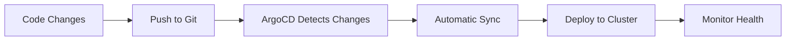

# 🚀 Enterprise GitOps Deployment Guide

This directory contains enterprise-grade GitOps deployment scripts for the Advancia Pay Ledger AI DevOps Agent.

## 📋 Overview

The `deploy-enterprise-gitops.ps1` script provides a comprehensive, production-ready solution for bootstrapping ArgoCD and configuring GitOps for your AI DevOps Agent in Kubernetes clusters.

## 🎯 Features

### Core Capabilities

- ✅ **Automated ArgoCD Installation**: Downloads and installs the latest stable ArgoCD
- ✅ **Namespace Management**: Creates and manages ArgoCD and application namespaces
- ✅ **Application Bootstrap**: Configures ArgoCD Application pointing to your repository
- ✅ **Automated GitOps**: Enables automated sync, prune, and self-heal
- ✅ **Health Monitoring**: Waits for deployments and validates cluster connectivity

### Enterprise Features

- 🔐 **Security**: Retrieves and displays ArgoCD admin credentials securely
- 📊 **Observability**: Comprehensive logging and status reporting
- 🛡️ **Error Handling**: Robust error handling with troubleshooting guidance
- 🔄 **Idempotency**: Safe to run multiple times without conflicts
- 🧪 **Dry Run Mode**: Test deployments without making changes
- ⏱️ **Timeout Controls**: Configurable timeouts for deployment readiness

## 📦 Prerequisites

### Required Tools

```powershell
# Install kubectl
winget install Kubernetes.kubectl

# Or via Chocolatey
choco install kubernetes-cli

# Verify installation
kubectl version --client
```

### Kubernetes Cluster

- Active Kubernetes cluster (local, cloud, or on-premises)
- Valid kubeconfig with cluster-admin permissions
- kubectl configured and connected

### Verify Cluster Connection

```powershell
# Test cluster connectivity
kubectl cluster-info

# Verify permissions
kubectl auth can-i create namespace
kubectl auth can-i create deployment
```

## 🚀 Quick Start

### Basic Deployment

```powershell
cd "C:\Users\mucha.DESKTOP-H7T9NPM\-modular-saas-platform\scripts"
.\deploy-enterprise-gitops.ps1
```

### Advanced Usage

```powershell
# Custom configuration
.\deploy-enterprise-gitops.ps1 `
    -Namespace "my-argocd" `
    -AppNamespace "my-app" `
    -RepoURL "https://github.com/your-org/your-repo.git" `
    -Branch "production" `
    -Path "k8s/overlays/prod" `
    -TimeoutSeconds 600 `
    -Verbose

# Dry run (test without changes)
.\deploy-enterprise-gitops.ps1 -DryRun

# Use specific kubeconfig
.\deploy-enterprise-gitops.ps1 -KubeConfig "C:\path\to\kubeconfig"

# Target specific context
.\deploy-enterprise-gitops.ps1 -Context "production-cluster"
```

## 📚 Parameters Reference

| Parameter         | Default                      | Description                                       |
| ----------------- | ---------------------------- | ------------------------------------------------- |
| `-Namespace`      | `argocd`                     | Namespace for ArgoCD installation                 |
| `-AppNamespace`   | `ai-devops`                  | Target namespace for your application             |
| `-RepoURL`        | Repository URL               | GitHub repository containing Kubernetes manifests |
| `-Branch`         | `main`                       | Git branch to track                               |
| `-Path`           | `ai-agent-k8s/overlays/prod` | Path within repository to Kubernetes manifests    |
| `-KubeConfig`     | Default                      | Path to custom kubeconfig file                    |
| `-Context`        | Current                      | Kubernetes context to use                         |
| `-DryRun`         | `false`                      | Test mode - shows what would be done              |
| `-Verbose`        | `false`                      | Enable detailed output and debugging              |
| `-Force`          | `false`                      | Force operations even if resources exist          |
| `-TimeoutSeconds` | `300`                        | Maximum time to wait for deployments              |

## 🔧 Step-by-Step Process

### 1. Pre-flight Checks

- Validates kubectl installation and connectivity
- Checks cluster permissions
- Verifies kubeconfig and context

### 2. Namespace Creation

- Creates ArgoCD namespace (`argocd`)
- Creates application namespace (`ai-devops`)
- Applies proper labels and annotations

### 3. ArgoCD Installation

- Downloads latest stable ArgoCD manifests
- Applies all ArgoCD components
- Configures RBAC and security settings

### 4. Deployment Readiness

- Waits for ArgoCD server deployment
- Monitors pod status and health
- Configurable timeout protection

### 5. Application Configuration

- Creates ArgoCD Application resource
- Configures automated sync policies
- Sets up retry and healing mechanisms

### 6. Post-Installation

- Retrieves admin credentials
- Displays access instructions
- Provides monitoring commands

## 🎛️ ArgoCD Application Configuration

The script creates an ArgoCD Application with the following features:

```yaml
apiVersion: argoproj.io/v1alpha1
kind: Application
metadata:
  name: ai-agent
  namespace: argocd
spec:
  project: default
  source:
    repoURL: "https://github.com/advancia-platform/modular-saas-platform.git"
    targetRevision: main
    path: ai-agent-k8s/overlays/prod
  destination:
    server: https://kubernetes.default.svc
    namespace: ai-devops
  syncPolicy:
    automated:
      prune: true # Remove resources not in Git
      selfHeal: true # Automatically fix drift
      allowEmpty: false # Prevent accidental empty deploys
    syncOptions:
      - CreateNamespace=true
      - PrunePropagationPolicy=foreground
      - PruneLast=true
      - RespectIgnoreDifferences=true
    retry:
      limit: 5
      backoff:
        duration: 5s
        factor: 2
        maxDuration: 3m0s
```

## 📊 Accessing ArgoCD

### 1. Port Forward to ArgoCD UI

```powershell
kubectl port-forward svc/argocd-server -n argocd 8080:443
```

### 2. Access the Web UI

- Open: <https://localhost:8080>
- Accept the self-signed certificate

### 3. Login Credentials

```powershell
# Username
admin

# Password (retrieved automatically by script)
kubectl get secret argocd-initial-admin-secret -n argocd -o jsonpath='{.data.password}' | base64 -d
```

## 🔍 Monitoring & Troubleshooting

### Application Status

```powershell
# Monitor application status
kubectl get application ai-agent -n argocd -w

# Detailed application info
kubectl describe application ai-agent -n argocd

# Application logs
kubectl logs -n argocd -l app.kubernetes.io/name=argocd-server
```

### Common Issues & Solutions

#### 1. Kubectl Not Found

```powershell
# Install kubectl
winget install Kubernetes.kubectl

# Or add to PATH
$env:PATH += ";C:\path\to\kubectl"
```

#### 2. Cluster Connection Failed

```powershell
# Check cluster info
kubectl cluster-info

# Verify config
kubectl config view

# Test permissions
kubectl auth can-i create namespace
```

#### 3. ArgoCD Pods Not Ready

```powershell
# Check pod status
kubectl get pods -n argocd

# View pod logs
kubectl logs -n argocd -l app.kubernetes.io/name=argocd-server

# Describe problematic pods
kubectl describe pod <pod-name> -n argocd
```

#### 4. Application Sync Issues

```powershell
# Force application sync
kubectl patch application ai-agent -n argocd --type='merge' -p='{"operation":{"sync":{}}}'

# Check application health
kubectl get application ai-agent -n argocd -o yaml

# View sync status
kubectl describe application ai-agent -n argocd
```

## 🔄 GitOps Workflow

### 1. Development Workflow



### 2. Rollback Process

```powershell
# View application history
kubectl get application ai-agent -n argocd -o yaml | grep -A 5 "history:"

# Rollback to previous version
argocd app rollback ai-agent <revision>
```

### 3. Manual Sync

```powershell
# Sync specific application
argocd app sync ai-agent

# Hard refresh (ignore cache)
argocd app sync ai-agent --force
```

## 🛡️ Security Considerations

### 1. RBAC

- Script creates minimal required permissions
- ArgoCD runs with service account restrictions
- Application deployments follow least privilege

### 2. Network Security

- ArgoCD UI accessible via port-forward only
- TLS encryption for all communications
- Secret management via Kubernetes secrets

### 3. Repository Access

- Uses HTTPS for repository access
- Supports private repositories with authentication
- Git credentials managed via ArgoCD settings

## 📈 Production Readiness

### High Availability

```powershell
# Scale ArgoCD components
kubectl scale deployment argocd-server --replicas=2 -n argocd
kubectl scale deployment argocd-repo-server --replicas=2 -n argocd
```

### Monitoring Integration

```powershell
# Enable metrics
kubectl patch configmap argocd-server-config -n argocd --patch '{"data":{"server.metrics.enabled":"true"}}'

# Prometheus monitoring
kubectl apply -f https://raw.githubusercontent.com/argoproj/argo-cd/stable/manifests/ha/argocd-metrics-server-service.yaml
```

### Backup Strategy

```powershell
# Backup ArgoCD configuration
kubectl get configmap argocd-server-config -n argocd -o yaml > argocd-backup.yaml
kubectl get secret argocd-server-cert -n argocd -o yaml >> argocd-backup.yaml
```

## 🤝 Contributing

### Script Modifications

1. Test changes in dry-run mode first
2. Update parameter documentation
3. Add appropriate error handling
4. Include verbose logging for debugging

### Repository Structure

```
scripts/
├── deploy-enterprise-gitops.ps1    # Main deployment script
├── DEPLOY_GITOPS_README.md          # This documentation
└── gitops-utils.ps1                 # Helper functions (optional)
```

## 📞 Support

### Troubleshooting Resources

- 📖 [ArgoCD Documentation](https://argo-cd.readthedocs.io/)
- 🐛 [Issue Tracker](https://github.com/advancia-platform/modular-saas-platform/issues)
- 💬 [Discussions](https://github.com/advancia-platform/modular-saas-platform/discussions)

### Enterprise Support

For enterprise support and custom implementations, contact the Advancia Platform Engineering Team.

---

**✅ You're ready to deploy enterprise GitOps with confidence!**
